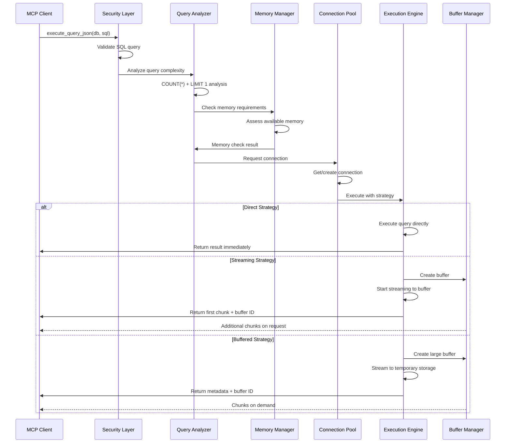

# LocalData MCP Architecture v1.3.1

## Overview

LocalData MCP v1.3.1 introduces a fundamentally new architecture designed around **memory-safe, streaming-first principles**. This document explains the core architectural decisions, component interactions, and design patterns that enable predictable performance with datasets of any size.

## Table of Contents

1. [Architectural Principles](#architectural-principles)
2. [System Components](#system-components)
3. [Streaming Pipeline Architecture](#streaming-pipeline-architecture)
4. [Memory Management System](#memory-management-system)
5. [Query Analysis Engine](#query-analysis-engine)
6. [Configuration Architecture](#configuration-architecture)
7. [Security Layer](#security-layer)
8. [Performance Optimization](#performance-optimization)
9. [Component Interactions](#component-interactions)
10. [Deployment Patterns](#deployment-patterns)

## Architectural Principles

### 1. Memory-Bounded Operations

**Principle**: No operation should consume unbounded memory, regardless of dataset size.

**Implementation**:
- Pre-execution memory estimation using query analysis
- Configurable memory limits per operation and globally
- Automatic streaming for operations exceeding limits
- Predictable memory usage patterns

```
┌─────────────────────────────────────────────────────┐
│                Memory Management                    │
├─────────────────────────────────────────────────────┤
│  ┌──────────────┐  ┌──────────────┐  ┌────────────┐ │
│  │ Pre-Analysis │─→│ Memory Check │─→│  Strategy  │ │
│  │  COUNT(*)    │  │ Estimation   │  │  Selection │ │
│  │  LIMIT 1     │  │ Available    │  │  Direct/   │ │
│  │  Row Size    │  │ Memory       │  │  Stream    │ │
│  └──────────────┘  └──────────────┘  └────────────┘ │
└─────────────────────────────────────────────────────┘
```

### 2. Streaming-First Data Flow

**Principle**: Data flows through the system in manageable chunks, not as monolithic blocks.

**Implementation**:
- Database cursor-based streaming for large results
- File processing with chunked readers where possible
- Buffer management with configurable chunk sizes
- Progressive data delivery to AI systems

### 3. Intelligent Resource Management

**Principle**: System makes informed decisions about resource allocation based on data characteristics.

**Implementation**:
- Query complexity analysis before execution
- Dynamic chunk size calculation based on row characteristics
- Connection pooling with usage-based optimization
- Automatic cleanup with configurable timeouts

### 4. Security by Design

**Principle**: Security controls are integrated at every layer, not bolted on.

**Implementation**:
- SQL query parsing and validation at ingress
- Path traversal prevention in file operations
- Connection limits and timeout enforcement
- Comprehensive audit logging

## System Components

### Core Components

```
┌─────────────────────────────────────────────────────────────┐
│                    LocalData MCP Server                     │
├─────────────────────────────────────────────────────────────┤
│                                                             │
│  ┌─────────────┐  ┌─────────────┐  ┌─────────────┐        │
│  │   Config    │  │   Query     │  │   Memory    │        │
│  │  Manager    │  │  Analysis   │  │  Manager    │        │
│  │             │  │   Engine    │  │             │        │
│  └─────────────┘  └─────────────┘  └─────────────┘        │
│                                                             │
│  ┌─────────────┐  ┌─────────────┐  ┌─────────────┐        │
│  │ Connection  │  │  Streaming  │  │  Security   │        │
│  │   Pool      │  │  Pipeline   │  │   Layer     │        │
│  │             │  │             │  │             │        │
│  └─────────────┘  └─────────────┘  └─────────────┘        │
│                                                             │
│  ┌─────────────┐  ┌─────────────┐  ┌─────────────┐        │
│  │  Database   │  │    File     │  │   Buffer    │        │
│  │  Adapters   │  │  Processors │  │  Manager    │        │
│  │             │  │             │  │             │        │
│  └─────────────┘  └─────────────┘  └─────────────┘        │
│                                                             │
└─────────────────────────────────────────────────────────────┘
```

### Component Responsibilities

| Component | Responsibility | Key Features |
|-----------|---------------|--------------|
| **Config Manager** | Unified configuration handling | YAML + env vars, hot reload, validation |
| **Query Analysis Engine** | Pre-execution query intelligence | COUNT analysis, memory estimation, complexity scoring |
| **Memory Manager** | Resource usage control | Limits, monitoring, garbage collection triggers |
| **Connection Pool** | Database connection optimization | Pooling, limits, health checks, timeout management |
| **Streaming Pipeline** | Data flow orchestration | Chunked processing, cursor management, buffering |
| **Security Layer** | Access control and validation | SQL parsing, path security, injection prevention |
| **Database Adapters** | Database-specific optimizations | Connection handling, query translation, metadata |
| **File Processors** | Structured file handling | Multi-format support, streaming, temporary storage |
| **Buffer Manager** | Large result set management | Pagination, expiration, cleanup, metadata |

## Streaming Pipeline Architecture

### Data Flow Overview

```
Input → Analysis → Strategy → Execution → Streaming → Buffering → Output
  ↓        ↓         ↓          ↓          ↓           ↓         ↓
Query    COUNT    Memory    Connection  Cursor    Chunk     Response
 SQL      (*)     Check      Pool      Stream   Manager   Metadata
         LIMIT1   Decision    Get       Setup    Buffer      + Data
```

### Execution Strategies

#### 1. Direct Execution
**When**: Small result sets (< 1000 rows, < 4MB memory)
```python
Strategy: DIRECT
├── Execute query directly
├── Load full result into memory  
├── Format response
└── Return immediately

Memory: < 4MB
Latency: Minimal
Use Case: Lookups, small aggregations
```

#### 2. Streaming Execution  
**When**: Medium result sets (1000-10000 rows, 4-40MB memory)
```python
Strategy: STREAMING
├── Execute query with cursor
├── Stream in configurable chunks
├── Buffer first N rows for immediate response
├── Provide pagination tokens
└── Background streaming to buffer

Memory: Bounded by chunk size
Latency: Low for first chunk
Use Case: Reports, data export
```

#### 3. Buffered Execution
**When**: Large result sets (> 10000 rows, > 40MB memory)
```python
Strategy: BUFFERED
├── Execute query with cursor
├── Stream to temporary storage (SQLite/Redis)
├── Return metadata + first chunk immediately
├── Provide buffer ID for chunk access
├── Background processing continues
└── Automatic cleanup after timeout

Memory: Minimal (chunk size only)
Latency: Very low for initial response
Use Case: Large datasets, analytics
```

### Chunk Size Optimization

```python
def calculate_optimal_chunk_size(row_sample, available_memory, target_latency):
    """
    Dynamic chunk size calculation based on:
    - Row size characteristics (numeric vs text heavy)
    - Available system memory
    - Target response latency
    - Network bandwidth considerations
    """
    base_chunk_size = 1000
    
    # Adjust for row size
    if row_sample['avg_row_bytes'] > 1024:  # Large rows
        chunk_size = base_chunk_size // 2
    elif row_sample['avg_row_bytes'] < 256:  # Small rows  
        chunk_size = base_chunk_size * 2
    else:
        chunk_size = base_chunk_size
    
    # Adjust for available memory
    memory_factor = min(available_memory / (50 * 1024 * 1024), 2.0)  # 50MB baseline
    chunk_size = int(chunk_size * memory_factor)
    
    # Bounds checking
    return max(100, min(chunk_size, 10000))
```

## Memory Management System

### Memory Architecture

```
┌─────────────────────────────────────────────────────────┐
│                Memory Management Layer                  │
├─────────────────────────────────────────────────────────┤
│                                                         │
│  ┌─────────────┐  ┌─────────────┐  ┌─────────────┐    │
│  │  Monitor    │  │   Limits    │  │  Cleanup    │    │
│  │             │  │             │  │             │    │
│  │ • RSS       │  │ • Per Op    │  │ • Auto GC   │    │
│  │ • Heap      │  │ • Global    │  │ • Buffer    │    │
│  │ • Buffers   │  │ • Database  │  │   Expiry    │    │
│  └─────────────┘  └─────────────┘  └─────────────┘    │
│                                                         │
│  ┌─────────────┐  ┌─────────────┐  ┌─────────────┐    │
│  │ Estimation  │  │ Allocation  │  │ Reporting   │    │
│  │             │  │             │  │             │    │
│  │ • Pre-exec  │  │ • Chunked   │  │ • Metrics   │    │
│  │ • Row size  │  │ • Streaming │  │ • Alerts    │    │
│  │ • COUNT     │  │ • Temp      │  │ • Debug     │    │
│  └─────────────┘  └─────────────┘  └─────────────┘    │
│                                                         │
└─────────────────────────────────────────────────────────┘
```

### Memory Monitoring

```python
class MemoryMonitor:
    def __init__(self, config):
        self.global_limit = config.get('max_memory_mb', 1024) * 1024 * 1024
        self.operation_limit = config.get('operation_memory_mb', 256) * 1024 * 1024
        self.warning_threshold = 0.8
        self.critical_threshold = 0.95
    
    def check_operation_feasibility(self, estimated_memory):
        """Check if operation can proceed within memory limits"""
        current_usage = self.get_current_usage()
        
        if current_usage + estimated_memory > self.global_limit:
            return {'allowed': False, 'reason': 'global_limit_exceeded'}
        
        if estimated_memory > self.operation_limit:
            return {'allowed': False, 'reason': 'operation_too_large', 
                   'recommendation': 'use_streaming'}
        
        return {'allowed': True}
    
    def get_current_usage(self):
        """Get current memory usage including buffers"""
        import psutil
        import os
        
        process = psutil.Process(os.getpid())
        return process.memory_info().rss
    
    def trigger_cleanup_if_needed(self):
        """Trigger garbage collection if approaching limits"""
        usage_ratio = self.get_current_usage() / self.global_limit
        
        if usage_ratio > self.critical_threshold:
            # Emergency cleanup
            self.cleanup_expired_buffers()
            self.force_garbage_collection()
        elif usage_ratio > self.warning_threshold:
            # Gentle cleanup
            self.cleanup_expired_buffers()
```

### Buffer Management

```
Buffer Lifecycle:
┌─────────┐  ┌──────────┐  ┌─────────┐  ┌──────────┐  ┌─────────┐
│ Create  │─→│  Store   │─→│ Access  │─→│ Expire/  │─→│ Clean   │
│ Buffer  │  │ Chunks   │  │ Chunks  │  │ Timeout  │  │  Up     │
└─────────┘  └──────────┘  └─────────┘  └──────────┘  └─────────┘

Storage Options:
• Small buffers (< 10MB): In-memory Python structures
• Medium buffers (10-100MB): SQLite temporary files  
• Large buffers (> 100MB): Redis or disk-based storage
```

## Query Analysis Engine

### Pre-Execution Analysis

```python
class QueryAnalysisEngine:
    def analyze_query(self, sql, connection):
        """
        Comprehensive pre-execution query analysis
        """
        analysis = {
            'complexity': 'unknown',
            'estimated_rows': 0,
            'estimated_memory_bytes': 0,
            'estimated_tokens': 0,
            'execution_strategy': 'direct',
            'sample_row': None
        }
        
        # Step 1: Get row count estimate
        count_query = f"SELECT COUNT(*) as total FROM ({sql}) as subquery"
        count_result = self.execute_safe(connection, count_query)
        analysis['estimated_rows'] = count_result[0]['total']
        
        # Step 2: Get sample row for size estimation
        sample_query = f"SELECT * FROM ({sql}) as subquery LIMIT 1"
        sample_result = self.execute_safe(connection, sample_query)
        
        if sample_result:
            analysis['sample_row'] = sample_result[0]
            analysis['estimated_memory_bytes'] = self.estimate_row_memory(
                sample_result[0]) * analysis['estimated_rows']
            analysis['estimated_tokens'] = self.estimate_tokens(
                sample_result[0], analysis['estimated_rows'])
        
        # Step 3: Determine execution strategy
        analysis['execution_strategy'] = self.select_strategy(analysis)
        analysis['complexity'] = self.assess_complexity(sql, analysis)
        
        return analysis
    
    def estimate_row_memory(self, sample_row):
        """Estimate memory usage per row based on sample"""
        import sys
        
        total_bytes = 0
        for value in sample_row.values():
            if isinstance(value, str):
                total_bytes += len(value.encode('utf-8')) * 2  # String overhead
            elif isinstance(value, (int, float)):
                total_bytes += 8  # Numeric overhead
            elif value is None:
                total_bytes += 8  # None overhead
            else:
                total_bytes += sys.getsizeof(value)
        
        # Add row structure overhead
        return total_bytes + (len(sample_row) * 8)
    
    def estimate_tokens(self, sample_row, row_count):
        """Estimate token count for AI consumption"""
        sample_tokens = 0
        
        for key, value in sample_row.items():
            sample_tokens += len(str(key)) // 4  # Field name tokens
            
            if isinstance(value, str):
                sample_tokens += len(value) // 4  # Rough token estimate
            elif isinstance(value, (int, float)):
                sample_tokens += 1  # Numbers are typically 1 token
            else:
                sample_tokens += len(str(value)) // 4
        
        # JSON serialization overhead
        overhead = len(sample_row) * 0.5  # Commas, quotes, braces
        
        return int((sample_tokens + overhead) * row_count)
    
    def select_strategy(self, analysis):
        """Select optimal execution strategy"""
        rows = analysis['estimated_rows']
        memory = analysis['estimated_memory_bytes']
        
        if rows < 100 and memory < 1024 * 1024:  # < 1MB
            return 'direct'
        elif rows < 10000 and memory < 50 * 1024 * 1024:  # < 50MB
            return 'streaming'
        else:
            return 'buffered'
```

### Query Complexity Assessment

```python
def assess_complexity(self, sql, analysis):
    """Assess query complexity for optimization hints"""
    complexity_score = 0
    sql_lower = sql.lower()
    
    # Join complexity
    join_count = sql_lower.count('join')
    complexity_score += join_count * 2
    
    # Subquery complexity
    subquery_count = sql_lower.count('select') - 1  # Exclude main SELECT
    complexity_score += subquery_count * 3
    
    # Aggregation complexity
    agg_functions = ['group by', 'order by', 'distinct', 'union']
    complexity_score += sum(1 for func in agg_functions if func in sql_lower)
    
    # Data volume impact
    if analysis['estimated_rows'] > 100000:
        complexity_score += 3
    elif analysis['estimated_rows'] > 10000:
        complexity_score += 2
    elif analysis['estimated_rows'] > 1000:
        complexity_score += 1
    
    # Classify complexity
    if complexity_score <= 2:
        return 'low'
    elif complexity_score <= 6:
        return 'medium'
    else:
        return 'high'
```

## Configuration Architecture

### Hierarchical Configuration System

```
Configuration Precedence (highest to lowest):
┌─────────────────────────────────────────┐
│ 1. Command Line Arguments               │  
├─────────────────────────────────────────┤
│ 2. Environment Variables                │
├─────────────────────────────────────────┤  
│ 3. YAML Configuration Files             │
├─────────────────────────────────────────┤
│ 4. Default Values                       │
└─────────────────────────────────────────┘

Configuration Discovery Order:
1. $LOCALDATA_CONFIG_FILE (if specified)
2. ./localdata-config.yaml  
3. ~/.localdata/config.yaml
4. /etc/localdata/config.yaml
```

### Configuration Schema

```yaml
# Complete configuration schema
databases:
  <database_name>:
    type: string                    # postgresql, mysql, sqlite, etc.
    host: string                    # Database host
    port: integer                   # Database port  
    user: string                    # Username
    password: string                # Password (supports ${ENV_VAR})
    database: string                # Database name
    timeout: integer                # Query timeout (seconds)
    max_memory_mb: integer          # Memory limit for this database
    connection_pool_size: integer   # Connection pool size
    
logging:
  level: string                     # DEBUG, INFO, WARNING, ERROR
  format: string                    # plain, json
  file: string                      # Log file path (optional)
  rotation:
    max_size_mb: integer           # Rotate when file exceeds size
    backup_count: integer          # Number of backup files
    
performance:
  default_chunk_size: integer      # Default chunk size for streaming
  max_tokens_direct: integer       # Max tokens for direct response
  buffer_timeout_seconds: integer  # Buffer expiration time
  max_concurrent_queries: integer  # Max concurrent query limit
  memory_check_interval: integer   # Memory monitoring interval
  
security:
  max_connections: integer         # Global connection limit
  enable_sql_validation: boolean   # Enable SQL query validation
  allowed_file_extensions: list    # Allowed file extensions
  path_restrictions:
    allow_parent_access: boolean   # Allow ../ in paths
    allowed_paths: list            # Explicitly allowed paths
    
monitoring:
  enable_metrics: boolean          # Enable performance metrics
  metrics_endpoint: string         # Metrics HTTP endpoint
  health_check_interval: integer   # Health check frequency
```

### Hot Configuration Reload

```python
class ConfigManager:
    def __init__(self):
        self.config = {}
        self.file_watchers = {}
        self.reload_callbacks = []
    
    def watch_config_file(self, file_path):
        """Watch configuration file for changes"""
        from watchdog.observers import Observer
        from watchdog.events import FileSystemEventHandler
        
        class ConfigReloadHandler(FileSystemEventHandler):
            def __init__(self, config_manager):
                self.config_manager = config_manager
            
            def on_modified(self, event):
                if event.src_path.endswith('.yaml'):
                    self.config_manager.reload_config()
        
        observer = Observer()
        observer.schedule(ConfigReloadHandler(self), 
                         os.path.dirname(file_path), 
                         recursive=False)
        observer.start()
        
        self.file_watchers[file_path] = observer
    
    def reload_config(self):
        """Reload configuration and notify components"""
        old_config = self.config.copy()
        new_config = self.load_config()
        
        # Identify changes
        changes = self.diff_config(old_config, new_config)
        
        # Apply changes
        self.config = new_config
        
        # Notify components
        for callback in self.reload_callbacks:
            callback(changes)
    
    def register_reload_callback(self, callback):
        """Register callback for configuration changes"""
        self.reload_callbacks.append(callback)
```

## Security Layer

### Multi-Layer Security Architecture

```
Request → Input Validation → SQL Analysis → Path Security → Execution → Response Sanitization
    ↓            ↓               ↓              ↓             ↓              ↓
  MCP Tool   Parameter     Query Parser    File Access   Connection    Output Filter
 Validation  Sanitization   SQL Safety    Restrictions     Limits      Data Scrubbing
```

### SQL Security Implementation

```python
class SQLSecurityValidator:
    def __init__(self):
        self.allowed_statements = {'SELECT'}
        self.dangerous_keywords = {
            'DROP', 'DELETE', 'UPDATE', 'INSERT', 'CREATE', 'ALTER',
            'EXEC', 'EXECUTE', 'CALL', 'MERGE', 'TRUNCATE'
        }
        self.parser = sqlparse
    
    def validate_query(self, sql):
        """Comprehensive SQL query validation"""
        try:
            # Parse SQL
            parsed = sqlparse.parse(sql)
            
            if not parsed:
                return {'valid': False, 'reason': 'unparseable_sql'}
            
            # Check each statement
            for statement in parsed:
                if not self.validate_statement(statement):
                    return {
                        'valid': False, 
                        'reason': 'disallowed_statement',
                        'statement': str(statement)
                    }
            
            return {'valid': True}
            
        except Exception as e:
            return {'valid': False, 'reason': f'parse_error: {e}'}
    
    def validate_statement(self, statement):
        """Validate individual SQL statement"""
        # Extract statement type
        statement_type = None
        
        for token in statement.flatten():
            if token.ttype is sqlparse.tokens.Keyword:
                statement_type = token.value.upper()
                break
        
        # Check if statement type is allowed
        if statement_type not in self.allowed_statements:
            return False
        
        # Check for dangerous keywords
        statement_text = str(statement).upper()
        for keyword in self.dangerous_keywords:
            if keyword in statement_text:
                return False
        
        return True
```

### Path Security

```python
class PathSecurityManager:
    def __init__(self, config):
        self.allowed_paths = config.get('allowed_paths', [])
        self.allow_parent_access = config.get('allow_parent_access', False)
        self.working_directory = os.getcwd()
    
    def validate_path(self, file_path):
        """Validate file path against security policies"""
        try:
            # Resolve path to absolute
            abs_path = os.path.abspath(file_path)
            
            # Check parent directory access
            if not self.allow_parent_access:
                if not abs_path.startswith(self.working_directory):
                    return {
                        'allowed': False,
                        'reason': 'parent_directory_access',
                        'suggestion': 'Use relative paths within working directory'
                    }
            
            # Check explicitly allowed paths
            if self.allowed_paths:
                allowed = any(abs_path.startswith(allowed) 
                            for allowed in self.allowed_paths)
                if not allowed:
                    return {
                        'allowed': False,
                        'reason': 'path_not_in_allowlist',
                        'allowed_paths': self.allowed_paths
                    }
            
            # Check file exists and is readable
            if not os.path.exists(abs_path):
                return {
                    'allowed': False,
                    'reason': 'file_not_found',
                    'path': abs_path
                }
            
            if not os.access(abs_path, os.R_OK):
                return {
                    'allowed': False,
                    'reason': 'file_not_readable',
                    'path': abs_path
                }
            
            return {'allowed': True, 'resolved_path': abs_path}
            
        except Exception as e:
            return {
                'allowed': False,
                'reason': f'path_resolution_error: {e}'
            }
```

## Performance Optimization

### Connection Pool Optimization

```python
class DatabaseConnectionPool:
    def __init__(self, config):
        self.pools = {}
        self.max_connections = config.get('max_connections', 10)
        self.connection_timeout = config.get('connection_timeout', 30)
        self.pool_recycle_time = config.get('pool_recycle_time', 3600)
        
    def get_connection(self, database_config):
        """Get optimized connection from pool"""
        pool_key = self.generate_pool_key(database_config)
        
        if pool_key not in self.pools:
            self.pools[pool_key] = self.create_pool(database_config)
        
        return self.pools[pool_key].get_connection()
    
    def create_pool(self, database_config):
        """Create connection pool with optimizations"""
        from sqlalchemy import create_engine
        from sqlalchemy.pool import QueuePool
        
        connection_string = self.build_connection_string(database_config)
        
        # Database-specific optimizations
        connect_args = {}
        if database_config['type'] == 'postgresql':
            connect_args.update({
                'application_name': 'localdata-mcp',
                'connect_timeout': self.connection_timeout,
                'server_side_cursors': True  # Enable server-side cursors
            })
        elif database_config['type'] == 'mysql':
            connect_args.update({
                'connect_timeout': self.connection_timeout,
                'autocommit': True,
                'charset': 'utf8mb4'
            })
        
        engine = create_engine(
            connection_string,
            poolclass=QueuePool,
            pool_size=database_config.get('pool_size', 3),
            max_overflow=database_config.get('max_overflow', 2),
            pool_recycle=self.pool_recycle_time,
            connect_args=connect_args
        )
        
        return engine
```

### Query Optimization Patterns

```python
class QueryOptimizer:
    def __init__(self):
        self.optimization_rules = [
            self.add_limit_hint,
            self.optimize_for_streaming,
            self.add_index_hints,
            self.optimize_column_selection
        ]
    
    def optimize_query(self, sql, analysis):
        """Apply optimization rules to query"""
        optimized_sql = sql
        optimizations_applied = []
        
        for rule in self.optimization_rules:
            result = rule(optimized_sql, analysis)
            if result['modified']:
                optimized_sql = result['sql']
                optimizations_applied.append(result['optimization'])
        
        return {
            'sql': optimized_sql,
            'original_sql': sql,
            'optimizations': optimizations_applied
        }
    
    def add_limit_hint(self, sql, analysis):
        """Add LIMIT hint for large result sets"""
        if analysis.get('execution_strategy') == 'streaming':
            if 'LIMIT' not in sql.upper():
                # Add comment hint for query planner
                hinted_sql = f"/* STREAMING_HINT: LARGE_RESULT_SET */ {sql}"
                return {
                    'modified': True,
                    'sql': hinted_sql,
                    'optimization': 'streaming_hint'
                }
        
        return {'modified': False}
    
    def optimize_for_streaming(self, sql, analysis):
        """Optimize query for streaming execution"""
        if analysis.get('estimated_rows', 0) > 10000:
            # Add ORDER BY if not present for consistent streaming
            if 'ORDER BY' not in sql.upper():
                # Find primary key or first column for ordering
                order_column = self.identify_order_column(sql)
                if order_column:
                    optimized_sql = f"{sql} ORDER BY {order_column}"
                    return {
                        'modified': True,
                        'sql': optimized_sql,
                        'optimization': 'streaming_order'
                    }
        
        return {'modified': False}
```

## Component Interactions

### Request Processing Flow



### Memory Management Flow

```
Memory Monitoring Cycle:
┌─────────────┐  ┌─────────────┐  ┌─────────────┐  ┌─────────────┐
│   Monitor   │─→│   Check     │─→│   Action    │─→│  Cleanup    │
│  Memory     │  │  Thresholds │  │  Required   │  │  Resources  │
│  Usage      │  │             │  │             │  │             │
└─────────────┘  └─────────────┘  └─────────────┘  └─────────────┘
      ↑                                                     │
      └─────────────────── Continuous Loop ←────────────────┘

Actions by Memory Level:
• < 70%: Normal operation
• 70-85%: Start background cleanup  
• 85-95%: Aggressive cleanup + warnings
• > 95%: Emergency cleanup + new request throttling
```

## Deployment Patterns

### Single Instance Deployment

```yaml
# docker-compose.yml for single instance
version: '3.8'
services:
  localdata-mcp:
    image: localdata-mcp:1.3.1
    environment:
      - LOCALDATA_LOG_LEVEL=INFO
      - LOCALDATA_LOG_FORMAT=json
      - LOCALDATA_MAX_MEMORY_MB=1024
    volumes:
      - ./data:/app/data:ro
      - ./config:/app/config:ro
      - ./logs:/app/logs
    ports:
      - "3000:3000"
    restart: unless-stopped
```

### High Availability Deployment

```yaml
# docker-compose.ha.yml for high availability
version: '3.8'
services:
  localdata-mcp-1:
    image: localdata-mcp:1.3.1
    environment:
      - INSTANCE_ID=1
      - REDIS_HOST=redis
    depends_on:
      - redis
      - postgres
  
  localdata-mcp-2:
    image: localdata-mcp:1.3.1
    environment:
      - INSTANCE_ID=2
      - REDIS_HOST=redis
    depends_on:
      - redis
      - postgres
  
  load-balancer:
    image: nginx:alpine
    ports:
      - "3000:80"
    depends_on:
      - localdata-mcp-1
      - localdata-mcp-2
  
  redis:
    image: redis:7-alpine
    volumes:
      - redis_data:/data
  
  postgres:
    image: postgres:15
    environment:
      - POSTGRES_DB=localdata
      - POSTGRES_USER=localdata
      - POSTGRES_PASSWORD=secure_password
    volumes:
      - postgres_data:/var/lib/postgresql/data

volumes:
  redis_data:
  postgres_data:
```

### Kubernetes Deployment

```yaml
apiVersion: apps/v1
kind: Deployment
metadata:
  name: localdata-mcp
spec:
  replicas: 3
  selector:
    matchLabels:
      app: localdata-mcp
  template:
    metadata:
      labels:
        app: localdata-mcp
    spec:
      containers:
      - name: localdata-mcp
        image: localdata-mcp:1.3.1
        resources:
          requests:
            memory: "512Mi"
            cpu: "250m"
          limits:
            memory: "2Gi"
            cpu: "1"
        env:
        - name: LOCALDATA_MAX_MEMORY_MB
          value: "1536"  # 75% of container limit
        - name: LOCALDATA_LOG_FORMAT
          value: "json"
        volumeMounts:
        - name: config
          mountPath: /app/config
        - name: data
          mountPath: /app/data
      volumes:
      - name: config
        configMap:
          name: localdata-config
      - name: data
        persistentVolumeClaim:
          claimName: localdata-data
```

## Monitoring and Observability

### Metrics Collection

```python
class MetricsCollector:
    def __init__(self):
        self.metrics = {
            'queries_total': 0,
            'queries_by_strategy': {'direct': 0, 'streaming': 0, 'buffered': 0},
            'memory_usage_bytes': 0,
            'buffer_count': 0,
            'connection_pool_usage': {},
            'query_duration_seconds': [],
            'errors_total': 0
        }
    
    def record_query(self, strategy, duration, memory_used):
        """Record query execution metrics"""
        self.metrics['queries_total'] += 1
        self.metrics['queries_by_strategy'][strategy] += 1
        self.metrics['query_duration_seconds'].append(duration)
        self.metrics['memory_usage_bytes'] = memory_used
    
    def get_prometheus_metrics(self):
        """Export metrics in Prometheus format"""
        return f"""
# HELP localdata_queries_total Total number of queries executed
# TYPE localdata_queries_total counter
localdata_queries_total {self.metrics['queries_total']}

# HELP localdata_memory_usage_bytes Current memory usage in bytes
# TYPE localdata_memory_usage_bytes gauge
localdata_memory_usage_bytes {self.metrics['memory_usage_bytes']}

# HELP localdata_query_duration_seconds Query execution duration
# TYPE localdata_query_duration_seconds histogram
localdata_query_duration_seconds_bucket{{le="0.1"}} {sum(1 for d in self.metrics['query_duration_seconds'] if d <= 0.1)}
localdata_query_duration_seconds_bucket{{le="1.0"}} {sum(1 for d in self.metrics['query_duration_seconds'] if d <= 1.0)}
localdata_query_duration_seconds_bucket{{le="10.0"}} {sum(1 for d in self.metrics['query_duration_seconds'] if d <= 10.0)}
localdata_query_duration_seconds_bucket{{le="+Inf"}} {len(self.metrics['query_duration_seconds'])}
"""
```

This architecture documentation provides a comprehensive overview of LocalData MCP v1.3.1's design principles and implementation details. The streaming-first, memory-bounded approach ensures predictable performance regardless of dataset size while maintaining security and providing rich development experiences.

For specific implementation examples and usage patterns, see:
- [Configuration Guide](CONFIGURATION.md) - Detailed configuration options
- [Migration Guide](MIGRATION_GUIDE.md) - Upgrading from previous versions  
- [Advanced Examples](ADVANCED_EXAMPLES.md) - Production usage patterns
- [API Reference](API_REFERENCE.md) - Complete MCP tool documentation