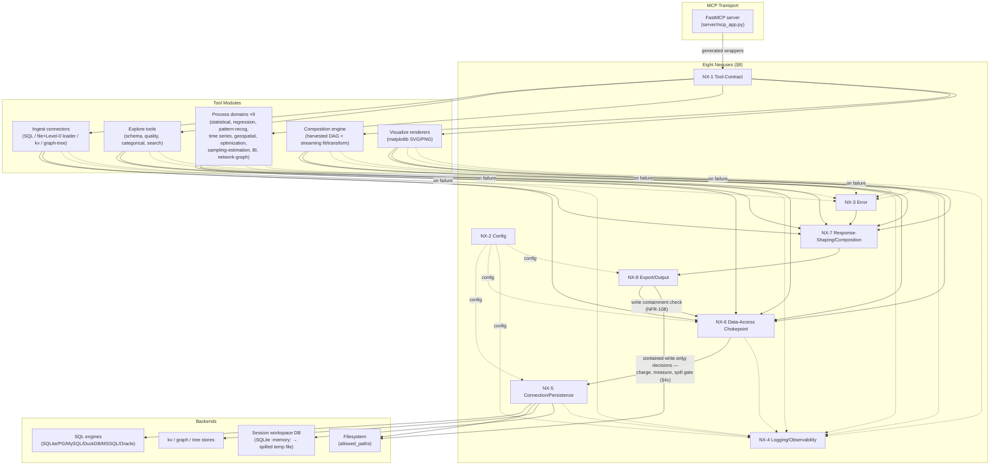
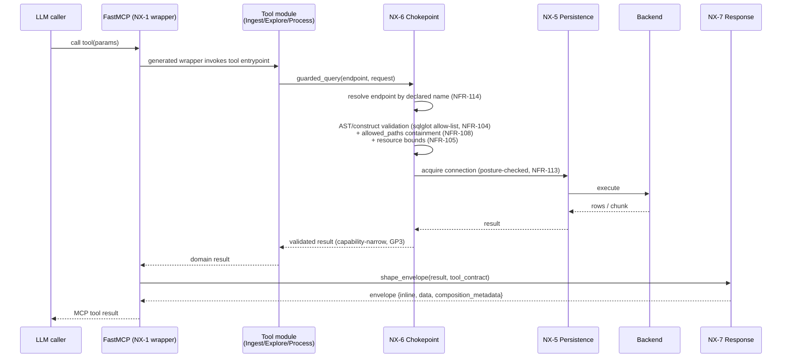
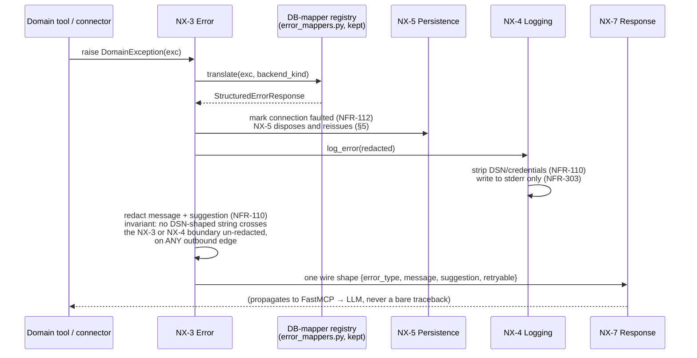

# LocalData MCP v3 — ARCHITECTURE.md

**Status:** RE-OPENED (2026-07-24) for the Level-0 / Level-1 re-alignment — a targeted revision
of §§1–10 under the owner's explicit authorization, currently in its own `agentic-arch`
convergence loop. Everything outside the re-alignment's scope remains as it converged and locked
on 2026-07-22 (`agentic-arch` closed after 3 rounds: 57 → 36 → 0 substantive findings, all seven
audit disciplines converged in round 3). This document is Design Authority for `agentic-prd`; the
re-opened sections become Design Authority again when this loop converges (coding.md#first-principles
— locked is not immutable, it changes only by re-running its convergence loop).
**Input documents (consumed in full):** `tmp/v3/REQUIREMENTS.md` (converged, round 4),
`tmp/v3/PROJECT-FP.md` (FP1–FP4 adopted), `tmp/v3/PLAN.md`, `tmp/v3/MISSION.md`,
`tmp/v3/audit/AS-IS-CONSOLIDATED.md`, the `main` tree (`165956fb`, package `2.1.0`), and — for
this revision — `tmp/harvest-review-main.md` (the five-dimension read-only harvest of `main` plus
its v3 cross-check) and `code_review.md` (the audit SSOT; CR-039..044's structural diagnosis is
what forced this re-open).
**Scope:** this document is Design Authority for `agentic-prd` once locked (coding.md#first-principles).
It resolves REQUIREMENTS §6(c)/(d)/(i) concretely, finalizes the §6(b) core/extras manifest as a
`pyproject.toml` shape, and names all 9 nexuses (merged to 8 anchors) as Arch GP per PLAN decision 3.

---

## 1. Overview

LocalData MCP v3 is a **single-process, single-operator, stdio MCP server** that gives one LLM
caller direct Ingest / Explore / Process / Output / Visualize capability over local and
network-reachable data, replacing ad-hoc one-off Python scripts the agent would otherwise write
(MISSION §"Mission statement"). It speaks the Model Context Protocol over stdio via FastMCP; it is
not a network service, not multi-tenant, and not a dashboard (REQUIREMENTS §1 non-goals).

**Architectural style: a nexus-anchored modular monolith.** One Python process, one dependency
graph, organized as independent tool modules (Ingest connectors, Explore reports, nine Process
domains, Visualize renderers) that share **zero private state** and instead route every
cross-cutting concern through one of eight non-optional internal nexuses (§8). This is the direct
structural answer to the AS-IS finding that `main` is "not one architecture but three fused at a
4,317-LOC god-class" (`AS-IS-CONSOLIDATED.md` §1) — v2's constitution declared five *behavioural*
principles and zero nexuses, so every shared concern grew two-or-more competing implementations,
later bridged rather than unified (T1–T14). v3 inverts that: nexuses are established **first**, at
this phase, and every subsequent feature is required to route through them (FR-401 fully — NFR-401,
NFR-402).

**Why this style, not a service-oriented rewrite:** the mission is explicitly single-operator/
single-caller (§1 non-goals); splitting into services would add a distribution/auth surface the KISS
security model (PROJECT-FP #2) does not need and MISSION does not ask for. A modular monolith gets
the benefit AS-IS actually needs — one owner per concern, no dead-rich-stack/live-thin-shim
twins (T4) — at the lowest architectural cost, honoring coding.md's minimal-intervention first
principle applied at the system level (coding.md#first-principles, FP6).

**Two layers, named explicitly.** LocalData is a **Level-0 SQL channel** under a **Level-1
analysis pipeline**, and the boundary between them is where each layer's memory story lives.

- **Level 0 — the SQL channel (load + query).** One channel makes *every* tabular source
  SQL-queryable. A declared database endpoint is queryable because it is a database; a flat file
  (CSV/TSV/Excel/Parquet/Feather/Arrow/HDF5/ODS/Numbers) becomes queryable because Level 0
  **loads it into a table in a session-scoped SQLite workspace database** — so the LLM reads a
  spreadsheet with the same `query` tool it reads PostgreSQL with, and **JOINs across several
  loaded files** because they are tables in one database (§5's workspace model, §4c's load flow).
  Level 0's memory posture is the genesis's *assume the flat file fits*: the load starts in
  `:memory:` and **migrates to an on-disk temporary database the moment measured residency says
  it does not fit** — the temp DB is the intended overflow, not a failure mode (GP9, §4c, §7).
- **Level 1 — the analysis pipeline.** Composition orchestrates registered tools as a validated
  DAG (§6.3); the analytical steps inside it are sklearn-compatible estimators, `partial_fit`-capable
  where they stream (GP10). **Streaming lives here** — a chain whose stages all declare
  `streaming_capable` consumes its source chunk by chunk, so a pipeline can chew through data
  originating from a large *database*, not merely from a file. That, not upfront file admission, is
  the large-scale memory safety.
- **The seam between them.** The caller's query **is the first pipeline step** — a chain-initial
  stage with `input_shape=NONE` — and it is fully LLM-controlled. LocalData's contribution at the
  seam is minimal support plus graceful, refinement-oriented error management, so the LLM adjusts
  the query and re-issues rather than being retried at by machinery it cannot see (§6.3).
- **Result delivery** is cached and chunked so a result never overwhelms the caller's *context*:
  the inline/stream cutover is decided on a **measured render** — rows, bytes, and tokens (§5).

This framing is a correction, not a new ambition. The harvest (`tmp/harvest-review-main.md` §D1)
established that `main` shipped Level 0 — flat files really were streamed into SQLite tables
(`file_processor/engine.py:82-104`) and served through the same SQL channel as databases — and
that v3 dropped it: the v3 tree contains **zero `to_sql` and zero `:memory:`** (verified by
whole-tree grep for this revision), and `query_file` is gated to `.db/.sqlite/.duckdb` suffixes
(`ingest/connectors/file/tools.py:39-45`), so a CSV cannot reach SQL at all. What replaced it —
`read_file` materializing a whole `pd.DataFrame` behind an upfront metadata size estimate — is the
abstraction `code_review.md`'s Round-5 structural diagnosis retired: upfront estimation cannot
soundly bound post-materialization memory across the 14-format × engine × dtype space (CR-039..044,
PAUSED because this design replaces the surface rather than extending it).

**Relationship to `main`:** v3 is a rewrite+harvest big-bang (PLAN decision 1) off `main`, not an
incremental patch. Salvageable assets (AS-IS §7 — sub-100ms discovery, real CSV/Parquet/SQL
chunking, the memory-budget *accounting* design — v3's **residency ledger**, §5.3, and not the
upfront estimator that sat in front of it — the DB-mapper error registry, the `connection_manager/`
mixin design, the L3 test-client shape) are kept and rebuilt on top of the new nexus boundaries;
dead masses (AS-IS §6 — `pipeline/integration/**`, `domains/time_series_analysis/`, the enhanced
manager, the dead `SecurityManager`) are harvested for design and then deleted (FR-605/FR-607).

---

## 2. Guiding Principles (Arch GP)

Ten principles, each refining the chain above it (global FP → coding-domain FP → PROJECT-FP
#1–#4 → this project's constitutional five in `CLAUDE.md`) with **zero contradiction** — validated
upward inline. GP8–GP10 were added by the 2026-07-24 Level-0 re-alignment; GP5 was amended by the
same pass. Once this document locks, these are
Design Authority for `agentic-prd` (coding.md#first-principles, Design Authority). (Round-1 note:
the former GP7 "Honest capability surface" restated the substance of the deliberately *downgraded*
FP5, which holds requirement rank, not principle rank — listing it as a numbered Arch GP would
have re-elevated it by the side door. It is now an enforcement note in §8's introduction, and the
former GP8 is renumbered GP7.)

**GP1 — Nexus-or-nothing.** Every cross-cutting concern (§8's eight anchors) has exactly one owning
module; any component needing it imports the nexus and never grows a private copy. A functional
duplicate is a MUST-FIX defect, not a variant.
*Upward check:* direct instantiation of coding-domain FP4 (Anchored Architecture) and PROJECT-FP #3
("no truth declared twice") for THIS project's concrete nexus set — no conflict, that is exactly
what PROJECT-FP #3 asks `agentic-arch` to do.

**GP2 — One declaration, generated everything.** A tool's contract (name, params, types, input/
output type-shapes, docstring) is authored once as data; the FastMCP schema, the wrapper, the
generated docs, and the docstring are all derived, never hand-duplicated (FR-701/704).
*Upward check:* refines PROJECT-FP #3's "flagship" nexus statement into the concrete generation
mechanism §6 specifies; no conflict.

**GP3 — Chokepoint-or-refuse.** Every data-touching call (read or mutate, SQL or non-SQL, backend
read or filesystem write) crosses `guarded_query`/`guarded_mutation` or NX-6's path-containment
service; resource and security failures are fail-safe, never fail-open; the KISS 2×4 matrix (two
assets × four threats) is the **only** frame for what gets built here — a control mapping to no
cell is deleted, not kept "just in case" (NFR-101). Corollary invariant: every object a chokepoint
call hands back to a tool module (`guarded_query`/`guarded_mutation`'s `Result`) is
**capability-narrow** — it exposes no `execute()`, no underlying `Engine`, no live cursor — so
holding a returned object never confers the ability to issue an unguarded operation; live
connection handles exist only at NX-6's internal boundary with NX-5 (§6.2) and appear in no
caller-facing return. Unbypassability is enforced twice: statically
(the import-graph test) and structurally (nothing reachable from a permitted import can execute
backend I/O outside NX-6).
*Upward check:* direct instantiation of PROJECT-FP #2; no conflict — this is PROJECT-FP #2's own
"implementation implications" restated as an architectural rule.

**GP4 — Correct-even-when-meaningless.** Composition returns the arithmetically right result of
what was asked, even when the composed analysis is domain-nonsensical; compatibility is a
declared, pre-execution-checked type-shape (FR-606), never a runtime discovery.
*Upward check:* direct instantiation of PROJECT-FP #1; no conflict.

**GP5 — Proven at the seam, and every mechanism names its caller.** A capability does not exist
until an L3 (MCP-protocol-seam) `fastmcp.Client` test exercises it against a real backend; unwired
or dead code is deleted, not left "for later" — the opposite of AS-IS's 40.5%-dead-tree finding.
**Amended 2026-07-24, the caller clause:** the project's *dominant* defect class is not dead
capability but **a well-built guard with no caller** — complete, config-backed, unit-tested,
threaded through five signatures, and never invoked. The harvest found eight instances across both
trees (`DiskMonitor`, `StagingManager`, `StreamingSQLSource`→pipeline, `_check_file_modified`,
`ShimRegistry`, `data_artifacts`, `execute_streaming`, and v3's own chain-initial handoff —
`tmp/harvest-review-main.md` §Synthesis 2), and this document's own review found a ninth
(`evict_idle_streams`, `surfaces_stream.py:233`, zero production callers; §5). So: **every guard,
gate, budget, sweep, or admission this architecture names states (a) the caller that invokes it on
the live path and (b) the test that turns red if that caller disappears.** A mechanism specified
without both is not under-documented — it is the defect being corrected, written down in advance.
The two are stated together in §8's per-nexus Owns lists and per-mechanism in §5/§6.
*Upward check:* direct instantiation of PROJECT-FP #4, and of coding.md#brownfield-adoption's
"survey the wiring before you wire it" — map the live-vs-dead call paths first, because code that
type-checks and unit-passes while the real wire stays dead is the exact failure. No conflict; the
amendment narrows GP5 rather than widening it.

**GP6 — Harvest the design, not the code.** Dead-but-capable subsystems (`pipeline/integration/**`,
`domains/time_series_analysis/`) are read for their proven logic and rebuilt **inside** the nexus
boundaries; reviving them wholesale is rejected because it would import their no-nexus assumptions
along with their logic (AS-IS §1's own recommendation).
*Upward check:* refines coding-domain FP6 (minimal-intervention) read at the *system* level:
rebuilding 26k LOC of unanchored framework as a black box is the larger, more failure-prone change;
harvesting its logic into ~8 well-bounded nexus modules is the smaller one for the same
capability. No conflict with PLAN decision 2, which names exactly this disposition.

**GP7 — Decompose by concern, never by accretion.** No class or module may own more than one
nexus's worth of responsibility; the `DatabaseManager` god-class pattern (registration + dispatch +
connection lifecycle + security + streaming + 70 of the 71 tools in one 4,317-LOC class,
`server/database_manager.py`) is structurally forbidden in v3 — modules are sized and split per
coding.md#code-size, with size limits triggering a responsibility review, not a mechanical split.
*Upward check:* refines coding-domain #readability and #code-size read together with GP1; no
conflict — a god-class is definitionally a nexus violation (it *is* several nexuses at once).

**GP8 — One SQL channel; a file becomes a table.** Every tabular source reaches the caller through
the same channel: SQL over a named endpoint. A flat file is not a second, weaker retrieval mode —
Level 0 **stages it into a table in the session workspace database** (§5), so the caller queries
it, filters it, aggregates it, and JOINs it against other loaded files with ordinary SQL. It
follows that the *engine*, not an in-process DataFrame, is what holds a loaded dataset; that
projection and predicate work happens in the engine rather than in Python; and that "this file is
too big to read" becomes "this query returns too many rows", which is a refinable statement the
caller can act on.
*Upward check:* refines the project's constitutional Principle 1 (Intention-Driven Interface — the
LLM asks an analytical question, it does not choose a retrieval mechanism) and Principle 4
(Streaming-First — an engine-side query is the streaming form of a file read); refines GP1 by
giving Level-0 retrieval exactly one owner instead of a SQL path and a parallel file path. It
narrows the surface rather than adding one, so no conflict with coding-domain FP6
(minimal-intervention): the alternative — keeping `read_file`'s whole-file materialization *and*
adding SQL over files — is the larger, two-truth change.

**GP9 — Resource bounds are measured, never predicted.** Every memory, disk, and context bound in
this architecture is decided from **an observation taken after the bytes exist** — the SQLite
workspace's own `page_count × page_size`, a batch's `memory_usage(deep=True)`, the measured free
bytes on the spill volume, the actual rendered length of a response — never from metadata about
data not yet materialized. **Upfront metadata estimation as an admission gate is retired**, not
re-tuned: it is unsound in principle (`code_review.md` Round-5 structural diagnosis) because a
type-aware estimate must enumerate every materialization cost correctly and is therefore leaky,
while a type-blind worst case cripples legitimate files. The price of measuring is that a bound is
crossed *slightly* before it is enforced; the design pays it by bounding the **granularity of the
step between two measurements** — one batch, whose own residency is itself measured — so the
overshoot is one bounded batch rather than one unbounded file. The irreducible floor is one row
(§5): a single row larger than the budget cannot be refused before it materializes, and that is
declared rather than papered over.
**The gap *between* two measurements is closed structurally, not by a third measurement.** Round-1
audit found the one place where GP9 was asserted but not held: the batch write itself allocated
between the pre-write charge and the post-write residency read, and pandas `to_sql` peaked at 35.6×
the charged amount on ordinary numeric data (`tmp/arch-workspace/supervisor-verification.md`). The
answer is not a multiplier and not a bigger instrument — it is a **write primitive that does not
materialize** (§7's write-primitive row): `executemany` fed a lazy row iterator holds its traced
peak flat (~0.008 MB) across a 16× growth in row count, so there is no unmeasured spike left
between the two measurement points and GP9 holds on this path **by construction**. That makes the
non-materialization property load-bearing, which is why §5 states it as a named invariant with a
test that fails if it regresses rather than as an implementation preference.
**GP9's scope is stated here, because a principle with unstated exceptions is not zero-contradiction
and round 1 found three places the universal quantifier did not survive contact with the document.**
The rule has a precise form and two boundaries:
*(i) A bound on quantity Q is decided from an observation of Q itself, taken after the bytes exist —
never from a prediction of Q derived from a different quantity R.* This is what the retired
estimator did: it predicted **memory** (Q) from **container metadata** (R), and every unmodelled
cell of the format × library × dtype cross product failed open. It follows that
`workspace.whole_parse_max_file_bytes` is **inside** GP9 rather than an exception to it, even though
it reads a compressed byte count and even though that is the same number `main` used: it bounds
*file bytes* from *measured file bytes*, Q against Q, and the design says in three places (§4c's
regime-2 row, §7's not-claim 2, §10's residual) that it is **not** a memory bound and that regime 2
has no memory bound to offer. The defect was never reading `st_size`; it was letting `st_size` stand
in for a quantity it cannot predict.
*(ii) GP9 governs quantities **this process can observe**.* The caller's context consumption is not
one of them — token counts belong to a tokenizer in another process, chosen by the operator's
client. So `response.inline_max_tokens` is not an exception smuggled past the principle either: the
design measures the one quantity it *can* measure (the rendered character count of a real render,
§5.9) and converts with `response.chars_per_token`, a **declared, conservative, NX-2-visible
assumption at a boundary the process cannot see across** — which is exactly why it is a config field
rather than a constant, so it is arguable instead of hidden.
*And the one genuine exception the audit found is removed rather than scoped around:* the
retrieval-side aggregate accounting used to extrapolate a chunk's residency per-row from one
measured chunk — a prediction of Q from R by any reading. It is deleted; every buffered chunk is now
measured exactly, on the same terms as every load batch (§5.9).
*Upward check:* direct instantiation of PROJECT-FP #4 (proven, not assumed) and of the global
"Leverage Existing & Evidence" first principle; refines GP3's fail-safe clause by fixing *what*
the gate may read. It supersedes no locked decision — NFR-105 mandates a fail-safe memory bound and
never mandated an estimator; the estimator was one implementation of it, now replaced.

**GP10 — Composition orchestrates tools; sklearn is the step contract.** The composition backbone
stays v3's validated tool-DAG (`process/composition/`): pre-execution whole-chain validation, named
stage failures, no partial runs. The **analytical steps** inside it are sklearn-compatible
estimators — `partial_fit`-capable where they stream, carried by `SklearnStreamingAdapter`
(`process/composition/streaming_exec/sklearn_adapter.py:22-31`), which refuses a non-`partial_fit`
estimator rather than faking incremental learning.
*This is the one principle that reinterprets rather than implements the stated genesis, and it is
deliberately isolated so it can be reversed by editing this principle alone.* The genesis names
scikit-learn *pipelining* as the composition mechanism. Literal `sklearn.pipeline.Pipeline` cannot
satisfy the genesis's own streaming requirement: `fit`/`transform` are whole-dataset by contract,
which is exactly why `main`'s streaming was theatre and its chunked fit semantically wrong (chunk 1
got a full `super().fit()`, later chunks `partial_fit`, so a `StandardScaler` was fitted on chunk 1
alone — `pipeline/core/streaming.py:651-678`). Only `partial_fit` streams. **Reversal, stated
concretely:** flipping to a literal sklearn backbone means replacing `dag_spec.py` + `scheduler.py`
+ `stage_runner/` with `Pipeline` construction and accepting that pre-execution chain validation
and chain-wide streaming both go away; nothing else in this document depends on the choice, because
the DAG is consumed only behind `compose_pipeline`'s contract (§6.3) and the estimators are
consumed only behind the step contract.
*Upward check:* refines PROJECT-FP #1 (GP4's correct-even-when-meaningless composition) and the
project's constitutional Principle 5 (Modular Domain Integration); it does **not** contradict a
higher scope, because the genesis is an owner's intent statement, not a principle in the chain —
and where an intent statement is structurally unsatisfiable, coding-domain FP3 (Design Authority)
directs us to resolve from Guiding Principles rather than implement the letter into a known defect.
Flagged in §10 as the highest-reversal-value decision this revision makes.

---

## 3. Component Map


```mermaid
graph TB
    subgraph Transport["MCP Transport"]
        FMCP["FastMCP server<br/>(server/mcp_app.py)"]
    end

    subgraph NX["Eight Nexuses (§8)"]
        NX1["NX-1 Tool-Contract"]
        NX2["NX-2 Config"]
        NX3["NX-3 Error"]
        NX4["NX-4 Logging/Observability"]
        NX5["NX-5 Connection/Persistence"]
        NX6["NX-6 Data-Access Chokepoint"]
        NX7["NX-7 Response-Shaping/Composition"]
        NX8["NX-8 Export/Output"]
    end

    subgraph Domains["Tool Modules"]
        ING["Ingest connectors<br/>(SQL / file+Level-0 loader / kv / graph-tree)"]
        EXP["Explore tools<br/>(schema, quality, categorical, search)"]
        PROC["Process domains ×9<br/>(statistical, regression, pattern-recog,<br/>time series, geospatial, optimization,<br/>sampling-estimation, BI, network-graph)"]
        COMP["Composition engine<br/>(harvested DAG + streaming fit/transform)"]
        VIZ["Visualize renderers<br/>(matplotlib SVG/PNG)"]
    end

    subgraph Backends["Backends"]
        SQLB["SQL engines<br/>(SQLite/PG/MySQL/DuckDB/MSSQL/Oracle)"]
        FILEB["Filesystem<br/>(allowed_paths)"]
        KVB["kv / graph / tree stores"]
        WSB["Session workspace DB<br/>(SQLite :memory: → spilled temp file)"]
    end

    FMCP -->|"generated wrappers"| NX1
    NX1 --> ING & EXP & PROC & COMP & VIZ

    ING & EXP & PROC & COMP & VIZ --> NX6
    NX6 -->|"also: Level-0 staging decisions —<br/>charge, measure, spill gate (§4c)"| NX5
    NX5 --> SQLB & FILEB & KVB & WSB

    ING & EXP & PROC & COMP & VIZ --> NX7
    NX7 --> NX8
    NX8 -->|"write containment check<br/>(NFR-108)"| NX6
    NX8 -->|"contained write only"| FILEB

    ING & EXP & PROC & COMP & VIZ -.->|"on failure"| NX3
    NX3 --> NX7

    ING & EXP & PROC & COMP & VIZ -.-> NX4
    NX5 -.-> NX4
    NX6 -.-> NX4

    NX2 -.->|"config"| NX5 & NX6 & NX4 & NX8
```

### Per-component responsibility, boundary, must-not

| Component | Responsibility | Boundary | Must NOT |
|---|---|---|---|
| **FastMCP server** (`server/mcp_app.py`) | Process entrypoint; owns fd 1 (stdout) exclusively for JSON-RPC frames; registers tools generated by NX-1; orchestrates startup/shutdown nexus init order (§4e). | Transport only. | Contain tool logic, connection state, or a second logging path. |
| **NX-1 through NX-8** | Own their concern exclusively (§8). | Internal API only; never expose HTTP/network surface. | Be bypassed; grow a second implementation elsewhere. |
| **Ingest connectors** | Translate a backend-specific read into a **bounded batch iterator** the rest of the system consumes — for SQL endpoints a cursor's `fetchmany` loop (`nexus/chokepoint/execution.py:132-147`), for flat files the per-format batch readers Level 0 stages into workspace tables (§4c). Declare their type-shape and `streaming_capable` to NX-1. | One connector per backend family; no cross-connector logic. The **construction of a batch generator** is the connector's; **every decision about those batches** — charge, measurement, spill gate, abort — is NX-6's, and **every operation on the workspace database** that executes those decisions is NX-5's (§5's ownership rule, §8). The connector hands NX-6 an iterator, never a path-plus-format for NX-6 to read (§6.2). | Hold its own connection object (all backend I/O crosses NX-6, which resolves endpoints against NX-5 internally — §6.2); implement its own security check (must cross NX-6); **materialize a whole file into one in-process frame as its normal mode** — a connector that cannot produce bounded batches declares itself whole-parse (§4c regime 2), it does not pretend otherwise. |
| **Explore tools** | Schema/quality/categorical/search reports over data obtained via NX-6 `guarded_query` against a named endpoint. | Read-only by construction. | Mutate state; duplicate NX-7's envelope shaping. |
| **Process domains** | Domain-specific analytical logic (fit/transform/predict), each a self-contained sklearn-compatible unit. | One package per domain (§9); no domain imports another domain's internals — cross-domain compatibility is expressed only via declared type-shapes (NX-1 / FR-606) and NX-7's composition-metadata channel. | Raise a bare exception to the transport (must go through NX-3); hold ad-hoc `eval`/`exec` on caller strings (NX-6 forbids it globally). |
| **Composition engine** | DAG construction, topological-sort scheduling, per-stage fit/transform across a chain of Process/Explore stages — streaming where a stage declares `streaming_capable`, materializing at the boundary of any stage that does not (§6.3); **shaping every stage's raw result into the handoff contract at one seam**, including NX-6's `Result` and `StreamOpened` (§6.3, CR-045). Topology and scheduling are harvested from `PipelineComposer`; the per-stage runtime is v3's tool-DAG, not `main`'s `DataSciencePipeline` (§7's sklearn row, GP10). | Orchestrates *existing* domain units; never contains domain logic itself. | Reimplement a domain algorithm; bypass NX-6/NX-7 for any stage's data access or result shaping; grow a second handoff conversion beside `_extracted_frame`. |
| **Visualize renderers** | Render a declarative chart spec to SVG/PNG bytes via matplotlib (object-oriented `Figure` + `FigureCanvasAgg` API, never `pyplot` global state) and hand the bytes to NX-8. | Rendering only — chart *construction* logic lives with the domain/Explore tool that requests a chart; sanitization and file output belong to NX-8 exclusively. | Sanitize or write artifacts itself (NX-8 owns the allow-list SVG sanitizer and the contained write path); retain a rendered `Figure` after the call returns (every render path disposes its `Figure` explicitly). |

---

## 4. Data Flows

### 4a. Happy path — connect → query → result, through the chokepoint

How a single tool call is served: the generated NX-1 wrapper dispatches to the tool module, every
backend touch crosses NX-6, and the result returns to the caller only through NX-7's one envelope.


```mermaid
sequenceDiagram
    participant LLM as LLM caller
    participant FMCP as FastMCP (NX-1 wrapper)
    participant Tool as Tool module<br/>(Ingest/Explore/Process)
    participant NX6 as NX-6 Chokepoint
    participant NX5 as NX-5 Persistence
    participant BE as Backend
    participant NX7 as NX-7 Response

    LLM->>FMCP: call tool(params)
    FMCP->>Tool: generated wrapper invokes tool entrypoint
    Tool->>NX6: guarded_query(endpoint, request)
    NX6->>NX6: resolve endpoint by declared name (NFR-114)
    NX6->>NX6: AST/construct validation (sqlglot allow-list, NFR-104)<br/>+ allowed_paths containment (NFR-108)<br/>+ resource bounds (NFR-105)
    NX6->>NX5: acquire connection (posture-checked, NFR-113)
    NX5->>BE: execute
    BE-->>NX5: rows / chunk
    NX5-->>NX6: result
    NX6-->>Tool: validated result (capability-narrow, GP3)
    Tool-->>FMCP: domain result
    FMCP->>NX7: shape_envelope(result, tool_contract)
    NX7-->>FMCP: envelope {inline, data, composition_metadata}
    FMCP-->>LLM: MCP tool result
```

### 4b. Error path — the Error nexus wire shape

How any exception becomes the one structured wire shape: NX-3 translates it, faults the connection
back into NX-5's lifecycle, and redacts **both** outbound edges — the log branch and the LLM-bound
message — before anything leaves the nexus.


```mermaid
sequenceDiagram
    participant Tool as Domain tool / connector
    participant NX3 as NX-3 Error
    participant Map as DB-mapper registry<br/>(error_mappers.py, kept)
    participant NX5 as NX-5 Persistence
    participant NX4 as NX-4 Logging
    participant NX7 as NX-7 Response

    Tool->>NX3: raise DomainException(exc)
    NX3->>Map: translate(exc, backend_kind)
    Map-->>NX3: StructuredErrorResponse
    NX3->>NX5: mark connection faulted (NFR-112)<br/>NX-5 disposes and reissues (§5)
    NX3->>NX4: log_error(redacted)
    NX4->>NX4: strip DSN/credentials (NFR-110)<br/>write to stderr only (NFR-303)
    NX3->>NX3: redact message + suggestion (NFR-110)<br/>invariant: no DSN-shaped string crosses<br/>the NX-3 or NX-4 boundary un-redacted,<br/>on ANY outbound edge
    NX3->>NX7: one wire shape {error_type, message, suggestion, retryable}
    NX7-->>Tool: (propagates to FastMCP → LLM, never a bare traceback)
```

The `retryable` flag is **caller-advisory only**: v3 implements no retry/backoff machinery of its
own (KISS single-operator scope — the LLM caller decides whether to re-issue a call), so the flag
carries a judgment ("transient, safe to re-ask") with no in-process consumer, and no retry bounds
exist to configure. The same redaction invariant extends to NX-5's `HealthCheckResult` text on any
caller-facing path (§5): a failed health probe's message can embed the failing DSN and passes the
same DSN/credential stripping before it reaches a tool result.

### 4c. Level-0 load and the serving path — the honest per-format matrix

Two flows, one story: how a file **becomes a table** (the load, measured and spillable), and how a
result **leaves the process** (the serve, under the `ChunkRegistry`'s bounds). The 2026-07-24
re-alignment changes what the per-format matrix classifies. It no longer sorts formats into
*genuinely-streaming* versus *load-then-serve at the serving edge*; **serving is always SQL
streaming out of an engine**, so the matrix now classifies each format by **how it reaches a
table** — the only axis on which formats still genuinely differ:

| Regime | Formats | How it loads | What is bounded, and how |
|---|---|---|---|
| **1 — batched into a table** | CSV, TSV, Excel `.xlsx` (openpyxl `read_only` + `iter_rows`), Parquet (`ParquetFile.iter_batches`), Feather / Arrow (`RecordBatchReader`), HDF5 (dataset row-slicing) | the connector yields bounded batches; NX-6 charges and measures each one and directs NX-5 to append it | **measured, per batch.** Peak in-process residency is one batch, measured with `memory_usage(deep=True)` before the write; workspace residency is measured with `page_count × page_size` after it. A high-expansion file is refused (or spilled) at the first over-budget batch, never after the whole file materializes. |
| **2 — whole-parse into a table** | ODS (`odfpy`), Numbers (`numbers-parser`), legacy `.xls`, JSON in record shape | the library's parse is atomic — it returns the whole object graph or nothing; the loader treats the parse result as a single batch | **declared, not claimed sound.** A coarse `workspace.whole_parse_max_file_bytes` pre-gate refuses very large inputs, and the parsed batch is measured before it is written. The pre-gate is a **file-size limit, not a memory guarantee** — that is stated in the tool's own generated docs, and it is why regime 2 is a named residual in §10 rather than a solved case. |
| **3 — not a table** | YAML, TOML, INI, XML, JSON in document shape | never enters the workspace; `read_file` returns the nested-mapping shape as today | bounded as today by the whole-parse pre-gate; these shapes have no SQL meaning, so Level 0 declines them rather than inventing a table for them. |

The regime is **declared per format in NX-1's inventory registry** (`nexus/contract/inventory.py`,
§7.2) — one declaration, consumed by the loader's dispatch, by the generated per-format docs, and
by NFR-202's battery, which asserts each cell against observed behaviour. **JSON is the one format
whose regime cannot be a constant** — it declares `shape_dependent`, and the loader resolves it once
per load from the parsed top-level shape: a record array becomes a table, any other shape returns
the document form (§7.2). Regime 1 is where the
compressed-container bombs live (CR-029/037/038 and the paused CR-039..044), and it is exactly the
set the measured-batch model makes sound: the estimator those findings kept defeating is not
re-tuned here, it is **deleted** (§7).

**Batch and chunk are two different units, and this document never uses them interchangeably.** A
**batch** belongs to the *load* flow: rows read out of a file and appended to a workspace table in
one `append()` call, sized by `workspace.load_batch_rows` and shrunk by the measured feedback below.
A batch never leaves the process. A **chunk** belongs to the *serve* flow: rows delivered to the
caller out of a `ChunkRegistry`, addressed by `chunk_id`, sized by the registry's resident K/B bound
and the inline cutover (§5.9). A chunk never enters the workspace. The one place the words meet is
pandas' own `chunksize` parameter, which §7 discusses only to reject it. Where a sentence says
"batch" the load path is meant; where it says "chunk" the serving path is.

**The load flow — `:memory:` first, on-disk when measurement says so.**

```mermaid
sequenceDiagram
    participant LLM as LLM caller
    participant Tool as load_file<br/>(ingest/connectors/file/tools.py)
    participant NX6 as NX-6 Chokepoint<br/>(staging + bounds)
    participant Batch as Batch reader<br/>(file/batches.py, per regime)
    participant WS as NX-5 WorkspaceStore<br/>(nexus/persistence/workspace.py)
    participant Led as Residency ledger<br/>(resource_bounds.py)

    LLM->>Tool: load_file(path, table=?, replace=?)
    Tool->>NX6: contain_path(path, mode="read") — NFR-108, before any read
    Tool->>Batch: batches(real, format, workspace.load_batch_rows)<br/>— a generator, not yet advanced
    Tool->>NX6: stage_batches(generator, table_name=…, source=…, replace=…)
    NX6->>NX6: evict idle streams + idle workspaces first (§5)
    NX6->>WS: ensure() — SQLite `:memory:`, StaticPool, PRAGMA auto_vacuum=FULL<br/>before the first table, query_only=ON, connection permits taken (§5)
    loop each batch
        Batch-->>NX6: batch N (regime 1: bounded; regime 2: the whole parse)
        NX6->>Led: charge measured batch bytes<br/>(memory_usage(deep=True))
        alt residency ledger refuses
            NX6->>NX6: a refusal asks for a spill first, it does not abort (§5.5)
            alt spill is available and its gate passes
                NX6->>WS: spill(target) — the charge is released, the load continues
            else already spilled, spill_dir unset, or the spill gate refuses
                NX6->>WS: DROP the partial table (the only undo — §5.5)
                NX6-->>LLM: structured NX-3 refusal, requires_refinement,<br/>naming the budget and the recovery
            end
        end
        NX6->>WS: append(table, rows, affinities) — batch 1 declares affinities;<br/>a later batch's conflicting storage class is RECORDED as mixed,<br/>never widened (§5.4); executemany over a LAZY row iterator,<br/>then COMMIT, so no transaction stays open (§5.5, §7)
        WS-->>NX6: residency = page_count × page_size (measured)
        NX6->>Batch: send() the next batch's row budget<br/>(shrink when the batch landed over load_batch_target_bytes)
        opt residency exceeds workspace.memory_budget_bytes
            NX6->>NX6: spill gate — measured free bytes vs min_free_disk_bytes,<br/>live spill total vs max_spill_bytes,<br/>contain_path(target, mode="write") — ONE owner (§5)
            NX6->>WS: spill(target) — O_EXCL 0600 pre-create,<br/>then VACUUM INTO that empty path
            WS-->>NX6: on-disk workspace live; `:memory:` handle disposed,<br/>its ledger charge released; registration swapped in place
        end
        NX6->>Led: recharge the workspace's current residency
    end
    NX6-->>LLM: load report {table, rows, columns, declared affinities,<br/>mixed columns + their typeof histograms,<br/>storage: memory or spilled}
```

Once the table exists, the caller reads it with `query(endpoint="workspace", sql=...)` — the same
tool, the same allow-list, the same cutover as any database (§4a). **A spill changes nothing the
caller can observe** except the `storage` field of the load report: the table name, the SQL, and
the results are identical, which is what makes the temp DB an overflow rather than a failure.

**One property of that SQL channel must be stated here rather than left to the affinity discussion,
because a reader will not infer it: an aggregate over a column holding mixed storage classes
silently coerces the non-numeric values to 0 and keeps them in the denominator.** Measured for this
revision (`tmp/arch-workspace/supervisor-verification.md`): a column of five integers `1..5` plus
two text values returns `avg(col)` = **2.142857** where the truth over the numeric values is
**3.0**, and `count(*) WHERE col > 1` = **6** where the truth is **4** — because TEXT sorts above
every numeric in SQLite's comparison order. This is a property of the aggregate, not of the declared
affinity, and it is the entire reason §5.4 makes the mixed-column signal a mandatory part of the
load result instead of a footnote.

**The serving flow — one registry, bounds unchanged.**

```mermaid
sequenceDiagram
    participant LLM as LLM caller
    participant NX6 as NX-6 Chokepoint<br/>(owns ChunkRegistry, §5)
    participant Src as Pull source<br/>(iter_frames over an NX-5 connection)
    participant NX5 as NX-5 Persistence
    participant Buf as Chunk buffer
    participant Led as Residency ledger

    LLM->>NX6: query(endpoint, sql) — or fetch_chunk(stream_id)
    NX6->>NX6: allow-list + posture + containment (§4a)
    NX6->>Src: peek the pull source
    Src->>NX5: fetchmany() over an NX-5-owned connection (never its own)
    NX6->>NX6: render the peek and MEASURE it —<br/>rows, bytes, tokens (§5, GP9)
    alt the measured render fits the inline budget
        NX6-->>LLM: inline Result; the connection returns immediately
    else it does not
        Src-->>Buf: chunk N — the reader pauses at the K/B bound<br/>and resumes on retrieval (backpressure, §5)
        Buf->>Led: charge measured residency; a refusal pauses the top-up
        Buf-->>NX6: buffer contents (the advertised count is derived<br/>from these at call time — T10)
        NX6-->>LLM: StreamOpened / ServedChunk
    else internal error in any bound check
        NX6-->>LLM: reject, fail-safe (NFR-105)
    end
```

### 4d. Composition/pipeline execution path

How a composed DAG runs: the chain is validated against the FR-606 registry before any execution,
**each chain-initial source's return value is shaped into the handoff contract at one seam**, each
stage's own data-touching operation re-crosses NX-6 with full checks, and the multi-leaf result is
a map of envelopes keyed by terminal stage name under one provenance chain.

**The handoff seam is the fix for CR-045** — the live defect where a query-first pipeline passes
whole-chain validation and *then* fails at runtime, which is precisely the failure the validation
exists to prevent ("No stage ran." is the promise, `process/composition/dag_spec.py`). The cause is
a contract gap, not a type slip: `run_stage` returns the tool implementation's raw result
(`stage_runner/runner.py:40,42`), the chain-initial ingest tools return NX-6's capability-narrow
`Result` or `StreamOpened` (`nexus/chokepoint/types.py:42-51,134-145`, both frozen dataclasses),
and the handoff contract models only `Mapping` (`stage_runner/results.py:53-59`). All 11 registered
chain-initial TABULAR sources are affected. The fix belongs in `_extracted_frame` — the one place
the handoff contract already lives — and is specified in §6.3.

```mermaid
sequenceDiagram
    participant LLM as LLM caller
    participant NX1 as NX-1 (compose_pipeline contract)
    participant CE as Composition engine
    participant Reg as FR-606 type-shape registry<br/>(owned by NX-1, §6.3)
    participant Stage as Process/Explore stage(s)
    participant NX6 as NX-6 Chokepoint
    participant NX7 as NX-7

    LLM->>NX1: compose_pipeline(dag_spec)
    NX1->>CE: validate dag_spec against ToolSpec schema
    CE->>Reg: check adjacent-stage type-shape compatibility
    alt incompatible chain
        Reg-->>CE: incompatible
        CE-->>LLM: structured Error-nexus rejection (FR-606), no partial run
    else compatible chain
        Reg-->>CE: ok
        CE->>CE: topological sort (harvested from PipelineComposer)
        loop each stage in order (linear chain + fan-out, no merge — §6.3)
            CE->>Stage: fit(data) / transform(data)  [streaming when the stage declares<br/>streaming_capable, else materializing — §6.1]
            Stage->>NX6: any backend read or file write the stage performs<br/>re-crosses NX-6 with full posture/paths/bounds checks (§8)
            Stage-->>CE: raw result — a Mapping, or NX-6's Result / StreamOpened<br/>from a chain-initial source
            CE->>CE: handoff shaping (§6.3): Mapping by shape; Result → frame;<br/>StreamOpened → drain under the residency ledger,<br/>or hand the chunk iterator on when every<br/>downstream stage declares streaming_capable
            CE->>NX7: propagate composition metadata to next stage
        end
        CE-->>NX7: one result per DAG leaf (terminal stage)
        NX7-->>LLM: {terminal_stage_name: envelope} map,<br/>single top-level provenance chain (§6.3)
    end
```

### 4e. Startup / shutdown

How the process boots: logging comes up twice (a minimal stderr-only bootstrap mode before config
exists, then a reconfiguration from validated NX-2 config), and NX-1's generated wrappers are
**imported**, never regenerated, on the startup path (§6.1 — generation is a build/CI-time step).

The fd-1 guard's mechanism is order-dependent, and its feasibility is **verified against the
installed transport, not assumed**: the MCP SDK's `mcp.server.stdio.stdio_server(stdin=None,
stdout=None)` accepts an injectable `stdout` AsyncFile (`mcp/server/stdio.py:34-49` in the
installed package) — the frame writer is *not* hardcoded to fd 1 — while FastMCP's high-level
`run_stdio_async` calls `stdio_server()` argless (`fastmcp/server/mixins/transport.py:207`),
wrapping `sys.stdout.buffer` at transport-start time. The guard therefore uses the SDK's
injectable seam: (1) `dup` the real stdout to a saved descriptor; (2) start the transport with
`stdout` bound over the *saved* descriptor (via the SDK parameter, driving FastMCP's low-level
`_mcp_server.run` — a wiring detail owed at PRD, the seam itself is proven); (3) `dup2` stderr
onto fd 1 and rebind `sys.stdout` to stderr, so stray Python *and* C-extension writes land on
stderr, never on the transport. The guard is the NFR-303 SHOULD; **the primary,
feasibility-independent gate is the whole-battery OS-level stdout-purity assertion** — no byte
reaches fd 1 except JSON-RPC frames, asserted across every battery run.

```mermaid
sequenceDiagram
    participant Proc as Process entrypoint
    participant NX4 as NX-4 Logging
    participant NX2 as NX-2 Config
    participant NX1 as NX-1 Tool-Contract
    participant NX5 as NX-5 Persistence
    participant FMCP as FastMCP

    Proc->>Proc: guard fd 1 (redirect any non-protocol writer to stderr, NFR-303)
    Proc->>NX4: init logging — bootstrap mode (stderr-only, minimal,<br/>enough to report a ConfigurationError)
    Proc->>NX2: load config (one path list, layered merge — §5)
    NX2-->>Proc: ConfigModel (validated, typed ConfigurationError on failure)
    Proc->>NX4: reconfigure from NX-2 (level/destinations, NFR-304) —<br/>stderr-only is the invariant floor NX-2 can refine, never move off
    Proc->>NX1: import committed generated wrappers<br/>(built at CI time by generate.py — no generation,<br/>no check_drift.py run, on this path)
    NX1-->>FMCP: generated wrappers registered
    Proc->>NX5: warm connection pool for declared endpoints (health-checked),<br/>each reserving its pool ceiling in connection permits —<br/>NX-2 already proved the arithmetic fits (§5)
    Proc->>NX5: reap orphaned workspace spill files — BEFORE this process<br/>can create one, so a file bearing our own recycled PID is<br/>reaped too (every localdata-workspace-&lt;pid&gt;-*.sqlite in<br/>workspace.spill_dir that is not this process's own live file, §5)
    FMCP->>FMCP: serve stdio loop
    Note over Proc,FMCP: shutdown: FMCP drains in-flight calls,<br/>NX5 closes/pools connections,<br/>NX4 flushes stderr logs, process exits
```

---

## 5. Data Model & Storage

This section is long because it carries the whole storage model; it is numbered so a cross-reference
can point at one paragraph instead of at 570 lines. **5.1** connections and sessions, **5.2**
ephemeral file connections, **5.3** the residency ledger (the accounting object every later
subsection charges), **5.4** the session workspace database, **5.5** spill, **5.6** temp-DB lifecycle
and crash safety, **5.7** the idle sweep, **5.8** the connection ceiling, **5.9** streaming buffers
and result delivery, **5.10** the results provenance store, **5.11** the config model and the fields
this revision adds.

### 5.1 Connection and session state (owned by NX-5)

A `ConnectionRecord` per declared endpoint:
`name` (operator-declared, never caller-supplied per NFR-114), `backend_kind`, `posture`
(read-only/read-write, NFR-113), `credentials_ref` (indirection into NX-2, never inlined —
NFR-110), `pool` (SQLAlchemy `Engine` or non-SQL client handle), `health` (`HealthCheckResult`,
harvested from `connection_manager/health.py` — its text passes the NX-3/NX-4 DSN-redaction
invariant before appearing in any caller-facing tool result, §4b), `resource_limits` (per-endpoint
timeout/max-conn, harvested from `connection_manager/resources.py`), and an explicit lifecycle
`state` field: `healthy | faulted | resetting | closed`. **NFR-112 reset semantics:** when an
operation on a connection raises, NX-3 marks the record `faulted` (§4b) and NX-5 performs
**dispose-and-reissue** — the faulted physical connection is discarded and the pool issues a fresh
one — rather than rollback-in-place, because a rollback can itself fail on a broken connection
while disposal cannot. The transition set is complete: `healthy → faulted` when NX-3 marks the
record on an operation exception (§4b); `faulted → resetting` when NX-5, re-entered on that same
error path, begins the dispose-and-reissue; `resetting → healthy` when the pool's fresh connection
is issued successfully; `resetting → closed` when the reissue itself fails (the endpoint is
unusable until the operator intervenes); and any state `→ closed` on shutdown or endpoint removal
(§4e). Granularity is record-level by declaration: the `state` field describes the endpoint's pool
as a whole, and a single-connection fault runs the `faulted → resetting → healthy` cycle only for
the duration of that one dispose-and-reissue — sibling pooled connections stay usable throughout,
and the record rests at `closed` only when the reissue itself fails. The documented consequence:
connection-session-scoped state (`SET`
statements, temp tables) does not survive a fault; v3's tools do not depend on such state, and the
guarantee NFR-112 needs (the follow-up query sees no partial mutation) holds by construction on a
fresh connection.

### 5.2 Ephemeral local-file connections

**They are a distinct lightweight type, not a `ConnectionRecord` variant.** Local file-engine sources (SQLite/DuckDB files) opened ad hoc by path within
`allowed_paths` (read-only default posture, NFR-114) get an `EphemeralFileConnection`: opened
per-call, never pooled, identity is the canonicalized path, no `name`, no `credentials_ref`, no
health probe. NFR-112 is vacuous for this type — there is no reuse to protect, because the
connection never outlives the call that opened it. Its two enforcement homes are stated, not
implied: **posture** — an ephemeral connection is read-only, period, unless an
operator-trust-layer (system/user, per the trust order below) NX-2 entry keyed by canonicalized
path or contained path prefix grants read-write; that entry is a security-relevant declaration
under the introduction rule below, so a project-layer file cannot mint it. **Resource limits** —
having no per-endpoint `resource_limits` record, an ephemeral connection inherits the global
NFR-105 defaults (timeout, concurrency — §6(g)) from NX-2, enforced at the same NX-6/NX-5 point
that enforces `ConnectionRecord` limits, so a runaway query over a large local file has the same
wall-clock owner as any declared endpoint.

### 5.3 The residency ledger — one object, one name

**Definition, stated once and used verbatim everywhere below.** The **residency ledger** is the
single process-wide record of how many bytes this process is currently holding resident on behalf of
callers, and the gate that refuses a new charge that would take the total over NFR-105's memory
ceiling. It has one implementation — the kept `MemoryBudget` machinery in
`nexus/chokepoint/resource_bounds.py` (fail-open defect fixed per NFR-105/203) — reached through one
charge/release pair, `reserve_load`/`release_load` (`surfaces_stream.py:145-158`), and one keyed
entry per live consumer: `load:<id>` for a Level-0 staging load, `composition:<pipeline_id>` for a
running pipeline's inter-stage data (`charge_composition`, `surfaces_config.py:73`), one per live
`ChunkRegistry`. **The keys differ; the ledger does not.** Its total is what every "the ledger
refuses" sentence in this document refers to.

The name is not invented here — it is the tree's own (`surfaces_stream.py:147`, *"reserve … on the
shared residency ledger"*). What this revision fixes is that the document had grown five aliases for
it — "aggregate ledger", "composition ledger", "the kept `MemoryBudget` machinery", "the
`reserve_load`/`release_load` ledger pair", "the memory-budget gate" — and the last of those named
**both** this object and the *deleted* upfront estimator, 700-odd lines apart, which made the
sentence "the ledger refuses" unresolvable. There is now one name. Where an older phrase survives
below it is because it is a verbatim quotation of superseded text, and it is marked as one.

Two distinctions the name has to carry, because both were being blurred:

- **The residency ledger is not the workspace's residency figure.** `residency_bytes` (§5.4) is one
  measurement of one database; the ledger is the process-wide total that measurement is charged
  *into*. A workspace spill releases the ledger charge and replaces it with the on-disk database's
  page-cache bound — the measurement changes, the ledger is the thing being updated.
- **The residency ledger is not the retired admission gate.** The deleted `admit_load` estimator
  family predicted a *file's* cost before reading it; the ledger records bytes that already exist.
  §7's deletion row is explicit that what survives is the ledger, not the estimate.

### 5.4 The session workspace database (Level 0's staging target)

> **Ownership, stated once and binding on every mention below (GP1).** **NX-5 owns the workspace
> database and every operation on it**; **NX-6 owns every decision about when those operations
> run.** NX-5's surface is five operations, reachable by NX-6 and by nothing else: `ensure()`,
> `append(table, rows, affinities)`, `residency_bytes()`, `spill(target_path)`, `drop(table)`.
> NX-6 does the charging, the residency comparison, the free-disk floor and aggregate-spill-cap
> gate, the `contain_path` check on the spill target, and the abort decision — then calls one of
> those five. **NX-6 never touches the workspace backend directly** (which is why §3's component
> diagram routes Level-0 staging through NX-5 like every other backend touch, and why the earlier
> "the record is NX-5's, the staging is NX-6's" split — which left the spill disk gate with two
> owners, §8 giving it to NX-6 and §5's config table to `WorkspaceStore.spill()` — is superseded
> by this paragraph). The rule generalizes the one already governing every other endpoint: NX-6
> decides, NX-5 holds the handle (§6.2).

Exactly **one** workspace database exists per server process — a `WorkspaceRecord` held
by NX-5 (`nexus/persistence/workspace.py`, §9) under the **reserved endpoint name `workspace`**,
created lazily on the first `load_file` and disposed at shutdown or idle TTL. One database, not one
per file, is what makes the genesis's cross-file JOIN ordinary SQL: every loaded file is a *table*
in it, so joining two CSVs is a two-table `SELECT` rather than a capability the system has to grow.
It also settles the `ATTACH` question that blocked `main` (`query_parser.py:57` refused attachment
outright, so `main` could join sheets of one file but never two files): with one database there is
nothing to attach, and `ATTACH` stays refused on the read path exactly as §7's allow-list has it.

**`WorkspaceRecord` IS a `ConnectionRecord` variant — and that is what makes `query(endpoint=
"workspace")` work at all.** The document previously left this unstated, and unstated it does not
work: `guarded_query`/`guarded_mutation` resolve a name through `PersistenceNexus.record()`
(`nexus/persistence/manager.py:97-101`), which reads the `self._records` map populated only from
`config.endpoints` at `warm_up()` (`:60-81`). A lazily-created record of some *other* type is not
in that map, so the flagship Level-0 call would raise `UnknownEndpointError` and the read-only
posture check the security argument rests on would never execute. Three concrete consequences,
each chosen rather than left to the implementer:

- **It is a variant, not a sibling type.** `WorkspaceRecord` carries every `ConnectionRecord`
  field (`name="workspace"`, `backend_kind="sqlite"`, `posture=read_only`, `credentials_ref=None`,
  `pool` = the workspace engine, `health`, `resource_limits`, lifecycle `state`) plus the
  workspace-only fields below, and it lives **in the same `_records` map under the same key
  discipline**. So resolution is the ordinary lookup with no special case, the NFR-112 lifecycle
  applies unchanged, and `endpoint_summaries()` — hence `list_endpoints` — enumerates it for free.
  This is deliberately the *opposite* disposition from `EphemeralFileConnection`, which is **not**
  a variant precisely because it is never in the map (identity is a canonicalized path, opened and
  discarded per call). The discriminator is map membership, and the two cases sit on opposite
  sides of it.
- **`ensure()` inserts it; disposal removes it.** `WorkspaceStore.ensure()` — the same call that
  builds the `:memory:` engine and takes its connection permit — inserts the record under the
  reserved name; idle-TTL eviction and shutdown remove it. Before the first `load_file`, resolving
  `workspace` does **not** produce a bare `UnknownEndpointError`: NX-2 has reserved the name, so
  NX-6 knows it is legitimate-but-empty and returns a structured NX-3 refusal naming `load_file`
  as the recovery — the same refinement-oriented shape every other resource refusal carries.
  Caller: `PersistenceNexus.record()`'s miss branch on the reserved name. Test that fails if the
  caller disappears: `query(endpoint="workspace", …)` on a fresh process asserts the structured
  "nothing loaded yet, call load_file" refusal, and asserts it is **not** the unknown-endpoint
  error.
- **`list_endpoints` shows it once it exists, and not before.** It renders as an ordinary row
  (`name=workspace`, `backend_kind=sqlite`, `posture=read_only`, healthy), extended with
  `storage: memory | spilled` and the loaded table names — because an LLM that has staged three
  files must be able to discover them, and a workspace reachable only by a magic string nothing
  enumerates is exactly the undiscoverable surface `list_endpoints` exists to prevent. Test: load
  a file, assert the workspace row and its table appear in `list_endpoints`; assert they are
  absent on a process that has loaded nothing.

The record's fields, and the rules that make each of them mean something:

- **`name`** is the literal reserved string `workspace`. It is **not caller-minted**, so NFR-114
  holds unchanged: the caller may *name* the workspace, exactly as it names an operator-declared
  endpoint, and may not create endpoints. The name is reserved at NX-2 validation time — an
  operator declaration called `workspace` is refused as a collision with a structured
  `ConfigurationError`, so the reserved name can never be shadowed.
  **The literal has one home, and this document names it because every use site is new** — verified
  for this revision, the string `"workspace"` does not appear anywhere in `src/` today. It has four
  consumers (NX-2's collision check, `PersistenceNexus.record()`'s legitimate-but-empty miss branch,
  `WorkspaceStore.ensure()`'s record insertion, and `list_endpoints`' rendering), which is three
  chances to typo it into a silent mismatch. It is declared **once in NX-2**, beside the config
  validation that reserves it, and imported by the other three: NX-5 already imports NX-2 for
  configuration, so this adds no import edge and no cycle, while homing it in NX-5 would force the
  config nexus to import persistence and create one. **Test that fails if it is restated:** the
  reserved-name collision test and the `query(endpoint="workspace")` resolution test both address the
  endpoint through the imported constant, so a second literal anywhere makes one of them fail rather
  than quietly diverge.
- **`posture` is `read_only`, and it is enforced by the engine, not only by a check.** A SQLite
  `:memory:` database is *per connection*, so the workspace is one engine over a `StaticPool`
  single connection (the harvested `StaticPool + check_same_thread=False` pattern, already carried
  at `nexus/persistence/engines.py`) — a second, read-only engine on the same URL would be a
  second, *empty* database, not a read-only view of this one. So the usual mechanism (posture
  applied at engine creation, §7's persistence row) cannot be used as-is. The structural
  replacement is **`PRAGMA query_only=ON`, set on that one connection at `ensure()` and held ON as
  its resting state**; NX-5's write operations (`append`, the affinity DDL, `drop`, and the
  `spill`) toggle it OFF for exactly the duration of the operation and restore it before
  returning. `PRAGMA query_only` is per-connection and settable at runtime, which is precisely why
  it fits a single-connection database. The consequence is that a statement arriving through
  `guarded_query` executes against a physically read-only connection: a hypothetical escape from
  NX-6 gets `SQLITE_READONLY` from the engine rather than a mutated workspace. NX-6's posture
  check (`surfaces_query.py:63-68`, which refuses `guarded_mutation` on the workspace) and the SQL
  allow-list's exclusion of DDL (§7) remain as the outer layers — the same defense-in-depth shape
  §7 already uses for the SQL deny-set — but the *guarantee* is the engine's.
  **Caller:** NX-5's `WorkspaceStore`, at `ensure()` and around each of its four write operations.
  **Test that fails if the caller disappears:** obtain the workspace connection directly from NX-5,
  bypassing NX-6 entirely, issue an `INSERT`, and assert `SQLITE_READONLY` — red if the pragma is
  dropped, and red if a write operation forgets to restore it. Two consequences are declared:
  reads and loads on the workspace serialize on that single connection (acceptable and intended
  for a single-operator stdio server), and the toggle windows are safe *because* of that
  serialization — no read can execute while a write holds the connection.
- **`storage`** is `memory | spilled`, and **`spill_path`** is set only in the second state.
- **`residency_bytes`** is the **measured** figure `page_count × page_size`, read from the live
  database after every batch write. This is the observation GP9 is built on: it is SQLite's own
  count of pages it has actually allocated, so it is blind to nothing — a BLOB column, a nested
  list flattened into text, a pathologically wide row all land as real pages. It replaces the
  entire upfront-estimator surface (`ingest/connectors/file/readers.py`'s
  `_EXPANSION_FACTOR` / `_logical_materialization` / `_arrow_array_bytes` / `_hdf5_materialization`
  machinery), which §7 deletes rather than extends.
  **The measure needs one pragma to be honest, and this design sets it: `PRAGMA
  auto_vacuum=FULL`, at `ensure()`, before the first table exists.** Without it the figure
  **ratchets**: `page_count` does not shrink when a table is dropped, so the design's *own* abort
  path inflates it permanently — measured directly for this revision, 1058 pages before a
  `DROP TABLE` and 1058 after, with `freelist_count` = 1057 of them free
  (`tmp/arch-workspace/supervisor-verification.md`). N refused loads would leave the workspace
  measuring at its high-water mark while holding no rows, so the next perfectly legitimate load
  spills — or, with `spill_dir` unset, refuses — for no reason at all. That is not a tuning nit:
  the ratchet is triggered by the design's own named failure path, so the first adversarial test
  of the abort path hits it. With `auto_vacuum=FULL` the same sequence reclaimed 1059 of 1060
  pages. **The rejected alternative is `(page_count − freelist_count) × page_size`**, which is
  equally accurate as *accounting* and was the audit's other suggestion — rejected because it
  makes the ledger honest while the process still holds the pages: the budget would read low while
  RSS stayed high, which inverts what the budget exists to protect. `auto_vacuum=FULL` returns the
  memory instead of merely describing it correctly. Its cost is stated rather than glossed: FULL
  relocates pages at every commit that frees pages, and on the load path nothing frees pages, so
  the cost lands only on `DROP TABLE` — the abort path, where a little work is exactly the right
  trade. **Caller:** `WorkspaceStore.ensure()`, before any DDL. **Test that fails if the caller
  disappears:** load a file, force the compensating drop, and assert `residency_bytes` returns to
  its pre-load baseline — asserted on **both** storage states, `:memory:` and spilled, so that
  whether `VACUUM INTO` carries the source's `auto_vacuum` setting to the target is proven by the
  suite rather than assumed from the documentation.
- **`tables`** maps table name → declared column affinities, the set of columns recorded as *mixed*
  with their `typeof` histograms (the record `describe_table` renders, §5.4), row count, and the
  **source provenance** recorded at load time (canonical path, mtime, size). That last field closes a gap
  the harvest found MISSING in *both* trees: `main` wrote `_check_file_modified` and never called
  it (`database_manager.py:3688`, zero callers; `source_file_mtime` never assigned), and v3 will
  happily keep serving a file's buffered rows after the file changes on disk. **A staged table is
  a snapshot, and the architecture says so out loud**: NX-6 re-stats the recorded source when a
  statement names the `workspace` endpoint (one `stat` per query, against an engine round-trip —
  immaterial) and, on a mismatch, attaches a `stale_source` note to the result's composition
  metadata naming the table and `load_file(..., replace=True)`. It **warns, it does not refuse** —
  the snapshot is still a valid answer to the question the caller asked, and refusing would strand
  a caller mid-analysis over a file someone else touched. Caller: the workspace branch of
  `guarded_query`. Test that fails if the caller disappears: load a file, mutate it on disk, query
  the table, assert the note is present.

**Table naming and cross-batch schema, resolved once.** The table name is derived from the file
stem (plus the sanitized sheet name for a multi-sheet workbook), sanitized by the harvested
sanitizer (`main`'s `file_processor/engine.py:148-171` — the harvest's verdict is KEEP, *the caller
misuses it*), and **resolved exactly once per (file, sheet) before the batch loop begins**. That
one sentence fixes a latent `main` defect the harvest found and no test caught: `main` re-sanitized
per chunk against an accumulating `used_names` set (`engine.py:88-96`), so any sheet larger than
one chunk fragmented across `Sales`, `Sales_1`, `Sales_2`… (its multi-sheet tests used 3- and
10-row sheets). A caller-supplied `table=` overrides the derivation; a collision with an existing
workspace table is refused with a suggestion naming `table=` and `replace=True`, never silently
overwritten.

**Cross-batch dtype conflict: declare the affinity, then detect and signal — never widen, never
rebuild.** This is the harvest's MISSING "cross-chunk schema/type unification" (`main`'s
`if_exists="append"` simply assumed batch N's dtypes matched batch 1's), and an earlier draft of
this section answered it with *declare-then-widen* — declare affinities from the first batch and
widen later ones to the least common supertype. **That answer was wrong twice over, and the
correction is the round-2 finding worth reading rather than skimming.** It was wrong mechanically:
SQLite has **no `ALTER COLUMN TYPE`**, so a column declared `INTEGER` stays `INTEGER` for the life of
the table and "widening" is not an operation the engine offers. And it was wrong about what widening
would have bought, which is the part measurement had to settle. All three candidate affinities were
probed directly for this revision (`tmp/arch-workspace/supervisor-verification.md`), against five
integers `1..5` followed by two text values arriving in a later batch:

| query | declared `INTEGER` | no affinity | rebuilt to `TEXT` | truth |
|---|---|---|---|---|
| `avg(col)` | 2.142857 | 2.142857 | 2.142857 | 3.0 |
| `count(*) WHERE col > 1` | 6 | 6 | 6 | 4 |
| `typeof` histogram | integer 5, **text 2** | integer 5, **text 2** | **text 7** | — |

**Finding 1 — the affinity is irrelevant to the wrong answer.** All three return the identical wrong
`avg` of 2.142857, because SQLite coerces the text to 0 *and keeps it in the denominator*
((15+0+0)/7). No affinity available to us makes a mixed column answer correctly, so "declare `TEXT`
on any mixed column" fixes nothing, and neither does declaring nothing. **Finding 2 — rebuilding the
column to `TEXT` is strictly worse, and this is the decisive result.** It does not fix the aggregate,
and it **destroys the only signal that survives**: the `typeof` histogram collapses from
`integer 5 / text 2` to `text 7`, so the previously-numeric values become indistinguishable from the
genuinely-textual ones and recovering them afterwards needs `GLOB '[0-9]*'` pattern-guessing, which
is a guess. It also costs a measured **2.20× residency transient** (100k rows: 1044 KB → 2296 KB peak
→ 1260 KB after) paid at exactly the moment the ledger is already under pressure — the rebuild is
triggered *by* a type conflict during a load, not at leisure.

So the decision, in three parts:

1. **Keep the declared affinity.** Affinities are declared from the first batch and never altered.
   Values retain their natural per-value storage class, which means `typeof(col)` remains an **exact
   per-value discriminator** — the one thing a caller can act on, and the one thing a rebuild would
   erase.
2. **Detect the conflict and signal it as a first-class part of the load result.** When a later
   batch's dtype for a column does not match the declared affinity, the column is recorded as
   **mixed** in `LoadReport`, carrying its per-storage-class histogram from
   `SELECT typeof(col), count(*) … GROUP BY 1` — cheap, exact, **measured rather than predicted**
   (GP9), and taken from the table that now exists rather than guessed from the frames that built
   it. The same record is exposed through `describe_table`, so a caller arriving later — a different
   turn, a different tool — sees it without having held the load report.
3. **Signal rather than refuse, and make strictness the knob.** Refusing an entire load because one
   column of forty is mixed fails the flagship path — making files queryable — for a condition the
   caller can work around the moment it is told: `WHERE typeof(col)='integer'`, or an explicit
   `CAST`. The genesis is explicit that LocalData gives *"minimal support + graceful error management
   so the LLM adjusts and refines the pipeline iteratively"*, and that is what a signal does and a
   refusal does not. **Silence is the defect here; refusal is the over-correction.** So
   `workspace.dtype_conflict` is an NX-2 field defaulting to **signal-and-continue**, with
   **refuse-on-conflict** available for a caller that wants the load to fail loudly.

**Caller:** NX-5's `append()` detects the mismatch as it binds the batch (it is the only code that
sees both the declared affinity and the incoming dtype) and reports it upward; NX-6's staging loop
records it in `LoadReport`, runs the `typeof` histogram once at end of load, and consults
`workspace.dtype_conflict` on whether to continue or abort through the ordinary compensating-drop
path (§5.5). **Test that fails if either caller disappears:** load a two-batch fixture whose column
is integer in batch 1 and text in batch 2, then assert three things — the load succeeds under the
default; `LoadReport` marks the column mixed and carries the histogram `integer N / text M`;
`describe_table` reports the same. A fourth assertion pins the behaviour that made the old answer
wrong: `avg(col)` over that table is asserted to be the coerced value, *not* the numeric mean, so the
test documents the hazard the signal exists to announce and turns red if someone "fixes" it by
rebuilding the column. A fifth runs the same fixture under `refuse-on-conflict` and asserts the
table is absent afterwards.

### 5.5 Spill: measured trigger, `VACUUM INTO` mechanism, compensating-drop atomicity

The load starts
in `:memory:` per the genesis's "assume it fits". After each batch write, NX-6 compares the
measured `residency_bytes` against `workspace.memory_budget_bytes`; crossing it — or a refusal from
the **residency ledger** (§5.3), which is the same pressure arriving from a different direction —
triggers migration.

**What a ledger refusal does, stated once because the document previously gave two incompatible
answers** (it said a refusal triggers a spill in one paragraph and aborted the load in another, and
those cannot both be true of the single most consequential branch in the design):

> **A residency-ledger refusal asks for a spill. It is never itself the abort.** The abort is what
> happens when the spill answer is *no*.

Concretely, and in this order: on a refusal NX-6 evaluates the spill gate. If the workspace is still
in `:memory:`, `workspace.spill_dir` is set, and the free-disk floor and aggregate spill cap both
pass, the workspace **spills** — which releases its ledger charge (step 5) and lets the load
continue, because the pressure the refusal reported is exactly the pressure the migration relieves.
The load **aborts**, through the compensating drop of step 7, in the three cases where spilling
cannot relieve it: the workspace is **already spilled** (spill is one-way, so there is no second
migration to make), `spill_dir` is **unset** (the fail-closed default: no spill was ever authorized),
or the **spill gate itself refuses** (no disk floor left, or the aggregate cap reached). Each of the
three produces a differently-worded NX-3 refusal naming its own recovery — raise the ceiling, declare
a `spill_dir`, free disk or raise the cap — rather than one generic out-of-memory message, because
they are three different operator actions. **Caller:** NX-6's staging loop, on the refusal branch.
**Test that fails if the branch collapses back to "refusal means abort":** run one over-budget load
with `spill_dir` set and assert it completes with `storage: spilled`, and the same load with
`spill_dir` unset and assert it aborts with the spill-unavailable refusal — the first turns red the
moment a refusal aborts unconditionally.

The migration itself:

0. **The invariant that makes every step below possible: no transaction may be open when
   `VACUUM INTO` runs.** SQLite refuses it outright — `OperationalError: cannot VACUUM from within
   a transaction`, reproduced directly for this revision on sqlite 3.47.1
   (`tmp/arch-workspace/supervisor-verification.md`). This is stated first because it is the one
   place where **doing the more careful thing breaks the flagship feature**: a bare write on a
   SQLAlchemy `Connection` auto-commits, so spill would work by accident, while wrapping
   declare-affinity-then-append in an explicit `conn.begin()` — the more defensive, more idiomatic
   SQLAlchemy-2.0 choice, and the one that gives the batch real atomicity — leaves the transaction
   open and breaks spill on **first use**. So the commit boundary is fixed by architecture, not
   left to taste: **NX-5's `append()` commits before it returns** — with §7's write primitive that
   is the DBAPI connection's own `commit()` after the `executemany`, one transaction per batch —
   and NX-6 therefore takes its residency reading, its spill decision, and its spill call at a
   point where no transaction is open, on every iteration. **Test that fails if this regresses:**
   drive a load whose second batch crosses the budget and assert the spill succeeds; then assert
   directly that the workspace connection reports no open transaction at the spill call site. A
   patch that wraps the append in an explicit transaction turns both red.
1. **Disk is checked before anything is written**, against measurements: free bytes on the spill
   volume (`shutil.disk_usage`) must leave `resources.min_free_disk_bytes` after a copy of the
   current residency, and the aggregate of live spill files must stay under
   `resources.max_spill_bytes`. **This gate has exactly one owner — NX-6** (per the ownership rule
   above); NX-5's `spill(target)` performs the migration and gates nothing. Both fields are
   **restored** by this revision: they were removed at CR-006 because the gate they fed had no
   caller (the correct call at the time — a config field with no consumer is dead config), and they
   return now with a real one, named here and in §8. **Caller:** NX-6's spill gate, on the refusal
   branch above and on every `residency_bytes` crossing — i.e. on the only path that can ever create
   a spill file, so the gate cannot be reached around. **Tests that fail if that caller
   disappears**, one per field because they fail differently: with the spill volume's free space
   driven below `min_free_disk_bytes` (a fixture directory on a small filesystem, or an injected
   `disk_usage` reading — the field is what makes the injection possible), an over-budget load must
   abort with the disk-floor refusal and leave **no** file in `spill_dir`; and with
   `max_spill_bytes` set below the size of one already-live spill file, a second over-budget
   workspace must be refused with the cap refusal. Each turns red if the check is removed *or* if it
   is moved after the `O_EXCL` pre-create, since the assertion is on the absence of the file, not
   only on the refusal.
2. The spill target is created inside `workspace.spill_dir` — an operator-declared,
   introduction-gated NX-2 field with the same fail-closed empty default as `allowed_paths` (unset
   means **no spill**, which means an over-budget load refuses with a named recovery rather than
   writing somewhere unasked). NX-6 resolves the target and **re-crosses its own
   `contain_path(mode="write")`** against that root, so the spill obeys the same containment
   discipline §6.3 already imposes on a mid-pipeline file spill — one containment implementation,
   two roots, no second check. **`spill_dir` is additionally required to be disjoint from
   `allowed_paths` and from `security.ephemeral_write_paths`, validated at NX-2** with a typed
   `ConfigurationError` naming the overlap. Without that rule the spilled workspace is reachable
   as an ordinary file by two other doors: `query_file`, whose engine-suffix gate already admits
   `.sqlite`, and `ATTACH`, a permitted write-side construct on any read-write SQLite endpoint
   (§7's allow-list). Either one would create a **second owner for the same bytes** (GP1) and a
   *write* path into data whose read-only guarantee this section places on the workspace engine —
   an LLM could reach around the entire Level-0 posture by opening the spill file by path. The
   disjointness is a configuration-time structural fix rather than a runtime check because that is
   the only place the whole path picture exists at once. **Caller:** NX-2's config validation, at
   load. **Test:** a config declaring `spill_dir` inside `allowed_paths` fails startup with the
   typed error; a spilled workspace's path is refused by `query_file` and by `ATTACH`.
3. `VACUUM INTO '<target>'` writes a compacted copy of the whole database in one statement, and
   leaves the source untouched on any failure — which is what makes the failure path clean: **if
   the migration fails, the in-memory workspace is exactly as it was.** Its guard on the target is
   narrower than this document previously claimed, and the precise form matters: **it refuses an
   existing *non-empty* target and accepts an existing *empty* one** (verified for this revision).
   That is not a weakening — it is the property the security fix depends on, see the next step.
4. **The spill file is created `O_EXCL` at `0600` *before* `VACUUM INTO` writes into it.** Left to
   itself, SQLite creates the file at `0o644` — world-readable on a multi-user host, holding the
   user's actual data (verified). Because `VACUUM INTO` accepts an empty existing target (step 3),
   the fix is exact and was verified end to end: `os.open(target, O_CREAT|O_EXCL|O_WRONLY, 0o600)`,
   close, then `VACUUM INTO` that path — the file **stays `0600`** and the migration succeeds. This
   is chosen over `chmod`-after-creation deliberately: the post-hoc form has a window in which the
   data is world-readable, and this project already treats file-identity races as real
   (`nexus/persistence/ephemeral.py:100-124`'s `_reject_symlinked_target`, CR-024). `O_EXCL` also
   makes the pre-create the collision detector, so a name collision fails before any data is
   written. **Caller:** NX-5's `WorkspaceStore.spill()`. **Test that fails if the caller
   disappears:** spill a workspace and assert `stat().st_mode & 0o777 == 0o600`.
5. On success the on-disk engine is opened, **swapped into the same registration** (so the
   connection-permit count does not move), the `:memory:` engine is disposed, and its ledger charge
   is released and replaced by the on-disk database's declared page-cache bound (`PRAGMA
   cache_size`, set from `workspace.memory_budget_bytes`) — which is what SQLite may hold resident
   once the data lives on disk. The load then continues against the on-disk engine.
6. **Spill is one-way.** Nothing migrates back; a spilled workspace stays on disk for the session.
7. **Atomicity is at table granularity, by compensating drop — and after step 0 the drop is the
   *only* undo there is.** `VACUUM INTO` cannot run inside a transaction, so a single transaction
   spanning the whole load is not available, and step 0's per-batch commit means that by the time
   any later step aborts **there is no transaction left to roll back**. This is stated plainly
   rather than left implied, because "each batch append is its own transaction" reads like a
   rollback guarantee and is not one: batches 1..N−1 are committed and durable. So when a step
   aborts — a residency-ledger refusal **that a spill cannot relieve** (the three cases above), a
   disk floor breach, a malformed batch, or a dtype conflict under `refuse-on-conflict` — the loader
   issues
   `DROP TABLE IF EXISTS` on the partial table before returning the refusal, and that compensation
   is what makes **the workspace never carry a half-loaded table**. Other tables in the workspace
   are untouched, which is the property that matters when the caller has already loaded three files
   and the fourth fails. **Caller:** NX-6's staging loop, on every abort branch. **Test that fails
   if the caller disappears:** force an unrelievable ledger refusal (`spill_dir` unset) on batch 3
   of 5 and assert the table is absent afterwards while previously-loaded tables are intact.

### 5.6 Temp-DB lifecycle and crash safety

Spill files are named
`<spill_dir>/localdata-workspace-<pid>-<uuid>.sqlite`, created `O_EXCL` with mode `0600`. **That
pattern is one declaration, not two.** The writer that formats a new name and the reaper that
matches existing ones are the same truth read in two directions, and a reaper matching a pattern the
writer no longer produces is a leak that looks like a working feature — so both live in
`nexus/persistence/workspace.py` (§9), the module that owns the database's whole lifecycle, and
neither restates the literal. **Test that fails if it is restated:** plant one file matching the
pattern and one deliberately near-miss (a different prefix, a missing PID field) in `spill_dir`,
boot, and assert the reaper removed exactly the first — red if the two sites drift apart.

Spill files are deleted on three paths, and each one has a caller: **explicit shutdown** (`Chokepoint.shutdown()`,
`guard.py:117-123`, which already closes streams then persistence — the workspace teardown joins
that order), **idle eviction** (`workspace.idle_ttl_seconds`, swept at the same point streams are
— below), and **startup reaping** (§4e: NX-5 scans `spill_dir` for the name pattern and removes
every file whose embedded PID is not a live process). The third is what neither tree had — both
were `atexit`-only, so a `SIGKILL` leaked a temp database permanently
(`tmp/harvest-review-main.md` §D1/§D2, MISSING in both). Reaping is deliberately PID-keyed rather
than mtime-keyed so a long-running server's own live file is never a reaping candidate.

**PID-keyed reaping has one failure mode, and the ordering is what closes it.** PIDs are recycled.
If a previous process died holding a spill file and the OS later hands its PID to *us*, a
liveness-keyed reaper looks at that orphan, sees a live PID, and **never reaps it** — the file
leaks permanently, which is the exact defect the reaper exists to prevent, reintroduced by the
reaper's own key. The fix is ordering, not a smarter key: **the reap runs at startup, before this
process is capable of creating any spill file** (§4e), so at reap time this process owns *no*
spill file and every file in `spill_dir` matching the pattern — including one bearing our own
freshly-recycled PID — is by definition an orphan. Reap-then-spill is therefore a stated ordering
invariant, not an incidental boot sequence. **Caller:** §4e's boot step, before FastMCP serves.
**Test that fails if the caller disappears or the order changes:** plant a spill file named with
the *current* process's PID, boot, and assert it was removed — red if the reaper skips live PIDs
unconditionally, and red if reaping is moved after the first `load_file`.

### 5.7 The idle sweep gets a caller — a live dead-seam this revision closes

`evict_idle_streams`
(`surfaces_stream.py:233` → `chunk_registry.py:216`) has **zero production callers** in the v3 tree
today; the only TTL enforcement that actually runs is `_checked_stream`'s lazy per-touch check
(`chunk_registry.py:297-309`), which by construction never fires for the exact case the TTL exists
for — a stream nobody touches again. An abandoned stream therefore holds its pinned NX-5 connection
until process exit. v3 deliberately runs no background thread (the harvest's verdict on `main`'s
30-second health thread is *do not resurrect it*; a stdio server has no scheduler), so the sweep is
**synchronous at every admission point**: `open_stream`, `serve_result`, `stage_batches`, and
workspace `ensure()` each call `evict_idle()` before admitting anything. Reclaiming expired
resources immediately before consuming new ones is the natural place for it and needs no timer.
The same sweep evicts idle workspaces. Test that fails if the caller disappears: open a stream,
advance the injected clock past the TTL, admit a *different* stream, and assert the first one's
connection was returned — red today, and red again if any single admission point drops the call.

### 5.8 The connection ceiling counts connections, and it is taken at engine registration

The genesis's "~10 concurrent
connections, configurable, including in-memory DBs" was *satisfied* on `main` but **emergent**: it
held only because every staged in-memory engine happened to be built inside `_get_engine`
(`server/database_manager.py:594-717`), downstream of the one semaphore acquire at `:2630` — any
future caller building an engine by another route would have bypassed it silently
(`tmp/harvest-review-main.md` §D2). v3 today has *no* global ceiling at all: only
`resources.max_connections_per_endpoint` (a per-endpoint pool size,
`nexus/config/models.py:53`), with ephemeral opens entirely unaccounted
(`nexus/persistence/ephemeral.py`). This revision restores the ceiling — **and the unit it counts
is a connection, because that is the unit the genesis names.**

One `EngineRegistry` (`nexus/persistence/engine_registry.py`, §9) holds a `BoundedSemaphore` sized
from **`resources.max_concurrent_connections`** (default ~10, per the genesis clause), and every
`EngineHandle` construction acquires **as many permits as that engine's pool can ever hold
physically**, not one permit per engine:

- a **declared endpoint** reserves its `resources.max_connections_per_endpoint` pool ceiling, and
  its engine is built `pool_size=<that ceiling>, max_overflow=0` — so the reservation is not an
  estimate of what the pool might use, it is a structural cap the pool cannot exceed;
- an **ephemeral file open** reserves 1, for the duration of its call (it is exactly one
  connection, never pooled — §5's ephemeral rule);
- the **workspace** reserves 1 (it is exactly one `StaticPool` connection — the posture bullet
  above), and a spill swap replaces the registration rather than adding one.

**An earlier draft of this paragraph counted engines, and that was an 8× hole.** With a ceiling of
~10 *engines* and `max_connections_per_endpoint` = 8, the design admitted up to 80 physical
connections while presenting itself as restoring a ~10-connection clause — `main`'s semaphore, for
all that it was emergent, at least counted the right thing. Counting connections is what makes the
number mean what the genesis says it means, and `max_connections_per_endpoint` becomes what it
already reads as: a per-endpoint share of one global budget.

**The budget is proved to fit at config time, not discovered exhausted at run time.** Warm-up
reserves every declared endpoint's pool ceiling, so a configuration declaring enough endpoints to
consume the whole budget would leave `load_file` refusing forever with nothing in the error to
explain why. NX-2 therefore validates the arithmetic when it validates the config: **Σ (each
declared endpoint's `max_connections_per_endpoint`) + 1 for the workspace + 1 for an ephemeral open
must be ≤ `max_concurrent_connections`**, refused otherwise with a typed `ConfigurationError`
showing the sum and the shortfall. The two 1s are not tuning numbers — they are the structural
facts stated above (a workspace is one connection; an ephemeral open is one connection), which is
why they are arithmetic here rather than a third config field. **Caller:** NX-2's config
validation, at load, beside the reserved-name rule. **Tests that fail if either caller
disappears:** an over-subscribed config fails startup with the typed error naming the arithmetic;
and with the budget saturated at run time, `load_file` refuses immediately with the ceiling-shaped
NX-3 refusal (below) rather than blocking.

`BoundedSemaphore`, not `Semaphore`, so the over-release bug the harvest found on `main`
(`:2675-2715` releasing a permit for a still-registered connection, silently inflating the ceiling
forever) raises instead of corrupting the count. The count is derived from the registry alone —
there is no second counter to diverge from it, which is `main`'s dual-bookkeeping defect
(`self.connection_count` vs. the semaphore) designed out. Refusal at the ceiling is immediate and
non-blocking, shaped through NX-3 with the live limit interpolated and `close_stream` /
`load_file(replace=True)` named as recoveries — never `main`'s bare string with a hardcoded `(10)`.
**This supersedes §5's earlier reconciliation note** that max-concurrency would be owned by a
"connections section absorbing `StagingConfig.max_concurrent`": there is no separate staging pool
in v3 (there is one workspace), so the two `main` fields collapse into this single field rather
than into a connections section with two meanings. **Naming note, because the name is reused:**
`main` also had a `PerformanceConfig.max_concurrent_connections` (`models.py:134-135`), retired as
a duplicate above. v3's `resources.max_concurrent_connections` is not its survivor — it is the
successor of `ConnectionsConfig.max_concurrent`/`StagingConfig.max_concurrent`, homed in
`resources.*` beside the per-endpoint share it bounds, and it carries the genesis clause's own
word.

### 5.9 Streaming buffers and result delivery (owned by NX-6 — one owner, not "Ingest mediated by NX-6")

A
`ChunkRegistry` per active retrieval, owned by the chokepoint every retrieval already crosses
(§4c, §8 NX-6 Owns list): `source_kind` (genuinely-streaming vs. buffered — see the supersession
note below) and a buffer of chunks the Ingest reader fills. The T10 closure is a concrete
mechanism, not a restated wish: **the advertised chunk count is computed lazily from the buffer's
actual contents at request time — never cached, never pre-declared** — so
`chunks_advertised == chunks_retrievable` is structurally true (there is only one number, derived
from the servable chunks themselves). Resident memory is bounded three ways, all fail-safe under
the **residency ledger** (§5.3):
(1) a **per-registry resident-chunk bound** — at most K chunks / B bytes resident, with
backpressure (the reader loop pauses at the bound, resumes when the caller retrieves a buffered
chunk — §4c); (2) a **process-wide aggregate
ceiling** — the ledger holds one entry per live registry and refuses against the sum, not against
each retrieval in isolation, so concurrent in-flight streams cannot
individually pass while jointly exceeding it; (3) a **TTL/idle-eviction rule** — a registry with
no `request_data_chunk` call for the configured idle window is released: the paused reader loop is
terminated, its NX-5 connection returned to the pool, and its memory returned to the budget
accounting, so an abandoned stream can hoard neither memory nor a pooled connection.

Three consequences of this design are declared, not left for discovery. **Served chunks are
evicted on retrieval — cursor semantics**: a chunk leaves the buffer the moment it is served,
which makes bound (1) a true cap on total per-registry residency rather than on look-ahead only;
re-requesting an already-served `chunk_id` returns a structured NX-3 already-served error (the
caller re-issues the originating query if it needs the data again) — a deliberate,
tool-contract-documented departure from `main`'s retained-buffer semantics. **An expired stream
fails structurally, not transparently**: a `request_data_chunk` against a TTL-evicted registry
returns a structured NX-3 error naming the stream expired and non-resumable; eviction takes the
same lock as retrieval, so it cannot race an in-flight request, and because the advertised count
derives from live buffer contents, a served or evicted chunk is atomically no longer advertised —
the advertised number is the count of currently-servable (resident, not-yet-served) chunks —
never a dataset total the buffer cannot yet serve; once the source is exhausted the stream
additionally reports the final total chunk count as metadata, never as servable chunks.
**A paused stream pins its connection, boundedly**: a backpressured SQL reader holds its NX-5
pooled connection for the life of the stream and counts against the per-endpoint max-connections
bound (a declared trade-off, not a surprise); the per-endpoint statement timeout is measured
against backend execution, not pause time, so an actively-consumed stream is never killed for
being slow — while rule (3)'s idle-TTL bounds how long a paused reader can sit on a connection.

**Aggregate accounting measures every chunk, and the per-row extrapolation is deleted — this is the
one place GP9 had a real exception.** The previous rule measured a registry's *first* chunk exactly
(`memory_usage(deep=True)`, harvesting the pattern at `streaming/sources.py:288`) and then attributed
every subsequent chunk by **per-row extrapolation** from that one measurement, re-measured only on
schema change. That is a prediction of one quantity from another — precisely what GP9 forbids — and
it fails in the same direction as everything else this re-alignment retired: a chunk holding wider
strings or a nested object column than the first one is charged at the first one's per-row cost,
silently, with no bound on the error. The stated justification was hot-path cost, and Level 0 is
what removes it: the registry's dominant occupant used to be whole files read into one frame, and
those are now workspace tables served by SQL. What is left in a registry is bounded **by the
registry's own K/B rule**, so the deep traversal runs over a frame whose size the same knob already
caps — the identical argument §7 makes for measuring every load batch, now available on this path
too. So each chunk is measured as it enters the buffer, and NFR-204's chokepoint-overhead assertion
— already extended to cover the load path's per-batch measurement — covers this cost as well, so it
is **measured rather than assumed tolerable**. **Caller:** the buffer top-up in NX-6's
`ChunkRegistry`, before the chunk becomes servable. **Test that fails if the extrapolation returns:**
a two-chunk fixture whose second chunk is deliberately an order of magnitude heavier per row than
the first (short strings then long ones) asserts the ledger's charge after chunk 2 matches chunk 2's
own measurement — red under any per-row extrapolation from chunk 1. NFR-202's battery measures
per classification: a genuinely-streaming cell asserts bounded total residency relative to
retrieval progress under bound (1); a **buffered** cell (a `read_file` document shape, a
`query_file` result — the residual set after Level 0, below) asserts that its residency was
measured and charged as it primed, and that the same aggregate ceiling (2) and idle TTL (3) govern
it. The **analytical row cap** is the same
memory-constraint class and gets the same treatment (closing SSOT-11): `main`'s
`MAX_ANALYSIS_ROWS = 500_000` module literal (`datascience_tools.py:23`) becomes an NX-2 field
(`query.max_analysis_rows`, default derived from the memory budget) consulted through
`resource_bounds.py` — never a module literal again.

**Supersession note — what "load-then-serve" means after Level 0.** The registry's
`load_then_serve` source kind (`chunk_registry.py`, `surfaces_stream.py`'s `serve_result`) was the
serving mode for *whole files read into one frame*. Level 0 removes its main occupant: a tabular
file is now a workspace table, and a query against it streams like any other SQL. The kind is
**not** deleted — it remains the correct classification for the residual set that genuinely has no
cursor: a `read_file` document shape (regime 3), and a `query_file` result over an ad-hoc
SQLite/DuckDB file whose connection cannot outlive the call by design (§5.2's ephemeral rule). What
*is* deleted is the sentence that governed it — quoting the superseded text verbatim so the change
is auditable: "governed instead by its upfront admission
decision, the memory-budget gate refusing the load if the *estimated* full size exceeds budget".
**The "memory-budget gate" in that quotation is the deleted upfront estimator, not the residency
ledger of §5.3** — the two shared a name in the old text, which is exactly why §5.3 now fixes one.
Those registries are governed by the same measured charge as every other: their frames are measured
and charged as they prime, a residency-ledger refusal stops the priming, and bounds (2) and (3)
apply unchanged. **No estimate of memory residency is left in the path** — that is the claim GP9
carries and it is now literally true, the last exception (per-row chunk extrapolation) having been
deleted above. The one quantity still converted rather than measured is the caller's **token**
count, which belongs to a tokenizer in another process; GP9's scope clause (§2) states that boundary
explicitly rather than letting a universal quantifier paper over it.

**Result delivery is measured, not estimated — the inline/stream cutover and the token bound.**
The cutover decides whether a result comes back inline or as a `StreamOpened` reference, and the
genesis names the property it protects precisely: a result must never overwhelm the caller's
**context**. Two changes, both instances of GP9.

*First, the cutover reads a real render.* Today it reads `approx_render_bytes`
(`nexus/chokepoint/types.py:178-188`), a per-cell `len(str(...))` estimate, while the envelope's
exact markdown measurement (`nexus/response/envelope.py`) happens later and can only trigger a
`_cutover` — which, with no stream id in hand, produces the documented dead end ("re-issue the
request through the streaming path"). So a value whose real render exceeds the estimate yields an
unusable answer instead of a stream. The peek is bounded (at most `inline_max_rows` plus one
chunk), so **rendering it is affordable and the render is the measurement**: NX-6 renders the peek
once, measures it exactly, decides the cutover, and hands the rendered text to NX-7 rather than
having NX-7 render it again. One render, one number, and the cutover happens where a stream can
actually be opened.

*Second, tokens join rows and bytes as a first-class bound.* v3 bounds a chunk by rows
(`response.inline_max_rows`) and bytes (`response.inline_max_bytes`) and by nothing else — and 256
KiB of dense numeric markdown is on the order of 60–80k tokens, so a chunk that satisfies every
current bound can still swamp a context window. A third field, **`response.inline_max_tokens`**,
is measured on the rendered text with a deliberately conservative characters-per-token divisor
(**`response.chars_per_token`**, its own NX-2 field so the assumption is visible and tunable rather
than a constant nobody can find). Whichever of the three bounds trips first opens the stream. The
enforcement shape is the harvested measure-then-shrink loop from `main`'s
`markdown_export.py:110-121` — render, measure, drop trailing rows, re-measure, emit — which the
harvest calls the correct pattern and notes is absent from result delivery; it is **never**
`row_count × tokens_per_row` as an admission decision. Caller: NX-6's `query_or_stream` and
`serve_result` (`surfaces_stream.py`), on the path NX-1's generated wrapper drives for every tool,
so it is never opt-in. Test that fails if the caller disappears: a result comfortably inside
`inline_max_rows` and `inline_max_bytes` but over `inline_max_tokens` must come back as a
`StreamOpened`; deleting the token bound turns it red.

### 5.10 Results provenance store (NFR-508)

A single embedded SQLite database
(`testbench/results_store/battery_results.db`) — file-based, zero new infrastructure, consistent
with the project's local-first ethos. Three tables: a `meta` table carrying `schema_version`;
`battery_runs` (`run_id` PK, `battery_name`, `run_mode` — `deterministic | randomized` —, `seed`,
`dataset_hash`, `software_versions` JSON, `started_at`, `finished_at`, `git_sha`); and
`battery_results` (`run_id` FK, `test_id`, `pass`, `numeric_output` JSON nullable, `duration_ms`).
`run_mode` is the discriminator NFR-509's compare-and-fail CI job joins on (`battery_name` +
`run_mode`) — `seed` alone cannot provide it, since a deterministic run may also record a fixture
seed.
`dataset_hash` is a **single aggregate hash over the full fixture set the run consumed**; per-test
localization comes from the `test_id` naming convention, which embeds the domain and fixture name
(`domain.dataset.operation…`), so a longitudinal query flags *that* something changed via the hash
and localizes *what* via `test_id` — no per-test dataset reference column is needed. **Schema
ownership and migration:** `testbench/results_store/schema.py` is the one owner of the DDL and of
forward migrations; the posture is additive-only versioned migrations, run at battery-runner
startup before any write, so historical rows stay readable across releases (the store is a
long-lived longitudinal artifact, not CI-ephemeral). **Concurrency, stated to what WAL actually
provides:** WAL mode lets readers (the NFR-506 CI check, a longitudinal query) proceed without
blocking the single active writer — it does **not** provide concurrent writers, so writers use a
configured busy-timeout + bounded-retry wrapper to serialize write bursts safely. Where CI battery
workers run as isolated jobs with no shared filesystem, each worker writes its own per-worker
SQLite file and a post-job step merges them into the canonical store — WAL is a same-host
enabler, not the cross-worker answer. The merge step has one owner and defined key semantics: it
lives in the results-store module (`testbench/results_store/merge.py`, §9), writes through
`store.py`'s parameterized path under `schema.py`'s migration discipline, and asserts
`meta.schema_version` equality between every per-worker file and the canonical store before
merging — refusing on mismatch or on a structurally incomplete file. The logical run's `run_id`
is a UUID minted once by the run coordinator before workers start and passed to every worker, so
all per-worker files share it and one logical battery execution is exactly one `battery_runs`
row — written by the coordinator alone, which also owns `started_at`/`finished_at`; the merge
unions `battery_results` under the declared unique key `(run_id, test_id)` with insert-or-ignore
semantics, so a re-run of the post-job step (a normal CI retry) is idempotent. All results-store
writes use parameterized queries — no
string-interpolated SQL, even in this trusted, non-LLM-facing test path. This store is the
mechanism NFR-506's `Battery-Run:` trailer CI check queries against, and what NFR-509's
randomized-order comparison and NFR-508's longitudinal regression comparison both read.

### 5.11 Config model (owned by NX-2, §7/§8)

One dataclass-per-truth (`ConfigModel`): every field
carries its own default; every env-var override name is derived from the field path
(`LOCALDATA_<SECTION>_<FIELD>`), not independently declared; one config-file search-path list. The
consolidation target is **all eight T7 config surfaces on `main`**, not just
`config_manager/models.py`: the operationally-critical runtime truths live in `config_schemas.py`
— `QueryConfig.default_chunk_size=100` / `buffer_timeout_seconds=600` (`config_schemas.py:93-94`),
`MemoryConfig.max_budget_mb=512` (`:60`), `StagingConfig.max_concurrent=10` (`:32`),
`ConnectionsConfig.max_concurrent=10` (`:121`), `SecurityConfig.allowed_paths` (`:139`),
`DiskBudgetConfig` (`:157`) — with `config_manager/models.py`, `security/models.py`,
`config_paths.py`, `config_manager/manager.py`'s `DEFAULT_CONFIG_FILES`, `env_loader.py`, and the
`_apply_defaults`/`get_performance_config` literal sets completing the eight. Each folds into
NX-2's one model; **every duplicated truth names its winner**: chunk-size and buffer-timeout are
owned by the query section (successor of `QueryConfig`); max-concurrency is owned by
**`resources.max_concurrent_connections`**, which absorbs `ConnectionsConfig.max_concurrent`,
`StagingConfig.max_concurrent` and `DatabaseConfig.max_connections` (this sentence previously named
a "connections section" as the home — §5.8 supersedes that, since v3 has one workspace and no
separate staging pool, so the fields collapse into one `resources.*` field rather than into a
section with two meanings; the superseded wording is replaced here rather than left standing beside
its own supersession note); and `PerformanceConfig`'s overlapping fields (`chunk_size`,
`max_concurrent_connections`, `models.py:134-135`) are **retired** — SSOT-02's own remediation.

**Layer-merge semantics are two-tier, not one rule** (resolving the cumulative-vs-first-wins
tension §8.1's `d5fb7280` row forward-ports): security-relevant fields — `allowed_paths`, per-endpoint
postures, resource ceilings (NFR-108/113/114) — are **pin-eligible, first-wins-by-layer**: an
operator-set higher-trust layer (system → user → project, in that trust order) is authoritative
and a lower-trust layer (e.g. a project file an LLM or collaborator can edit) cannot shadow it.
**Environment variables have an explicit place in that order**: a derived override
(`LOCALDATA_<SECTION>_<FIELD>`) ranks at the **user layer** — a stdio MCP server's process
environment is set by whoever launches it, i.e. the operator's client configuration — so env
participates in last-wins merge for ordinary fields and is subject to first-wins pinning exactly
as a user-layer file would be, always subordinate to system-layer pins. **Pinning defends against
shadowing only, so introduction is layer-gated separately**: security-relevant declarations —
endpoint declarations (name, DSN, posture, `credentials_ref`), credential material,
`allowed_paths` entries — may be **introduced only at operator-trust layers** (system/user, env
included); a project-layer file may narrow what a higher layer declared (drop a path, downgrade a
posture) but can never mint a new endpoint, credential, or path — a project-layer introduction
attempt is refused and reported, closing the hole a mintable read-write endpoint would otherwise
reopen in NFR-114. **Pin-eligibility has exactly one home**: it is declared per-field on the
`ConfigModel` dataclass declaration itself — field metadata alongside the default and the derived
env-var name, the same single-declaration discipline — and the merge logic
(`provenance.py`/`loaders.py`) consumes that metadata; a separately-maintained pin list anywhere
is the rejected re-implementation, and on security-classed sections an absent flag defaults to
pin-eligible (fail-closed). Every other field merges **last-wins cumulative** across the same
layer order. `ConfigModel` carries per-field provenance — the winning `(value, source_layer)`
**plus every losing contribution as a `(layer, attempted_value)` entry** — which is what makes
the *shadowed* half of the startup pinned/shadowed-config report (§8.1, `d5fb7280`) derivable,
not only the pinned half; attempted values for credential-bearing fields pass NFR-110 redaction
before the report is logged through NX-4, never printed. A typed `ConfigurationError` is raised
on validation failure — never a silent `print()` to stdout (closes #39).

**NFR-403 is not a convention here, it is a live AST gate — and this document had not mapped it.**
`nexus/config/default_site_check.py` exists in the tree today (~164 lines, run by pytest and
therefore by CI) and asserts that no S8 default value is restated anywhere in the v3 tree outside the
`ConfigModel` declarations, reading the expected values from a default-constructed model rather than
from a parallel list. Its scan rules are mechanical and they bite the fields below in two specific,
predictable ways, stated now rather than discovered at implementation:

- **Byte-valued defaults are "distinctive"** — any int ≥ 2048 is flagged wherever it appears in the
  v3 tree, as a bare literal, in any context. Every `*_bytes` field this revision adds
  (`workspace.memory_budget_bytes`, `load_batch_target_bytes`, `whole_parse_max_file_bytes`,
  `resources.min_free_disk_bytes`, `max_spill_bytes`, `response.inline_max_tokens`) therefore takes
  its whole tree hostage to that value: a test asserting the number, a docstring example containing
  it, or a coincidental unrelated constant of the same magnitude fails CI. The consequence for the
  PRD, which owns the numbers: **defaults must be chosen distinct from each other and from any
  plausible unrelated constant**, and tests must read them from the model rather than restate them.
- **Small-int defaults are "common"** and are flagged only in restatement contexts — module or class
  constant assignments and function parameter defaults. Two of this revision's fields land squarely
  there: `resources.max_concurrent_connections` (~10) and especially `response.chars_per_token`
  (~4), because 4 is the most common small integer in any codebase. A `pool_size=10` parameter
  default, or any `def f(width=4)`, becomes an NFR-403 failure the moment the config default matches
  it.

Neither is a reason to change the design; both are reasons the design must say so out loud, since
the alternative is an implementer meeting a green-looking config change and a red CI with no
explanation in this document. **Caller:** pytest, over the whole v3 tree (`iter_v3_sources`).
**Where the exemption lives if one is genuinely needed:** the field's own `unscanned` metadata flag,
declared beside the default — never a suppression at the use site.

**Fields this revision adds to that one model** — every numeric below is an NX-2 field with one
default site, never a module literal (NFR-403, enforced as above), and every *value* stays pending
PRD per §10's standing disposition; what this document fixes is the knob, its home, its consumer,
and its pin-eligibility.

| Field | Section, classification | Consumer | Why it is config and not code |
|---|---|---|---|
| `workspace.memory_budget_bytes` | `workspace.*`, security-classed (a resource ceiling → pin-eligible) | NX-6's staging loop: the measured-residency spill trigger | The memory a machine can spare for a staged dataset varies per deployment; this is the knob that decides `:memory:` vs. disk. |
| `workspace.spill_dir` | `workspace.*`, security-classed, **introduction-gated**, **disjointness-validated** | NX-2's validation (introduction gate + disjointness from `allowed_paths` and `security.ephemeral_write_paths`), NX-6's `contain_path(mode="write")` on the resolved target, NX-5's `spill()` and the startup reaper | It is a filesystem write root, so it carries `allowed_paths`' rules exactly: operator-trust introduction only, empty default = fail-closed = no spill. Disjointness is validated here rather than checked at run time because config load is the only point where all the roots are visible at once (§5's spill step 2). |
| `workspace.load_batch_rows` | `workspace.*` | `load_file`, which reads it through NX-2 and passes it to the batch generator as its initial row budget (§6.2) | The granularity of the step between two measurements (GP9) — the one lever trading load throughput against overshoot. |
| `workspace.load_batch_target_bytes` | `workspace.*`, **derived** from `workspace.memory_budget_bytes` | NX-6's staging loop, which compares each measured batch against it and `send()`s the shrunk row budget back into the generator (§6.2) | Derived, not independently defaulted, by the same `cfg_field(DERIVED, derive=…)` mechanism `query.max_analysis_rows` already uses (`nexus/config/models.py:78-80`) — one formula, one home. |
| `workspace.whole_parse_max_file_bytes` | `workspace.*`, security-classed | **`load_file`, before it constructs the regime-2 whole-parse adapter** — i.e. before the library's atomic parse begins, since afterwards there is nothing left to refuse (§4c). One `stat` on the already-contained path. | The declared size limit for formats with no incremental reader. Honest naming: it bounds *file size*, not memory — and per GP9's scope clause (§2) that is why it is inside GP9 rather than an exception to it: it bounds the quantity it measures. **Test that fails if the caller disappears:** an ODS fixture over the configured limit is refused by `load_file` with the size-shaped NX-3 refusal **and** the test asserts the parse library was never entered (the refusal arrives without the parse's wall-clock cost) — red if the gate is moved after the parse, which is the failure mode that would leave it looking present and doing nothing. |
| `workspace.dtype_conflict` | `workspace.*` (`signal` \| `refuse`) | NX-6's staging loop, on a batch whose dtype conflicts with the column's declared affinity (§5.4) | Whether a mixed column is a fact to report or a reason to fail is a caller-policy question, not an architectural one: an exploratory LLM session wants the load to succeed with the `typeof` histogram in hand, a scripted ETL caller wants it to fail loudly. Default `signal`, per the genesis's "minimal support + graceful error management". |
| `workspace.idle_ttl_seconds` | `workspace.*` | the idle sweep at every NX-6 admission point | Mirrors `query.stream_idle_ttl_seconds`; the two are separately tunable because a workspace is expensive to rebuild and a stream is not. |
| `resources.max_concurrent_connections` | `resources.*`, security-classed | `EngineRegistry`'s `BoundedSemaphore` (permits = physical connections), plus NX-2's startup arithmetic check against the declared endpoints (§5) | The genesis's "~10 concurrent connections, **configurable**, including in-memory DBs" is a configurability requirement in its own words — and it says *connections*, which is why this field is not `max_registered_engines`. |
| `resources.min_free_disk_bytes`, `resources.max_spill_bytes` | `resources.*`, security-classed | **NX-6's spill gate** — the one owner of the spill disk budget (§5); `WorkspaceStore.spill()` performs the migration and gates nothing | **Restored.** Removed at CR-006 as dead config when the gate they fed had no caller; they now have one, so **two** module comments — not one — must be corrected in the same change-set rather than left contradicting the code. Both citations are verified for this revision: (1) `nexus/config/models.py:54-60`, the removal comment itself, which states that "neither an aggregate spill cap nor a free-disk floor has any consumer left to feed"; and (2) `nexus/chokepoint/resource_bounds.py:15-23`, whose module docstring goes further and asserts that **no spill/staging write path exists in the tree at all** — a sentence that becomes actively false the moment Level 0 lands, and the more dangerous of the two because a reader would take it as a statement about the architecture rather than about a config field. An earlier draft of this row cited `resource_bounds.py:54-60` for the removal comment; those lines are the `_fail_safe` decorator, and the citation is corrected here. |
| `response.inline_max_tokens`, `response.chars_per_token` | `response.*` | the measured cutover in `surfaces_stream.py` | The context budget belongs to the *caller's model*, which the operator knows and the server cannot; and the chars-per-token assumption must be visible to be arguable. |

---

## 6. Interfaces & Contracts

### 6.1 The Tool-Contract SSOT mechanism (NX-1, the flagship — concretely)

A tool is authored as exactly one `ToolSpec` declaration:

```python
@tool_spec(
    name="query_table",
    summary="Run a read query against a declared connection.",
    params=[
        Param("connection_name", str, "Operator-declared endpoint name (NFR-114)."),
        Param("query", str, "SQL SELECT/WITH statement."),
    ],
    input_shape=TypeShape.NONE,            # source tool: consumes no upstream stage output
    output_shape=TypeShape.TABULAR,        # FR-606 declared type-shape
    streaming_capable=True,                # honest per-stage streaming declaration (§6.3)
    domain=None,                           # None => Ingest/Explore, not a Process domain
)
def query_table(connection_name: str, query: str) -> ToolResult: ...
```

**`TypeShape` is a closed enumeration, fixed here** (FR-606's compatibility mechanism depends on
every declaration drawing from one vocabulary — two implementers must not each invent a
plausible-sounding shape that never matches):

- `TABULAR` — a DataFrame-shaped result (rows × named columns); the workhorse shape for Ingest,
  Explore, and most Process output.
- `SCALAR` — a single value or flat statistic record (a test statistic, a fitted R², an RFM
  segment count summary).
- `VECTOR` — a one-dimensional ordered series (a forecast horizon, residuals, cluster labels).
- `MATRIX` — a two-dimensional numeric array with homogeneous cells (correlation/distance
  matrices, dimensionality-reduction embeddings).
- `FITTED_MODEL` — a fitted-but-not-yet-applied estimator, distinct from its transform output
  (regression/pattern-recognition fit stages emit this; predict/transform stages accept it).
- `GRAPH` — a node/edge structure (network-graph domain, graph/tree stores).
- `GEO` — geometry-bearing tabular data (the geospatial domain's input/output; distinct from
  `TABULAR` so a non-geo stage cannot silently receive geometries it will mangle).
- `CHART_SPEC` — the declarative chart specification Visualize consumes and NX-8 renders (§7).
- `NONE` — the declared absence of a composable data edge, in either position. As `input_shape`:
  the tool is a **source** — it consumes no upstream stage output (connectors and query tools
  take an endpoint name and a query, not a frame); such a stage accepts no inbound `depends_on`
  edge in a `dag_spec` and may appear only chain-initial. As `output_shape`: the tool is a
  **terminal sink** — its product is a rendered artifact or a written file, not composable data
  (Visualize render tools, the FR-4xx/9xx export tools); such a stage accepts no downstream edge
  and may appear only as a leaf. `NONE` appears in no adjacency-table row — nothing feeds it and
  it feeds nothing — so the FR-606 check refuses any `dag_spec` edge into a `NONE` input or out
  of a `NONE` output pre-execution (GP4's no-runtime-discovery promise held at the chain
  endpoints too), and the battery generator's chain enumeration (NFR-502d, §6(k)) treats
  `NONE`-input tools as chain heads and `NONE`-output tools as chain tails by construction.
- `DYNAMIC` — see the `compose_pipeline` contract below; assignable to no other tool.

**`load_file` declares `NONE` in both positions, and that is the right answer, not a gap.** Its
product is a *staged table*, not composable data — the load report it returns is a receipt (§6.2's
`LoadReport`), and the thing a downstream stage would want is the table, which it addresses by
name through `query(endpoint="workspace", …)`. Declaring `NONE`/`NONE` therefore makes it
standalone by construction, and the alternative — an ordering-only `depends_on` edge carrying no
data — would mean inventing a second kind of edge whose compatibility the FR-606 adjacency table
cannot express, for a sequencing the caller expresses perfectly well by issuing two tool calls.
The genesis's "load, then query" is two calls at the MCP surface and one chain thereafter, which
is how an agent works anyway.

**The `compose_pipeline` contract, explicitly:** its `ToolSpec` declares
`output_shape=TypeShape.DYNAMIC` (and `input_shape=TypeShape.DYNAMIC`), with defined semantics —
`DYNAMIC` is **excluded from adjacent-stage compatibility checks** (the engine instead validates
the submitted `dag_spec`'s internal edges against the concrete shapes of its stages, §6.3), and a
tool declaring `DYNAMIC` is **barred from appearing as a stage** inside a `dag_spec`, so
`compose_pipeline` cannot nest inside itself and the registry stays free of unbounded recursion.
This keeps the one-declaration generation model intact for the one tool whose real output shape is
determined by its terminal stage at call time.

**Generation is a build/CI-time codegen step producing committed artifacts — never runtime
reflection.** A thin orchestrator (NX-1, `nexus/contract/generate.py`) drives one per-artifact
generator module each (§9 — mirroring the NX-5 mixin precedent), consumes the `ToolSpec` registry,
and **writes committed generated files** for each of the five artifacts below. Process startup
only *imports* the generated wrapper module (§4e) — no generation and no drift comparison run on
the startup or request path, so cold boot pays import cost only. `check_drift.py` runs **in CI
exclusively**: it regenerates in a scratch location and fails the build on any difference from the
committed artifacts, which is precisely what gives FR-704's hand-edit-fails-CI acceptance a
well-defined meaning (a hand edit diverges the committed file from what the generator would
produce). The generated docstring lives **on the generated wrapper**, not on the hand-authored
implementation function — the implementation function carries no caller-facing docstring, so
there is nothing for the generator to write back into hand-authored code. The five artifacts:

1. the FastMCP registration wrapper module (`server/tools_generated.py`, registered into
   `server/mcp_app.py`'s FastMCP instance — replacing the god-class's hand-written registration
   surface: 70 `add_tool` calls in `database_manager.py` plus one `@mcp.tool`-decorated
   `get_metrics` in `localdata_mcp.py:292`, 71 tools total);
2. the docstring (rendered from `summary`/`params`, never hand-duplicated — closes #40's residual
   structural cause and FR-704);
3. the generated docs table row (`docs/tools/*.md`);
4. a parametrized L3 contract test stub, iterating the registry so every tool gets a
   `fastmcp.Client`-seam test asserting a well-formed response (FR-702/NFR-501) — CI fails if any
   registered `ToolSpec` lacks a corresponding test entry;
5. an entry in the FR-606 type-shape compatibility registry the composition engine (§6.3) consults.

A CI check (`nexus/contract/check_drift.py`) fails the build if any FastMCP-registered schema,
docstring, or docs entry differs from what the generator would produce from the current
`ToolSpec` — making a hand-edited generated artifact a hard failure (FR-704's acceptance).

### 6.2 Internal APIs between components

Every nexus exposes a narrow Python protocol (not a network API — this is one process). The set
**domain/Ingest/Explore/Visualize modules may import** is:
`NX6.guarded_query(endpoint_name, request) -> Result`,
`NX6.guarded_mutation(endpoint_name, request) -> Result`,
`NX6.stage_batches(batches, *, table_name, source, replace) -> LoadReport`,
`NX3.wrap(exc) -> StructuredErrorResponse`,
`NX7.shape_envelope(result, tool_spec) -> ToolResult`, `NX8.render(artifact, format) -> bytes`.

`stage_batches` is Level 0's only entry (§4c). It is on NX-6 rather than NX-5 because staging *is*
a data touch under a resource bound: it charges the residency ledger, it takes the spill decision,
and it directs NX-5's write (§5's ownership rule). The connector supplies the batch generator and
the format knowledge and nothing else; it never sees an engine, never writes, and never decides
admission — which is the same split §3's connector row states and the reason the loader cannot
become a second chokepoint.

**The signature takes an iterator, and the reason is an import-direction invariant, not taste.**
An earlier draft took `(real_path, format_name, table_name)`. That reads harmlessly and is not:
to turn a path plus a format *name* into batches, `nexus/chokepoint/workspace_stage.py` must import
`ingest/connectors/file/batches.py` — a nexus importing a tool module, the exact inversion §6.2's
own import-graph test exists to forbid, and one that **no `nexus/**` module commits today**
(verified whole-tree for this revision). Taking the iterator keeps the arrow pointing the one way
it may point: `ingest` imports `nexus`, never the reverse. Concretely,
`batches: Generator[pd.DataFrame, int | None, None]` — a plain generator that yields a batch and
accepts the **next** batch's row budget back via `send()`, which is how NX-6's measured shrink
feedback (`workspace.load_batch_target_bytes`) reaches the reader without NX-6 knowing anything
about formats. A reader that cannot honour a smaller budget — regime 2's whole-parse adapter has
exactly one batch — simply ignores the sent value, which is declared rather than special-cased.
`source` is the provenance record §5's `stale_source` note needs (canonical path, mtime, size):
**data, not a reader**, so it carries no import. `LoadReport` is capability-narrow like every other
NX-6 return (GP3's corollary): table name, row count, the declared column affinities, **any column
recorded as *mixed* together with its `typeof` histogram** (§5.4 — the signal that replaces the
withdrawn declare-then-widen answer), and `storage: memory | spilled` — no engine, no connection, no
cursor.
**Test that fails if this regresses:** the import-graph test (below) carries an explicit assertion
that no module under `nexus/**` imports anything under `ingest/**` — which is the assertion that
turns red the moment someone "simplifies" the signature back to a path and a format name.
`NX5.get_connection` is deliberately **not** in this set: NX-5 is reachable by NX-6 exclusively
(§8 NX-5), so no tool module can obtain a live connection by importing a permitted nexus — the
import-graph test and the reachability model agree. Tool modules pass the operator-declared
endpoint *name* to NX-6, which resolves it against NX-5 internally. The objects NX-6 returns are
capability-narrow per GP3's corollary invariant (no `execute()`, no `Engine`, no live cursor), so
even a handle held by a tool cannot issue an unguarded operation. All of this is enforced by the
same import-graph architectural test pattern FR-105/NFR-103 already specify — generalized to all
eight nexuses (§8) — plus the dynamic security-battery leg for what static analysis cannot prove.

### 6.3 Composition contract (FR-606)

The `compose_pipeline` `ToolSpec` (§6.1's `DYNAMIC` contract) accepts a `dag_spec`: an ordered
list of `{stage: tool_name, depends_on: [stage_names]}` entries, matching the harvested
`PipelineComposer.add_pipeline(name, pipeline, depends_on=...)` shape (`pipeline/core/composer.py`,
read in full for this document). Before execution, the engine validates every `depends_on` edge's
adjacent-stage type-shape compatibility against the FR-606 registry; an incompatible chain is
rejected with a structured Error-nexus response pre-execution — never a mid-pipeline crash
(closing the exact class of failure that made `main`'s dead composition core untrustworthy,
AS-IS §1). **NX-1 owns both halves of the compatibility mechanism**: the registry (built from
every `ToolSpec`'s declared `input_shape`/`output_shape`) *and* the compatibility relation itself
— a **declared adjacency table** over the closed `TypeShape` set (§6.1), stating which shapes may
feed which — so the composition legality matrix has exactly one home; the composition engine
consults it, NX-7 only carries the resulting metadata. The adjacency table is **hand-authored
declared data at `nexus/contract/compatibility.py`** (§9), deliberately not a `generators/`
output: which shapes may feed which is a policy decision, not a derivation from `ToolSpec`s, so
authored policy and generated artifacts never share a file. Stages declaring `DYNAMIC` cannot
appear in a `dag_spec` (§6.1 — no nesting).

**Multi-leaf response contract:** a DAG with fan-out has multiple terminal (leaf) stages, and
NX-7's rule is determinate: the composed result is a **map `{terminal_stage_name: envelope}`** —
one standard NX-7 envelope per leaf, under a **single top-level provenance chain** recording the
full DAG execution. A linear chain is simply the singleton case of the same rule (a one-entry
map), so there is one response shape, not two (§4d).

**The handoff contract, complete over the shapes a stage can actually return (closes CR-045).**
One function owns the conversion from a stage's raw result to the frame its downstream edge
consumes — `_extracted_frame` in `process/composition/stage_runner/results.py`. It must model
*every* shape a registered tool returns, and today it models one. The complete contract:

| Raw result | Handoff |
|---|---|
| `Mapping` | as today — TABULAR by `columns`+`rows`, VECTOR by a declared carrier key. |
| NX-6 `Result` | `pd.DataFrame(result.rows, columns=result.columns)`. Direct, lossless, no policy needed. |
| NX-6 `StreamOpened` | **drained** — see the semantics below. |
| anything else | the named handoff failure, as today. |

**`StreamOpened` needs semantics, not a cast.** It carries `stream_id`, `columns` and
`advertised_chunks` and **no rows at all** (`nexus/chokepoint/types.py:134-145`), so there is
nothing to convert; the architecture must say what a pipeline *does* with a reference. Two defined
behaviours, chosen by a property the DAG already declares:

1. **Every downstream stage declares `streaming_capable`** → the chunk iterator is handed on, and
   the chain runs through `execute_streaming`
   (`process/composition/streaming_exec/executor.py:46-59`), which folds capable stages
   chunk-by-chunk and materializes only at the first non-capable boundary. This is the genesis's
   Level-1 requirement — *the pipeline chews through data originating from a large database* — and
   it is the property the harvest found MISSING in **both** trees (`main` stubbed the bridge with
   `NotImplementedError` at `pipeline/input.py:526-553`; v3 has both halves, sound, and never
   connects them). It also gives `execute_streaming` and `SklearnStreamingAdapter` their **first
   production caller** — today they are reachable only from
   `tests/v3/test_composition_streaming.py`, which is the GP5 caller-clause defect in its purest
   form.
2. **Any downstream stage is not `streaming_capable`** → the stream is **drained into a frame under
   the residency ledger** (§5.3 — its `composition:<pipeline_id>` entry, one ledger and not a second
   one): chunks are pulled through the existing cursor, each charged via
   `charge_composition` (`surfaces_config.py`), and the stream is closed on both the success and
   the failure path so no pinned NX-5 connection leaks. If the ledger refuses mid-drain, the stream
   closes and the stage fails with a structured NX-3 refusal carrying `requires_refinement` and the
   concrete recoveries (narrow the query, raise the ceiling, or compose a chain whose stages all
   declare `streaming_capable`) — never a silent truncation, and never a partial frame handed
   downstream.

The choice is made **before execution**, from declarations already on every `ToolSpec`, so it
cannot become a runtime discovery (GP4). Test that fails if either caller disappears: a
**parametrized contract test composing every registered chain-initial source as stage 1** and
asserting the chain completes — which is exactly the test whose absence let CR-045 survive a green
suite (`test_composition_tool.py:73-107` composes two *process* tools returning dicts, and the
runner tests use `fake_source` fakes, so **no test composes any registered chain-initial source**).
Plus a peak-residency assertion on the fully-capable chain, which turns red if branch 1 silently
falls back to branch 2.

**The caller's query is the first pipeline step, and refinement is the error contract.** A
chain-initial stage declares `input_shape=NONE` (§6.1) and addresses its own source exactly as a
standalone call does — `query`, `query_file`, `read_file`, or, after Level 0,
`query(endpoint="workspace", …)` over a staged table. A *multi-step* first step (an initial
transform, a re-shaping, a mapping) needs no new machinery: it is either SQL inside the one
statement or additional stages, both already expressible. What LocalData owes the caller here is
**minimal support plus graceful, refinement-oriented failure**, and the three pieces of that
already exist and are kept: whole-chain pre-execution validation naming the offending stage and
ending "No stage ran." (`dag_spec.py`); per-stage failures carrying `suggestion` and `retryable`
(`stage_runner/errors.py:76-82`); and `retryable` being **caller-advisory only** — v3 implements no
retry machinery (`nexus/error/model.py:6-7`). This revision adds the fourth and generalizes it:
**every resource refusal carries `requires_refinement: true`, the operative bound, and concrete
next actions**, harvested from the one working refinement surface in either tree (`main`'s
size-refusal response, `server/query_execution.py:25-30,166-184`, which the harvest marks KEEP AND
GENERALIZE) and extended beyond the size dimension to the residency ledger, the token bound, the
spill floor,
and the engine ceiling. The two mechanisms that *fight* iterative refinement stay out, deliberately
and by name: `main`'s retry policy discriminated on exception class and never consulted the
computed `is_retryable`, so a malformed query cost three executions and ~3s of backoff before the
caller saw anything; and an open circuit breaker **masked the real error and rejected the corrected
query** (`retry.py:75-85`, `circuit_breaker.py:295-307`). A recovery layer that answers a caller's
mistake with anything other than the mistake is the mechanism that denies the LLM the error it
needs. Neither is harvested.

**Pipeline-wide resource discipline:** every stage's own data-touching operation (a mid-pipeline
enrichment read, a file spill) **re-crosses NX-6 with the same posture/`allowed_paths`/bounds
checks as a top-level call** (§4d, §8 NX-6) — stages are not exempt because the initial load was
checked. In addition, NFR-105's memory accounting is **aggregate across the pipeline**: a
length-4 chain draws on the same process-wide budget (§5), so N stages cannot each sit just under
the single-operation ceiling while jointly exceeding it. The pipeline-length bound (N=4, §6(k))
and the launch domain set have **one declared home** — the bound is an NX-2 config value
(`composition.max_pipeline_length`), the domain set is derived from the NX-1 registry's `domain`
declarations — consulted by both the composition validator and the battery generator, never
duplicated as literals in each. The field's two consumers are reconciled by stated policy: the
config value is the runtime acceptance bound; the exhaustive battery covers chains up to the
shipped default; an operator raising the field is an accepted departure from the battery-covered
envelope (and a stretch battery runs with a deliberately raised value) — so the tested and
operational envelopes align at the default by declaration, not by hope.

**Topology scope at launch (this document's FR-606 decision):** linear chains with fan-out (one
stage feeding multiple independent downstream stages), **no fan-in/merge**. This matches
the linear fit/transform/predict shape every sklearn-compatible step assumes at the step layer
(GP10) and matches
NFR-502(d)'s pipeline-battery model, which is explicitly an *alternating linear chain*
(A-B-A, A-B-A-B) up to the §6(k) length-4 bound — nothing in the battery's own acceptance
criterion requires join/merge semantics. Fan-in is deferred (§10) rather than designed
half-specified; `PipelineComposer`'s own dependency graph already supports non-linear DAGs
structurally (Kahn's-algorithm topological sort over an arbitrary `_dependency_graph`), so
extending to fan-in later is additive to the harvested scheduler, not a rewrite.

**Streaming through a chain is per-stage-conditional, never a chain-wide guarantee** (FR-603's own
qualifier — "stages that support chunked input" — carried into the architecture rather than
dropped): most sklearn-compatible estimators materialize their full input at `fit()` time (no
`partial_fit`), so a chain containing one non-streaming stage materializes at that stage boundary
regardless of upstream chunking. This is architecturally unavoidable and therefore *declared*, not
implied away: every `ToolSpec` carries a `streaming_capable` flag (§6.1) — the composition-side
counterpart of NFR-202's per-format honest matrix — and the pipeline battery (NFR-502d) asserts
each stage's declared flag against its observed behavior, the same way NFR-202's battery asserts
the format matrix.

### 6.4 Versioning stance

Clean break, per REQUIREMENTS §6(a): ships as `localdata-mcp` **3.0.0**, no v2.1.0 tool-name/
signature compatibility shim, with a migration guide covering the renamed/reshaped tool surface.
`2.0.0` on PyPI is left as-is (Chris's parked decision, PLAN §"Standing dogfood issues"). A
compatibility shim would itself be a second declaration of a tool's contract — exactly what NX-1
exists to prevent — so REQUIREMENTS' Option 1 is architecturally, not just administratively,
correct.

---

## 7. Technology Decisions

The heaviest decisions are summarized in the table and argued in the prose subsections that follow
it — the table stays scannable, the reasoning gets room to be read once. Four were argued at the
original lock (safe-AST evaluation, SQL AST validation, visualization, composition surface); the
2026-07-24 re-alignment revised the sklearn row and added four: the Level-0 staging engine, the
**batch write primitive**, the in-memory→disk migration mechanism, and the deletion of upfront
file-size estimation. The last four are argued together under "Level-0 staging — detail," because
they are one decision seen from four angles. The write primitive was added in round 2, when the
audit found it holding the round's only BLOCKER.

| Decision | Choice | Alternatives considered | Evidence | Reversal cost |
|---|---|---|---|---|
| **Safe-AST expression evaluation (§6d)** | `asteval` with a **deny-by-default symbol table** (`use_numpy=False`, only whitelisted functions bound by name) as an NX-6 service, replacing the two live `eval()` RCE sites. Detail below. | See "Safe-AST expression evaluation — detail." | REQUIREMENTS §6(d); T3/#42; PROJECT-FP #2. | Low — one NX-6 service function; callers only see `evaluate_numeric_expression(expr, columns) -> float`. |
| **SQL AST validation (NFR-104)** | `sqlglot` as a genuine **allow-list** gate — enumerate what is permitted, refuse everything else including parse failures and unknown nodes; pinned version; bounded validation cache. Detail below. | See "SQL AST validation — detail." | AS-IS §5 nexus 7; `query_parser.py` read in full; `release/2.0.1` CHANGELOG [2.0.1]. | Medium — `sqlglot` is the dominant Python SQL-AST library (dbt, SQLMesh); the chokepoint's dialect policy mapping is the only integration surface. |
| **Visualization engine (§6c)** | `matplotlib` (`Agg` headless backend), object-oriented `Figure` + `FigureCanvasAgg` API only, one `Figure` → SVG + PNG, explicit disposal; declarative chart-spec layer above it; **allow-list** SVG sanitizer owned by NX-8. Detail below. | See "Visualization engine — detail." | REQUIREMENTS §6(c); no visualization dependency exists on `main` today (T13 pattern would recur if undecided). | Low for the renderer (isolated to `visualize/render/`); the chart-spec layer is the reversal boundary a renderer swap must not discard. |
| **Composition surface exposure shape (§6i)** | **Primary: one DAG-spec tool, `compose_pipeline`** (§6.3) on the harvested `PipelineComposer` topo-sort; **secondary: curated zero-logic convenience wrappers** over the same engine. Detail below. | See "Composition surface — detail." | Harvested `pipeline/core/composer.py` (read in full); FR-601/602/604; REQUIREMENTS §6(i). | Medium — the DAG-spec schema is the harder-to-reverse part (§10 risk 1); wrappers are trivially reversible. |
| **sklearn's place in composition** (revised 2026-07-24, GP10) | **Orchestration is the tool-DAG; sklearn is the step contract.** `compose_pipeline` schedules registered tools (`process/composition/dag_spec.py` + `scheduler.py` + `stage_runner/`); the analytical steps inside stages are sklearn-compatible estimators, carried chunk-wise by `SklearnStreamingAdapter` (`streaming_exec/sklearn_adapter.py:22-31`) where they declare `partial_fit`, and materialized at the declared boundary where they do not (§6.3). | (a) A literal `sklearn.pipeline.Pipeline` backbone, as the genesis names — **rejected**: `fit`/`transform` are whole-dataset by contract, so it cannot satisfy the genesis's own Level-1 streaming requirement, and it gives up pre-execution whole-chain validation. (b) Reviving `main`'s `DataSciencePipeline` (`pipeline/core/pipeline_class.py`) — **rejected**: it *claimed* the sklearn contract while `AnalysisPipelineBase.transform()` returned a `PipelineResult` rather than array-like, it declared four extra abstract methods constituting a parallel bespoke step protocol that was the real execution path, and nothing in 30k LOC ever composed a multi-step `Pipeline` (a tree-wide grep for `Pipeline([...])` returns **only docstrings**). | `tmp/harvest-review-main.md` §D4 (read in full): `main`'s streaming was `DataFrameStreamingSource` over an already-materialized frame; its chunked fit gave chunk 1 a full `super().fit()` and later chunks `partial_fit`, so a `StandardScaler` was fitted on chunk 1 alone (`pipeline/core/streaming.py:651-678`); `_transform_chunk` swallowed failures into an empty frame and reported success with rows missing (`:724-727`). v3's replacements are 99 + 75 lines and honest. | **Low, and deliberately isolated** — the reversal is GP10's own note: the DAG is consumed only behind `compose_pipeline`'s contract and the estimators only behind the step contract, so flipping the backbone touches neither the tool surface nor any other nexus. |
| **Level-0 staging engine** | **SQLite**, one session workspace database (§5), reached through the same NX-5 `EngineHandle` protocol as every other engine — `StaticPool` + `check_same_thread=False` for the `:memory:` case, the harvested pattern already carried at `nexus/persistence/engines.py`. Batches land in a table whose column affinities the loader declares up front (§5); the write primitive itself is the next row's decision, not this one's. | (a) **DuckDB** — genuinely attractive for analytical scans and it is already a core dependency; rejected for *this* role because the property the design turns on is a cheap, exact, engine-reported residency figure that also survives migration to disk, and SQLite gives it in one pragma pair (`page_count × page_size`) with `VACUUM INTO` as a one-statement, all-or-nothing migration. DuckDB's own spill-to-disk is internal and opaque to our ledger, which is precisely the visibility GP9 exists to have. (b) **Keep everything in a pandas frame and bound it by estimate** — rejected: that is the retired abstraction (CR-039..044). | `tmp/harvest-review-main.md` §D1: `main` shipped flat-file-into-SQLite-table staging (`file_processor/engine.py:82-104`), so the *channel* is a restoration of something that demonstrably worked, not an invention — the *primitive* it used (chunked `to_sql`) is the one part not restored, for the reason the next row measures. SQLite is already a core dependency and already the results-store engine (§5), so the manifest does not change. | **Medium.** The staging *target* is behind `stage_batches` and the reserved `workspace` endpoint name, so a swap to DuckDB changes no tool contract; what it would change is the residency measurement (§5) and the migration mechanism (the row below the write primitive). |
| **Level-0 batch write primitive** (added 2026-07-24, round 2 — the round's BLOCKER) | **`cursor.executemany(INSERT …, rows)` fed a LAZY row iterator (`df.itertuples(index=False, name=None)`), on the DBAPI connection borrowed from the workspace engine via `engine.raw_connection()`, followed by an explicit `commit()`.** The sequence handed to `executemany` is **never materialized** — that is a named invariant with a named test (§5), not a coding preference. The engine is not abandoned: `raw_connection()` borrows the pooled DBAPI connection, so the workspace stays one engine over `StaticPool`, `PRAGMA page_count × page_size` still reads on that same engine afterwards, and NX-5 keeps its single owner (§5's ownership rule). | (a) **pandas `to_sql`** — what this document specified until round 2; **rejected**, and this is the decision the BLOCKER forced. (b) **`to_sql(chunksize=K)`, i.e. sub-batching the write** — the audit's first suggested direction; **rejected on measurement**: the peak scales with *total rows*, not with `K`, because pandas materializes the whole frame into insert-ready sequences *once, before* it chunks — so chunking bounds the statement size and not the allocation. (c) **Measuring the process across the write** (`tracemalloc` around the write path) — the audit's third direction; **rejected**: it costs 5.71× wall-clock, and with (b) above there is no transient left to measure. (d) **A multiplier constant** ("charge 35× the measured batch") — **rejected on principle**: an estimate wearing a measurement's clothes, exactly GP9's prohibition, and data-dependent besides (35.6× vs 19.4× at identical row counts). (e) **`exec_driver_sql(sql, list(itertuples))`** — the same primitive with the sequence materialized; **rejected on measurement**, 6.6× — which is precisely why the non-materialization invariant is stated as an invariant. | Supervisor measurement, `tmp/arch-workspace/supervisor-verification.md` (python 3.12.9, sqlite 3.47.1, numpy 2.4.4, pandas 3.0.2, SQLAlchemy 2.0.49; `tracemalloc` peak with the frame allocated before tracing starts, every case asserting the rows actually landed). `to_sql` peaked at **113.75 MB against a 3.20 MB charge — 35.6×** on ordinary numeric data at 200k rows (19.4× with text). `to_sql(chunksize=5000)` asymptotes at ~5× and scales with total rows (100k→5.8×, 800k→5.1×). `executemany` over the lazy iterator held its peak at **0.008 MB across 100k → 1.6M rows — a 16× growth in rows moving the peak not at all** — correct on numeric, mixed (int/float/str/bool) and NULL-bearing frames (NaN/`None` → `NULL`, `np.True_` → `1`), and **~4–5× faster** than `to_sql` (0.92 s vs 4.57 s at 200k). Through `engine.raw_connection()` the peak was 0.020 MB and the residency pragma still read correctly on the same engine. | **Low.** One method body — NX-5's `WorkspaceStore.append()`. Reverting to `to_sql` is a body change with the same signature, and it re-opens the BLOCKER, which is why §5's non-materialization test exists to make the reversal loud rather than silent. |
| **In-memory → disk migration mechanism** | SQLite **`VACUUM INTO '<target>'`**, taken when *measured* residency crosses `workspace.memory_budget_bytes` (§5). Guarded by a measured free-disk floor and an aggregate spill cap before it runs — NX-6's gate, one owner (§5); performed by NX-5 onto a path pre-created `O_EXCL 0600`; on failure the source database is untouched. Requires **no open transaction** (§5's spill step 0). | (a) A **decision taken once, up front, from file size** — `main`'s `use_temp_file = file_size_mb > 100` (`file_processor/engine.py:44-48`), a literal with no config key, computed from `os.path.getsize()` on *compressed* bytes, unchangeable after chunk 0. Rejected on all three axes; it is the direct ancestor of the estimator class being retired. (b) **Row-by-row copy into a fresh on-disk DB** — more code, no transactional guarantee, and slower than the engine's own compacting copy. (c) **`sqlite3.Connection.backup()`** — viable and close in behaviour, but it copies page-for-page including free pages, where `VACUUM INTO` compacts; the compaction matters because the spilled file is exactly the thing the disk cap is protecting. | `VACUUM INTO` semantics, **verified by execution for this revision** rather than read from the documentation (`tmp/arch-workspace/supervisor-verification.md`, sqlite 3.47.1): it works from a `:memory:` source (311,296 bytes written, all rows present); it **fails inside an open transaction** (`cannot VACUUM from within a transaction`); it refuses an existing **non-empty** target but **accepts an existing empty one** — which is what makes the `O_EXCL 0600` pre-create work; it leaves the source unmodified on failure; and the file it creates unaided is `0o644`, world-readable. The trigger's soundness rests on §5's measured `page_count × page_size`, not on the mechanism. | **Low** — one method on `WorkspaceStore` (`nexus/persistence/workspace.py`); swapping to `backup()` is a body change with the same pre-checks and the same failure contract. |
| **Upfront file-size estimation (`admit_load` and its estimator family)** | **Deleted**, not re-tuned: `_EXPANSION_FACTOR`, `_logical_materialization`, `_arrow_array_bytes`, `_hdf5_materialization`, `_zip_materialization` and `ResourceBounds.admit_load` go, together with the docstrings that describe them as the bomb gate. Their job passes to §4c's measured-batch model and §5's measured workspace residency. **What survives is the residency ledger (§5.3), not the estimate:** `reserve_load`/`release_load` (`surfaces_stream.py:145-158`) stay as the charge/release pair, now fed a *measured* batch size instead of a predicted file size — so an implementer reading this row deletes the estimator and rewires the reservation, never the reservation itself. | Keeping them as a *belt-and-braces* second layer — rejected, and this is the one alternative worth arguing against explicitly: a gate that is unsound in principle does not become sound by sitting behind a sound one; it contributes false confidence, it is the thing four audit rounds kept re-tuning, and CR-035 showed it also mis-shapes the caller-facing refusal. GP1 (one owner per concern) forbids a second admission truth for the same bytes. | `code_review.md` Rounds 3–5: CR-029 → CR-037/038 → CR-039..044, each round closing the modelled cases and the next finding an unmodelled type, engine, or axis, ending in the explicit structural diagnosis that upfront metadata estimation cannot bound post-materialization memory. Six format families, five engines, three rounds — the evidence for deletion is the audit trail itself. | **Low mechanically** (delete the module and its callers), **high in review value** — this is the change the whole re-alignment exists to make, so §10 flags it for the highest scrutiny. |
| **Config nexus foundation** | Consolidate **all eight T7 config surfaces** into NX-2's one dataclass-per-truth model (§5). The dataclass-with-`__post_init__`-validation *pattern* is kept (it appears in both `config_manager/models.py` and `config_schemas.py`), but the anchor for the runtime truths is **`config_schemas.py`** — the home of chunk-size, buffer-timeout, memory-budget, concurrency, and `allowed_paths` (§5's verified field list) — with `models.py`'s non-overlapping truths folded in and its `PerformanceConfig` duplicates retired. Layer semantics: two-tier merge per §5 (pin-eligible security fields first-wins, all else last-wins cumulative), env-derivation from fields, one path list. | A from-scratch Pydantic-only config system — rejected: the tree already mixes Pydantic and dataclasses (two schema systems per T7); the fix standardizes on dataclasses-with-validation for the truth model, keeping Pydantic only at the I/O-deserialization boundary. | `config_manager/models.py`, `config_manager/types.py`, `config_schemas.py` (all read for this document — the §5 field/line citations are verified against `main`); AS-IS T7 (eight config surfaces, two schema systems); SSOT-02/SSOT-10/SSOT-11. | Low — config nexus is import-isolated by construction (NX-2). |
| **Logging foundation** | Extend `logging_manager/` (already `structlog`-based, already has a `context.py`/`manager.py` separation) — fix is exactly the two lines T2 identifies (`logging_manager/config.py:65` `StreamHandler(sys.stdout)` → `sys.stderr`; `config_manager/models.py:62-64` `OutputDestination.STDOUT` default → `STDERR`), plus the NFR-303 defensive fd-1 guard at process startup and the whole-battery OS-level stdout-purity assertion. | Replace `structlog` — rejected: it is a mature, already-adopted structured-logging library; the defect is a wiring choice (which stream), not a library choice. | `logging_manager/config.py` (read in full, confirms the exact defect); `config_manager/models.py` (confirms the `[OutputDestination.STDOUT]` default). | Trivial — this is a 2-line fix plus a startup guard; the risk is regression, which NFR-303's whole-battery assertion structurally prevents from shipping silently again. |
| **Persistence nexus foundation** | Revive `connection_manager/` (`EnhancedConnectionManager`, mixin composition: `EngineFactoryMixin`, `HealthMonitorMixin`, `QueryTrackingMixin`, `ResourceManagerMixin`) as NX-5's implementation, replacing the bare `self.connections: Dict[str, Any]` dict in `server/database_manager.py:117`. | Rebuild from scratch — rejected: the mixin-per-concern pattern already read (`connection_manager/manager.py`, in full) is exactly GP7's "decompose by concern" done correctly; it is dead only because nothing wires it, not because its design is wrong (PLAN per-pair disposition: "revive"). | `connection_manager/manager.py` (read in full — pooling, health, metrics, resource limits, thread-safe). | Medium — the revived module becomes the single owner of all connection state; any future change touches every caller through its accessor interface, which is the intended cost of a nexus. |
| **DB-mapper error registry** | Keep `error_mappers.py` (per-backend heuristic translators: SQLite/Postgres/MySQL/DuckDB/Oracle/MSSQL) as NX-3's backend-specific feeder, unchanged in design. | Reimplement per-backend mapping inside the new Error nexus — rejected: AS-IS §7 names this an explicitly good, salvageable pattern; read in full, confirms clean per-backend heuristic mappers with no dead-code entanglement. | `error_mappers.py` (read in full). | Trivial — already isolated, already good. |
| **Dependency core/extras manifest (§6b, finalized)** | See table below. | — | `pyproject.toml` (read in full — confirms `duckdb`, `umap-learn`, `rasterio`/`rtree`/`skgstat`, `pyodbc` are **currently absent from packaging entirely**, live T13); REQUIREMENTS §6(b) DECIDED row. | N/A (packaging metadata, cheap to amend). |

#### Safe-AST expression evaluation — detail (§6d)

The evaluator runs inside NX-6 as a dedicated `evaluate_numeric_expression` service
(`chokepoint/expr_eval.py`), replacing the two `eval(objective_function, {"__builtins__": {}},
local_vars)` call sites found live in `domains/optimization/_tool_functions_lp.py:198,208`
(T3/#42's RCE class). The security model is **deny-by-default symbol-table construction**: the
`asteval.Interpreter` is created with `use_numpy=False` — so no numpy namespace is ever injected
and then pruned — and the symbol table is built empty, then bound *only* with (a) the query's own
numeric columns plus `x`, and (b) the enumerated whitelist of numeric functions (`sum`, `mean`,
`abs`, `sqrt`, `exp`, `log`, and the arithmetic ufuncs — no file I/O, no `np.load`/`np.save`
because numpy's namespace is simply never present). That whitelist lives as **one named constant
in `expr_eval.py`** — the sole source; any documentation of it references the constant, never
restates the list. Required interpreter configuration is stated, not inherited: all of
`no_if`/`no_while`/`no_for`/`no_try`/`no_functiondef`/`no_print`/`no_import` **plus explicit
attribute-access restriction** (asteval's version history includes dunder-traversal bypasses, so
the restriction is a required flag, not a default we hope holds). The format-string escape class
is closed by an invariant worth recording, not leaving implicit: the symbol table contains only
numeric columns, so **no attacker-controlled string ever enters the evaluator's namespace**. The
`asteval` version is pinned and swept by NFR-109's CI CVE gate (§10 risk 2).

*Alternatives:* `numexpr` — array-vectorized, no control flow, but not built for the per-candidate
scalar objective/constraint shape `scipy.optimize.minimize` calls; an in-house restricted AST
walker — exactly the security-critical custom code PROJECT-FP #2 says to minimize, not grow.

#### SQL AST validation — detail (NFR-104)

`sqlglot`, parsed per-dialect (`sqlglot.parse_one(sql, dialect=backend_kind)`), replacing the
regex statement-prefix gate in `query_parser.py` (verified: `BLOCKED_OPERATIONS`/
`ALLOWED_OPERATIONS` are string-keyword regexes over raw text, SQLite-shaped — no notion of
PostgreSQL `COPY ... TO` or DuckDB `read_csv_auto` as constructs). The mechanism is a **genuine
allow-list, fail-safe in every disposition** (GP3 — a deny-walk over node types would be fail-open
for anything it forgot to enumerate):

- **Permitted statement types are enumerated, in three categories**: `SELECT`/`WITH` through
  `guarded_query` on any posture; an enumerated DML set (`INSERT`/`UPDATE`/`DELETE`) through
  `guarded_mutation` on read-write posture only; and the **local-file construct class** as its
  own explicitly-conditioned third category — the per-dialect statements and table functions in
  the policy mapping's `local_file_constructs` entry (DuckDB `read_csv_auto`, `COPY ... TO`,
  `EXPORT DATABASE`; SQLite `ATTACH`), permitted **only** when (a) the endpoint posture allows
  the construct's declared direction — read-side constructs (`read_csv_auto`) through
  `guarded_query` on any posture; write-side constructs (`COPY ... TO`, `EXPORT DATABASE`,
  `ATTACH`) through `guarded_mutation` on read-write posture only, per NFR-104's acceptance —
  and (b) every extracted path literal passes NFR-108's `allowed_paths` containment; refused
  otherwise. Any statement type outside these three enumerated categories is refused.
- **Permitted node/function sets are enumerated per dialect *and per entrypoint*** — the read
  walk and the mutation walk use different node sets: the policy carries, per dialect, the shared
  `allowed_nodes` plus a `mutation_nodes` subset (`Insert`/`Update`/`Delete` and dialect write
  nodes) that only the `guarded_mutation` walk accepts. The `guarded_query` walk refuses a
  mutation node **at any nesting depth, regardless of the enclosing statement type**: a
  data-modifying CTE (`WITH d AS (DELETE FROM t RETURNING *) SELECT * FROM d`) parses as a
  permitted WITH/SELECT statement carrying a `Delete` node and is refused on the read path,
  exactly as NFR-104/NFR-113 mandate ("data-modifying CTEs … on read-posture endpoints are
  rejected regardless of construct"). A construct not on the applicable allow-list is refused —
  including any node `sqlglot` lowers to `Command`/`Anonymous`/unknown (the escape hatch for
  constructs newer than the pinned parser version).
- **Parse failure → refuse. More than one statement → refuse.** Never a vacuous pass over a
  partial tree.
- The deny-set (network/extension-loading constructs: DuckDB `INSTALL`/`LOAD`/`httpfs`, SQLite
  `load_extension`, MySQL `INTO OUTFILE`/`LOAD_FILE`, Postgres server-file functions) is kept as a
  **redundant second layer inside the allow-list**, not as the primary gate.
- The per-dialect policy is **one declarative mapping** — `dialect → {allowed_statements,
  allowed_nodes, mutation_nodes, denied_nodes, local_file_constructs}` (each
  `local_file_constructs` entry direction-tagged `read | write`) — pure data: `policy.py` defines
  the policy schema and aggregates the one mapping from per-dialect **data fragments** in
  `sql_validate/dialects/*.py` (§9), with no per-dialect control flow anywhere, so adding a
  dialect is a one-file data edit (§9 pre-splits `sql_validate/` as a package for the same
  reason).
- The `sqlglot` version is **pinned, with a CI assertion that pin-drift fails the build** — the
  allow-list's semantics are only as stable as the parser they are defined against.

**Per-call cost, stated as the decision it is:** validation results are cached in a bounded LRU
keyed on `(dialect, normalized statement text)` — the composition engine and the batteries drive
many textually-identical statements through the chokepoint, which is exactly the case the cache
serves — and the NFR-204 perf/memory battery carries a chokepoint-overhead assertion (p99
validation latency bound) so the parse cost on cache misses is measured, not assumed. The cache
is fail-closed by construction: normalization is **strictly semantics- and literal-preserving**
(whitespace and keyword case only — never literal masking or fingerprinting), so two statements
differing in a path or value literal never share an entry, and a statement that cannot be
normalized is validated uncached or refused — never served from cache. The cache stores only the
**parse/walk classification** (statement category, node verdict, extracted path literals);
posture and NFR-108 containment are evaluated per call, outside the cache, so a cached verdict
never carries the containment decision and never goes stale against config. The cache bound is an
NX-2 field alongside the other resource bounds (`security.validation_cache_entries` — numeric
default pending PRD, §10), never a module literal.

*Alternative:* keep the regex denylist and extend its keyword list — rejected: NFR-104 requires
construct-level validation; a keyword list cannot distinguish "a SELECT that reaches
`pg_read_file()`" from a benign SELECT. `release/2.0.1` independently patched this same gap class
(§8.1 rows for `ca945c97`/`face12bc`) with the fix shape this decision generalizes structurally.

#### Visualization engine — detail (§6c)

`matplotlib` with the `Agg` (headless, non-interactive) backend, producing SVG and PNG from one
`Figure`. Renderers use the **object-oriented API exclusively** — `Figure()` +
`FigureCanvasAgg`, never the stateful `pyplot` interface whose module-global figure manager
retains figures until explicitly closed — and **every render path disposes its `Figure` before
returning** (an NX-8/Visualize Must-NOT, §3/§8): a long-running single-process server rendering an
unbounded number of charts is exactly the shape where an unclosed-figure leak compounds. NFR-204's
battery asserts stable resident memory across a repeated-Visualize loop as the leak-class
regression guard. A declarative chart-spec (`{"kind": "histogram", "data": ..., "encoding":
{...}}`) sits above matplotlib so FR-504's composition metadata can describe "what chart"
independent of "how it was drawn."

**SVG inertness (FR-501) has one owner and is an allow-list.** The sanitizer is **new code owned
by NX-8** (`nexus/export/renderers/svg.py`) — not `defusedxml`, whose actual scope is XML *parse*
hardening (entity-expansion/XXE/blowup protection) and which exposes no element/attribute
stripping API at all. The sanitizer parses the rendered SVG through `defusedxml` (parse-hardening
is its real, retained role) and then **permits only the element/attribute set matplotlib's Agg SVG
backend legitimately emits** (`svg`, `g`, `path`, `rect`, `text`, `line`, `defs`, `use` with
local references, geometric/style attributes) — everything else is dropped or the artifact
refused. Permitted attributes are additionally constrained **by value** wherever a value can
carry a reference: `style` values must contain no `url()` or external reference of any form, and
every reference-class attribute (`href`/`xlink:href` on `use`) must be a local fragment (`#id`)
— the artifact is refused otherwise, making the "local references" qualifier the general rule
rather than a `use`-specific aside. An allow-list is chosen over "strip `<script>`/`on*=`/`href`" because SVG's active-content
surface (`javascript:` URIs in arbitrary attributes, `<style>` `url()`, `<animate>`, `data:` URIs)
is too large to deny-enumerate; matplotlib's own XML-escaping of data-derived text nodes remains
the first layer, the allow-list the second (FR-501's defense-in-depth clause).

*Alternatives:* `plotnine` — additive footprint over matplotlib, no independent benefit for a
programmatic (non-interactive-authoring) use case; `vega-lite` — cleanest spec/render separation
but needs a headless Node/Chromium renderer for raster output, an unusual dependency class for a
Python-native project.

#### Composition surface — detail (§6i)

**Primary: a single DAG-spec tool, `compose_pipeline`** (§6.3), directly adopting the harvested
`PipelineComposer`'s `add_pipeline(name, depends_on=...)` + Kahn's-algorithm topological sort.
**Secondary: a small number of curated convenience wrappers** (e.g. `clean_then_analyze`) for
the highest-traffic couplings among the §7.3-fixtured domains, selected at PRD time — each
wrapper is a `ToolSpec` whose body
is a fixed `dag_spec` passed straight to the same engine, contributing **zero independent logic**
(so it cannot become a second SSOT, NFR-402).

*Alternatives:* wrapper-family-only — rejected: FR-604's exhaustive AB/BA coverage across 36
unordered domain pairs (72 ordered) growing to length 4 would need dozens of near-identical
`ToolSpec`s, recreating T1's "contract in six places" at the pipeline layer. DAG-spec-only —
considered, but the curated wrappers cost nothing (pure sugar over the same engine) and materially
improve LLM naturalness for common single-hop couplings, so REQUIREMENTS §6(i) option 3 ("both")
is adopted with the DAG-spec tool as the one and only implementation.

#### Level-0 staging — detail (the measured-residency model)

The four staging rows above are one argument. It starts from a question the audit answered the
hard way: **what can a server observe, before it is too late, about how much memory a file is about
to cost?**

The estimator answer was *read the container's metadata and predict*. Four audit rounds show why
that fails, and the shape of the failure is more informative than any single bug. Round 3 found the
prediction defeated by dictionary/RLE compression (a 92 KB parquet materializing 160 MB, CR-029).
Round 4 fixed that by reading declared logical shape instead of `st_size`, and was defeated by
nested columns, where the cost is per *element* rather than per row (CR-037), and by an HDF5 reader
that `.tolist()`s a buffer into Python objects at roughly ten times its size (CR-038). Round 5,
against the fixed estimator, found six more breaks across five formats in three new root-cause
classes: per-column bookkeeping that scales with column count and appears nowhere in a
rows × width model (200k columns → estimate 215 KB, actual ~2 GB); a zip archive's uncompressed
total failing to bound the *object graph* the spreadsheet engine builds from it (ODS at 19×);
`map` and `fixed_size_list` falling through to the scalar branch in the Arrow path while the
parquet path handled them; `decimal128` charged at 64 bytes and materializing 112-byte
`decimal.Decimal` objects. The pattern is not a run of bad luck. **An upfront estimate has to model
the full cross product of format × reader library × dtype, and every unmodelled cell fails open.**
The alternative — a type-blind worst case — refuses ordinary numeric files.

So the design changes what is observed. **After a batch has been read, its residency is a fact**:
`memory_usage(deep=True)` on the frame, `page_count × page_size` on the database. Neither can be
fooled by a dtype nobody enumerated, because neither asks what the data *is* — they ask how much
space it *took*. The remaining question is what happens between two facts, and the answer is the
whole design: **bound the step.** A batch is `workspace.load_batch_rows` rows; its own residency is
measured and fed back, shrinking the next batch when it lands over
`workspace.load_batch_target_bytes`. So the worst overshoot is one measured batch, not one
unmeasured file — and that is the CSV/TSV running-charge model the Round-5 diagnosis named as *the
only structurally sound path in the tree today*, generalized from one format to every format that
has an incremental reader.

**And then round 2 found the hole in exactly that argument, which is why the write primitive is now
one of these rows.** "After a batch has been read, its residency is a fact" is true; "so the model
is sound" did not follow, because **between** the pre-write charge and the post-write residency read
sat an operation nobody had measured — the write itself. Measured, pandas `to_sql` peaked at
**35.6× the charged amount on ordinary numeric data**: no exotic dtype, no compression bomb, no
BLOB. That is worse than anything the retired estimator was ever caught doing on ordinary input
(its worst confirmed miss, CR-029, needed a pathological compressed container), and it means the
mechanism built to retire the estimator was reproducing the estimator's failure mode on the
commonest input there is. The finding was correct and it was a BLOCKER.

What matters is the *shape* of the fix. The three directions available were: bound the write's
transient by sub-batching, measure the process across the write, or change the primitive. **Only
the third is structural, and measurement — not preference — chose it.** Sub-batching does not bound
anything: pandas materializes the whole frame into insert-ready sequences once, *before* it chunks,
so the peak tracks total rows and merely asymptotes at ~5× as `chunksize` falls. Measuring across
the write costs 5.71× wall-clock to observe a transient we can instead *not create*. Feeding
`executemany` a lazy row iterator creates no transient at all: sqlite3 pulls one row, binds it,
steps, and discards, so the traced peak sat at **0.008 MB and did not move across a 16× growth in
row count** — while running 4–5× faster than `to_sql`, so there is no speed-for-memory trade to
weigh. **GP9 is therefore satisfied by construction rather than by a bigger measurement**: with a
non-materializing write there is no unmeasured spike between the two measurement points, and the
two measurements the design already takes become sound exactly as written. No multiplier, no new
estimator, no instrumentation on the hot path.

Two properties of that fix are load-bearing, so both are invariants with tests rather than
implementation notes (GP5's caller+test clause):

1. **Non-materialization.** The property belongs to the *laziness*, not to `executemany`: the same
   call with `list(itertuples(...))` in front of it measured 6.6×. So the invariant is stated
   sharply — **the row sequence handed to `executemany` is never materialized** — and its test is
   the probe that established it: assert the traced peak stays flat while the row count grows by an
   order of magnitude. Wrapping the iterator in `list(...)` must turn it red. **Caller:** NX-5's
   `WorkspaceStore.append()`, the only writer.
2. **numpy scalar binding.** `itertuples` yields `np.int64`, `np.float64` and `np.bool_`, not
   Python `int`/`float`/`bool`, and the write depends on sqlite3 binding them. All three were
   verified individually on numpy 2.4.4 + python 3.12.9 — but that is a **library behaviour this
   design depends on, not a language guarantee**, and the honest place for a depended-upon library
   behaviour is a test that fails when the library changes it. So the same test asserts a
   round-trip over a frame carrying every dtype the batch readers can produce — including
   NULL-bearing columns, where NaN and `None` must both land as `NULL` — rather than trusting the
   binding to keep holding.

Four things this does **not** claim, stated because an honest bound is worth more than a
comfortable one:

1. **The granularity floor is one row.** A single row whose materialization exceeds the budget — a
   cell holding a hundred-million-element list — cannot be refused before it exists, because no
   reader offers sub-row granularity. The process may die on such a row. It is declared here and
   carried in §10 rather than hidden behind a number that would pretend otherwise.
2. **Regime 2 is a size limit, not a memory bound.** ODS, Numbers and legacy `.xls` have no
   incremental reader; their parse is atomic. `workspace.whole_parse_max_file_bytes` refuses large
   inputs and the parsed result is measured before it is written, but between "the parse started"
   and "the parse returned" there is no observation to take. Round 1 read this as GP9 contradicting
   itself — the gate reads a *compressed* byte count, the exact number §7 rejects `main` for using.
   GP9's scope clause (§2) answers it: this gate bounds file bytes from measured file bytes, Q
   against Q, and claims nothing about memory; `main`'s defect was letting that same number stand in
   for memory, which is a different act. The residual is that regime 2 has **no** memory bound at
   all, which is stated here, in §4c's table, and in §10 — three times, because it is the one place
   the design offers a limit and not a guarantee. The named upgrade path is to convert
   each to a bounded reader as its library allows — `.xlsx` already moves to regime 1 this way via
   openpyxl's `read_only` + `iter_rows`, which is the exact mechanism `main` used
   (`sources_excel_json.py:48-118`, harvest verdict KEEP).
3. **The pre-write charge is a floor for `object` dtype, not an exact figure — the *post*-write
   measure is the authoritative one.** `memory_usage(deep=True)` applies `sys.getsizeof` per
   element and **non-recursively**, so a cell holding a list counts the list object and not the
   strings inside it; measured for this revision at **~6× undercount** on a frame of nested lists
   (`tmp/arch-workspace/supervisor-verification.md`). This is the same per-element blindness
   recorded as CR-037 against the retired estimator, and it is worth being precise about what it
   does and does not compromise. It does **not** compromise the workspace measure: SQLite reports
   pages it actually allocated, whatever the frame's shape, and that reading is what decides the
   spill and what the ledger carries forward. It **does** mean that for a batch of object-dtype
   columns the refuse-before-this-batch-lands decision is taken on an under-count, so the design's
   declared overshoot — "one bounded batch" — can be a materially larger batch than the charge
   said. That is a widening of the same declared residual GP9 already owns, not a new class, and
   the mitigation is the one already in the design: `workspace.load_batch_rows` bounds how many
   such rows arrive together, and NFR-202's anti-fail-open assertion (§10 — the admitted charge
   must be ≥ the measured read peak) is what keeps the gap **visible per regime** instead of
   silent, since an object-dtype fixture is precisely the case it is there to catch.
4. **Measurement costs something.** `page_count × page_size` is two pragmas per batch, not per row,
   and `memory_usage(deep=True)` is a deep traversal. The load path runs it per *batch* deliberately:
   a load is not the hot path a retrieval is, and this is the measurement the whole safety argument
   rests on. **Round 2 extended the same reasoning to the retrieval path and deleted its per-row
   extrapolation** (§5.9) — the deep traversal there runs over a frame already capped by the
   registry's own K/B bound, so its cost is bounded by the same knob that bounds the residency, and
   the estimate it replaces was GP9's one genuine surviving exception. NFR-204's chokepoint-overhead
   assertion covers both, so the cost is measured rather than assumed tolerable.

Migration then becomes the mundane part — with two constraints that are not mundane at all and are
stated in §5 rather than assumed here. `VACUUM INTO` is one statement with the three properties a
migration under pressure needs — it refuses an existing **non-empty** target (accepting an empty
one, which is what lets the target be pre-created `0600` and closes the world-readable-spill
finding), it leaves the source untouched on failure, and it compacts rather than copying free pages.
The constraint that bites is that it **cannot run inside a transaction**, which fixes the load
loop's commit boundary by architecture rather than by taste (§5's spill step 0) — and after that
commit boundary, the compensating `DROP TABLE` is the only undo the design has. Everything else
interesting about the decision is upstream of it, in the number that triggers it.

### 7.1 Finalized `pyproject.toml` manifest (closes FR-104/T13, realizes §6(b))

| Tier | Packages | Rationale |
|---|---|---|
| **Core** | `fastmcp`, `pandas`, `sqlalchemy`, `psycopg2-binary`, `mysql-connector-python`, `duckdb` (newly declared — currently undeclared per T13/WIRE-13), `pyyaml`, `toml`, `psutil`, `pydantic`, `python-dotenv`, `openpyxl`, `defusedxml`, `xlrd`, `odfpy` (ODS — core format per §7.2, `main`-verified), `numbers-parser` (Numbers — core format per §7.2, `main`-verified), `h5py` (HDF5 — core format per §7.2, `main`-verified), `pyarrow` (CSV/Parquet/**Arrow**, FR-101's amended list), `lxml`, `structlog`, `networkx`, `pydot`, `rdflib`, `SPARQLWrapper` (kv/graph/tree is FR-103 MUST, not extras-gated — an architecture-level clarification of §6(b), flagged §10), `scipy`, `scikit-learn`, `statsmodels`, `numpy`, `asteval` (new, version-pinned — §7's safe-eval decision), `sqlglot` (new, version-pinned with CI pin-drift failure — §7's SQL-validation decision), `matplotlib` (new — §7's visualization decision). | §6(b)'s DECIDED row names SQLAlchemy engines, DuckDB, core file formats, and matplotlib explicitly as core; this row adds the already-core-on-`main` scientific stack and the two new security-critical libraries (`asteval`, `sqlglot`). `networkx`/`rdflib`/`SPARQLWrapper` stay core per §6(b)'s literal DECIDED text — FR-103 is a MUST with no extras carve-out; the full argument and its flagged confirmation item live in §10. Format-to-library correspondence with §7.2 is CI-asserted via the inventory registry. Deliberately absent: `prometheus_client`/`python-json-logger` — the metrics capability is dropped in v3 (§8 NX-4). |
| **`[geospatial]` extra** | `rasterio`, `rtree`, `skgstat`, `geopandas`, `shapely`, `fiona`, `pyproj`. | §6(b) names this extra explicitly — native-code, heaviest footprint. One extra = one concern: `ruptures` (time-series changepoint) does **not** belong here — it ships with the deferred §6(f) changepoint algorithm under a future `[timeseries-advanced]` extra when that algorithm lands (§10), so no extra couples two domains and no undeclared-capability dependency ships early. |
| **`[umap]` extra** | `umap-learn`. | §6(b) names this extra explicitly. |
| **`[mssql]` extra** | `pyodbc`, `pymssql`. | §6(b) names MSSQL as extras explicitly. |
| **`[enterprise]` extra (scope changed: retains `oracledb` only)** | `oracledb` | Oracle is a server engine of the same class as the core-tier engines, but it sits outside §6(e)'s interim floor (PostgreSQL/MySQL/SQLite/DuckDB) and is tiered `[enterprise]` because it requires a licensed test target, not because §6(b) names it heavy. `main`'s `[enterprise]` extra contains `oracledb` **and** `pymssql` (`pyproject.toml`, verified); this manifest moves `pymssql` into the new `[mssql]` extra per §6(b)'s DECIDED text, so `[enterprise]`'s scope IS changed by this decision and `pymssql` has exactly one declared tier: `[mssql]`. |
| **`[modern-databases]` extra (kept)** | `redis`, `elasticsearch`, `pymongo`, `influxdb-client`, `neo4j`, `couchdb` — the kv/graph/document non-relational backends beyond the FR-103 floor (§7.2 below). | These are FR-103-adjacent but not the "at least one kv, one graph/tree" floor NFR-504 requires; kept as an opt-in expansion set per the bounded-launch-scope decision (§6(j)). |
| **`dev`** | unchanged (`pytest`, `pytest-cov`, `mypy` — now **blocking** per NFR-510, not advisory). | — |

### 7.2 Connector inventory (closes REQUIREMENTS §6(e))

The exhaustive, `main`-verified connector list (from `config_manager/types.py`'s `DatabaseType`
enum, read in full, cross-checked against `pyproject.toml`'s driver dependencies):

- **SQL engines (core, NFR-504 floor):** SQLite, PostgreSQL, MySQL, DuckDB.
- **SQL engines (extras):** MSSQL (`pyodbc`/`pymssql`), Oracle (`oracledb`).
- **File formats (core):** CSV, TSV, JSON, YAML, TOML, INI, XML, Excel (`.xlsx`/`.xls`), ODS,
  Numbers, Parquet, Feather, **Arrow** (new, FR-101), HDF5.
- **Non-relational stores (core floor, NFR-504):** graph/tree via `graph_storage.py`/
  `tree_tools.py`; at least one kv-store and one graph/tree-store fixture per NFR-504's interim
  floor. **RDF/SPARQL** (`rdflib`/`SPARQLWrapper`) is core per §7.1.
- **Non-relational stores (extras, `[modern-databases]`):** Redis, Elasticsearch, MongoDB,
  InfluxDB, Neo4j, CouchDB.

This satisfies REQUIREMENTS §6(e) Option 1's "connector-inventory pass" obligation at this phase.
**The inventory's SSOT is code, not this table — and that registry already exists; this revision
extends it rather than builds it.** `nexus/contract/inventory.py` is in the tree today (162 lines,
verified for this revision) and already carries everything an earlier draft of this section
described as work: `Kind`, `Tier`, a frozen `InventoryEntry` per connector and format, the 15
file-format entries with the Excel pair sharing one `family`, `driver_packages` for the extras drift
test, and — the part that matters most here — a **`StreamingClass` per entry**
(`GENUINELY_STREAMING | LOAD_THEN_SERVE`) derived mechanically from `Kind` in the `_core`/`_extra`
constructors, so no entry can be declared inconsistently by hand. Mapping it accurately changes what
this document owes: not a new registry, but **three edits to an existing one**.

1. **Add the Level-0 load regime as a per-entry field** (§4c: `batched | whole_parse | not_a_table`),
   alongside `StreamingClass` and in the same declared-once style — one declaration consumed by the
   loader's dispatch, by the generated per-format documentation, and by NFR-202's honest-matrix
   battery, so the matrix cannot drift from the dispatch that implements it.
2. **Correct `StreamingClass`'s docstring, which asserts a mechanism this revision deletes.** It
   currently reads that `LOAD_THEN_SERVE` sources "are read whole under the memory-admission gate and
   sliced from that admitted buffer" (`inventory.py:43-52`). After Level 0 that is false twice over:
   there is no memory-admission gate (it is the retired estimator, §7), and tabular file formats are
   no longer read whole at all (they become workspace tables). This is the **third** in-tree comment
   this revision must correct, beside the two CR-006 sites named in §5.11 — and it is the one an
   auditor is least likely to find, because a docstring on an enum reads as description rather than
   as a claim about the architecture. GP5's rule applies to prose as much as to code: a docstring
   asserting a gate that no longer exists is the same defect as a gate with no caller.
3. **Resolve JSON, whose regime is data-dependent and therefore cannot be a single constant.** JSON
   is one inventory entry (`_core("json", Kind.FILE_FORMAT)`) but two regimes: a record-shaped
   document (an array of flat objects) belongs in regime 2 and becomes a table, while any other
   shape belongs in regime 3 and is `read_file`'s nested mapping. The resolution is **not** to split
   the entry — the format is one format, and a second entry would fork every other truth the entry
   carries (tier, drivers, streaming class) to express one axis. Instead the regime field admits a
   fourth value, **`shape_dependent`**, and JSON is the format that declares it. That value is itself
   a declaration with teeth: it says the regime is decided **once per load, from the parsed
   top-level shape**, by the loader's dispatch and by nothing else — a record array goes to
   `stage_batches`, anything else returns the document shape — and it obliges NFR-202's battery to
   assert **both** cells for JSON rather than one. The alternative, a constant that is right half the
   time, would put a false row in the honest-capability matrix, which is the one thing that matrix
   exists not to contain. **Test that fails if the dispatch drifts from the declaration:** the
   battery loads a record-shaped JSON fixture and asserts a queryable workspace table, then loads a
   nested-object fixture and asserts the document shape and no table — and the matrix generator
   renders both cells from the `shape_dependent` declaration, so a format declaring one regime while
   dispatching two fails the drift check. The collect-and-build fixture script
(NFR-503/504) consumes **the registry**; this §7.2 table, the §7.1 manifest rows, and the
`pyproject.toml` extras groups are CI-asserted consistent with it by a drift check mirroring
`nexus/contract/check_drift.py` — the same one-declaration discipline NX-1 applies to the tool
contract, applied to its sibling cross-cutting truth (the axis T13 already proved drifts when
hand-synced). The doc tables are rendered views, never a consumed source.

### 7.3 Test-bench data strategy (closes REQUIREMENTS §5's oracle-dataset mapping, in outline)

| FR-301 domain | Oracle | Convention |
|---|---|---|
| Regression | `sklearn.datasets` diabetes / California housing | Published R² baselines |
| Time series | `statsmodels` `AirPassengers` / `macrodata` | Published ARIMA-family fits (auto-ARIMA/SARIMA at launch, §6(f)) |
| Pattern recognition / clustering | Iris | Known cluster assignments |
| Statistical analysis | A standard textbook paired dataset (e.g. `statsmodels`' built-in `sleep`/`anova` examples) | Published test statistics |
| Optimization | Hand-solved small linear program | Analytically-derivable expected answer |
| Network/graph | Hand-computed shortest-path/centrality on a small fixture graph | Analytically-derivable |
| Geospatial | Hand-constructed spatial fixture with known join/distance results | Analytically-derivable |
| Business intelligence (RFM) | Hand-constructed cohort with known segment assignments | Analytically-derivable |
| Sampling/estimation | Small finite population, known mean/variance, fixed seed | Textbook closed-form / bootstrap CI |

Exact dataset versions, license terms, and the collect-and-build script itself are NFR-503
execution detail, owed at PRD time — this table fixes the *strategy* per REQUIREMENTS §5's own
scoping ("this paragraph fixes the strategy so `agentic-arch` has a concrete brief"). Testbench
fixture paths are not a second path-resolution truth: they resolve through NX-2's one config
mechanism (a testbench config file declaring the fixture root inside `allowed_paths`), so
path authority stays with NX-2 in tests exactly as in production. Because §5's introduction rule
reserves `allowed_paths` introduction to operator-trust layers, the battery runner — which is the
process launcher and therefore operator-trust — injects the fixture root at the user layer (via
the derived `LOCALDATA_SECURITY_ALLOWED_PATHS` env override, or by loading the testbench config
file at user-layer rank); the introduction rule is satisfied, not weakened, for test runs.

---

## 8. Cross-Cutting Concerns & Nexuses

All 9 nexuses from AS-IS §5 / PLAN §"9 nexuses", with nexuses 6 (security chokepoint) and 7 (SQL
validation) merged into one anchor per PLAN's explicit instruction — **8 architectural anchors**.
Because the merge shifts every anchor above 5, the old (AS-IS/REQUIREMENTS nine-nexus) numbering
maps to this document's NX-n as follows — REQUIREMENTS' FR/NFR citations use the *old* numbers:

| AS-IS/REQUIREMENTS nexus # | v3 anchor |
|---|---|
| 1 Tool-Contract | NX-1 |
| 2 Config | NX-2 |
| 3 Error | NX-3 |
| 4 Logging/observability | NX-4 |
| 5 Connection/persistence | NX-5 |
| 6 Security chokepoint + 7 SQL validation | NX-6 (merged) |
| 8 Response-shaping | NX-7 |
| 9 Export/output | NX-8 |

So a REQUIREMENTS citation like FR-403's "Response-shaping nexus (NX-8)" resolves to **v3 NX-7**,
and AS-IS nexus 9 (export) is **v3 NX-8**.

**Enforcement note — honest capability surface (requirement rank, ex-FP5).** A claim (streaming,
sub-100ms discovery, chart correctness, per-format matrix cell, per-stage streaming capability) is
either true and enforced by a CI battery assertion, or it is not documented. This is the retained
substance of the downgraded FP5 (`PROJECT-FP.md`), carried at requirement rank — it is *not* an
Arch GP (§2's round-1 note) — and the nexuses below are where the architecture enforces it
structurally: NX-1's drift gate, NFR-202's format matrix, §6.3's `streaming_capable` battery
assertion, NFR-204's perf/leak assertions.

For each anchor: what it owns, where it lives, how components reach it, and the concrete
re-implementation this document rejects.

### NX-1 — Tool-Contract (flagship)

- **Owns:** the single `ToolSpec` declaration per tool; the build/CI-time generator that derives
  schema/wrapper/docstring/docs/contract-test from it as committed artifacts (§6.1); the FR-606
  type-shape registry **and** the compatibility relation (the declared adjacency table, §6.3); the
  tier-annotated connector/format inventory registry (§7.2).
- **Lives at:** `nexus/contract/` (`spec.py` the `ToolSpec` dataclass + decorator + the closed
  `TypeShape` enum, `registry.py` the collected set, `compatibility.py` the hand-authored
  adjacency table — declared data, §6.3 — `inventory.py` the connector/format registry,
  `generate.py` a thin orchestrator over per-artifact generator modules — §9's pre-split,
  mirroring the NX-5 mixin precedent — and `check_drift.py` the CI-only gate). The committed
  generated artifacts have named homes (§9): the wrapper module (generated docstrings included)
  at `server/tools_generated.py`, the L3 contract-test stubs at
  `testbench/batteries/base/contract_generated_test.py`, the type-shape registry entries at
  `nexus/contract/generated_shapes.py`, and the docs rows at `docs/tools/*.md`.
- **Reached by:** every tool module via the `@tool_spec(...)` decorator on its entrypoint function;
  nothing else imports FastMCP's raw registration API directly.
- **Rejected re-implementation:** a second tool hand-registering itself directly with FastMCP,
  bypassing `@tool_spec` — this recreates exactly T1's "contract in six places" defect and is
  caught by `check_drift.py`.

### NX-2 — Config

- **Owns:** the one dataclass-per-truth config model (consolidating all eight T7 surfaces, §5);
  the one config-file search-path list; env-var derivation from field declarations; the two-tier
  layer-merge semantics — pin-eligible security fields first-wins-by-layer with pin-eligibility
  declared as field metadata on the dataclass itself (one home, §5), security-relevant
  declarations introducible only at operator-trust layers, env-var overrides ranked at the user
  layer, everything else last-wins cumulative, with per-field winner-plus-shadowed provenance
  (§5, forward-porting `release/2.0.1`'s fixes, §8.1 rows `d5fb7280`/`9bb13364`); the analytical
  row cap (`query.max_analysis_rows`, §5); the validation-cache bound
  (`security.validation_cache_entries`, §7); the pipeline-length bound
  (`composition.max_pipeline_length`, §6.3); the whole `workspace.*` section (spill budget, spill
  root, batch granularity and its derived byte target, whole-parse file limit, idle TTL — §5's
  added-fields table); the connection ceiling (`resources.max_concurrent_connections`) and the
  restored disk bounds (`resources.min_free_disk_bytes`, `resources.max_spill_bytes`); and the
  context bounds (`response.inline_max_tokens`, `response.chars_per_token`).
- **Also owns three validation rules that only config load can see (§5), each a typed
  `ConfigurationError` rather than a runtime surprise:** the **reserved name** — `workspace` is
  reserved, so an operator endpoint declaration using it is refused, not a silent shadow; the
  **spill-dir disjointness** — `workspace.spill_dir` must not overlap `allowed_paths` or
  `security.ephemeral_write_paths`, because an overlap gives `query_file` and `ATTACH` a second
  owner of, and a write path into, the spilled workspace's bytes; and the **connection-budget
  arithmetic** — Σ declared endpoints' `max_connections_per_endpoint` + 1 (workspace) + 1
  (ephemeral) ≤ `max_concurrent_connections`, so an over-subscribed configuration fails at startup
  instead of leaving `load_file` refusing forever with nothing to explain it.
- **Lives at:** `nexus/config/` (`models.py` extending the kept `config_manager/models.py` shape,
  `loaders.py`, `env_derive.py`, `provenance.py`).
- **Reached by:** NX-5 (endpoint declarations, credentials refs), NX-6 (resource bounds,
  `allowed_paths`), NX-4 (log level/destinations), NX-8 (export defaults) — no tool module reads
  raw environment variables or files directly.
- **Rejected re-implementation:** a domain module reading its own env var or hardcoding a default
  inline (coding.md#nexuses' "hardcoded-should-be-config" check applies structurally here).

### NX-3 — Error

- **Owns:** one error model, one taxonomy, one wire shape (§4b); the DB-mapper registry
  (`error_mappers.py`, kept unchanged) as its backend-specific feeder; the outbound-edge
  DSN/credential redaction of `message`/`suggestion` before the wire shape leaves the nexus
  (NFR-110, §4b's invariant). Retry/backoff is **out of scope** (KISS single-operator): the wire
  shape's `retryable` flag is caller-advisory only — no in-process retry machinery, no retry
  config, exists to own (§4b).
- **Lives at:** `nexus/error/` (`model.py`, `translate.py` wrapping `error_mappers.py`, `wire.py`
  the shape NX-7 consumes, `redact.py`).
- **Reached by:** every tool module's exception boundary; no tool may raise a bare exception to
  the transport (FR-308/NFR-301).
- **Rejected re-implementation:** an analytical tool catching-and-returning its own ad-hoc dict
  instead of `NX3.wrap(exc)` — the exact `main` defect (T8: "analytical tools raise bare
  `ValueError` to the transport").

### NX-4 — Logging/Observability

- **Owns:** all log output; the fd-1 guard; the two-phase bring-up (bootstrap stderr-only mode
  before NX-2 exists, reconfigured from validated config after — §4e, with stderr-only as the
  invariant floor); credential redaction (NFR-110) applied structurally to every DSN-shaped string
  before it leaves this nexus. **Logging only:** `main`'s Prometheus metrics capability
  (`get_metrics`, `logging_manager/metrics.py`) is dropped in v3 — no REQUIREMENTS FR/NFR asks for
  it, and an unrequired capability is exactly the undeclared surface the honest-capability
  enforcement note (requirement rank, §8 introduction) forbids (§7.1's manifest omits its
  dependencies accordingly).
- **Lives at:** `nexus/observability/`, built on the kept `logging_manager/` package
  (`config.py` fixed per §7, `context.py`, `manager.py` kept in shape; `metrics.py` not carried).
- **Reached by:** every component via `get_logger(__name__)`; nothing calls `print()` or opens its
  own `StreamHandler`.
- **Rejected re-implementation:** a third-party library (solver verbosity, C-extension) writing
  directly to fd 1 — closed structurally by the startup fd-1 guard (§4e), not by convention alone.

### NX-5 — Connection/Persistence

- **Owns:** every live connection object; pooling, health checks, resource limits; the
  `ConnectionRecord` lifecycle (`healthy | faulted | resetting | closed`) and NFR-112's
  dispose-and-reissue reset (§5); the `EphemeralFileConnection` type for ad-hoc local-file opens
  (§5); the **`WorkspaceRecord`** — a **`ConnectionRecord` variant living in the same `_records`
  map under the reserved name**, so resolution, the NFR-112 lifecycle and `list_endpoints` all work
  through the ordinary path with no special case (§5) — carrying Level 0's one session database:
  its `:memory:` handle, its resting `PRAGMA query_only=ON` posture and the toggle around each of
  its own writes, its `PRAGMA auto_vacuum=FULL` set at `ensure()` before the first table, its
  `O_EXCL 0600` spill pre-create and `VACUUM INTO` migration, its spill-file naming and deletion,
  and the reap-before-first-spill of orphans left by a killed process (§5); and the
  **`EngineRegistry`**, the one home of the `resources.max_concurrent_connections` ceiling, whose
  permits are **physical connections** — a declared endpoint reserves its pool ceiling (with
  `max_overflow=0` making the reservation structural), an ephemeral open and the workspace reserve
  one each — so declared endpoints, ephemeral opens and the workspace all pass through the same
  `BoundedSemaphore` (§5).
  **Owns the workspace *operations*, not the decisions that call them** (§5.4's ownership rule): the
  five NX-6-only entrypoints `ensure` / `append` / `residency_bytes` / `spill(target)` / `drop`.
  `append()` additionally **detects** a batch dtype that conflicts with the column's declared
  affinity — it is the only code that sees both — and reports it upward; it does not decide what to
  do about it, and it never widens or rebuilds the column (§5.4).
  The spill free-disk floor and aggregate spill cap are **NX-6's gate, not NX-5's** — `spill()`
  migrates and gates nothing.
  **Called by:** NX-6 for every issue and every staging operation; `server/mcp_app.py`'s §4e boot
  for warm-up and orphan reaping; `Chokepoint.shutdown()` (`guard.py:117-123`) for teardown.
- **Lives at:** `nexus/persistence/`, the revived `connection_manager/` (§7), plus `workspace.py`
  and `engine_registry.py` (§9).
- **Reached by:** NX-6 exclusively for backend I/O — `NX5.get_connection` is *not* in the
  protocol set tool modules may import (§6.2); the composition engine resolves connections through
  NX-6 the same way (FR-802) — no subsystem establishes its own connection.
- **Rejected re-implementation:** a tool holding `self._my_own_engine` — the exact `main` defect
  (`self.connections: Dict[str, Any]` in the god-class, `server/database_manager.py:117`, 30+ call
  sites per AS-IS §4).

### NX-6 — Data-Access Chokepoint (merged security-enforcement + SQL/construct validation)

- **Owns:** `guarded_query`/`guarded_mutation`; the AST-based SQL **allow-list** with its
  declarative per-dialect policy mapping and bounded validation cache (`sqlglot`, §7);
  `allowed_paths` containment (NFR-108) — for reads, for every NX-8 file write (§3, §8 NX-8), and
  for the Level-0 spill write against the `workspace.spill_dir` root (§5); resource bounds
  (NFR-105), including the process-wide aggregate memory accounting and the analytical row cap
  sourced from NX-2 (§5); **every Level-0 staging *decision*** — `stage_batches` (§6.2), the
  per-batch measured charge, the `send()`-based batch-shrink feedback, the measured-residency
  **spill decision** and, as its **sole owner**, the spill's free-disk floor, aggregate spill cap
  and `contain_path(mode="write")` on the target, plus the compensating-drop abort — each of which
  it executes by calling one of NX-5's five workspace operations, never by touching the workspace
  backend itself (§5.4's ownership rule); the **mixed-column record** (NX-5 detects the conflict,
  NX-6 records it in `LoadReport`, runs the end-of-load `typeof` histogram, and applies
  `workspace.dtype_conflict` — §5.4); the **measured inline/stream cutover** including the token bound (§5.9); the
  **`ChunkRegistry`** streaming-buffer state — one owner, §5.9's resident bound/backpressure/TTL
  rules, **including the exact per-chunk residency measurement that replaces the deleted per-row
  extrapolation** (§5.9, GP9's last exception closed); the **idle sweep** that reclaims expired streams and workspaces, invoked synchronously at
  every admission point (`open_stream`, `serve_result`, `stage_batches`, workspace `ensure()`) —
  there is no background thread and no timer (§5); per-endpoint posture enforcement (NFR-113);
  the `asteval`-based numeric expression evaluator (§7) — where `optimize_constrained`'s
  objective/constraint strings are evaluated, replacing the two live `eval()` sites in
  `_tool_functions_lp.py`.
- **Lives at:** `nexus/chokepoint/` (`guard.py` the two entrypoints, `sql_validate/` a package —
  shared AST-walk scaffolding plus the declarative per-dialect policy, §9's pre-split —
  `path_contain.py`, `resource_bounds.py`, `chunk_registry.py`, `expr_eval.py`,
  `workspace_stage.py` the Level-0 staging surface, §9).
- **No longer owns:** upfront whole-file *size estimation*. `admit_load` and the estimator family
  it fronted are deleted (§7); the concern they served is now the per-batch measured charge and the
  measured workspace residency, both owned here, and the **residency ledger** (§5.3) — its
  `reserve_load`/`release_load` pair — survives to carry them. Their docstrings go with them — a docstring asserting a gate that no
  longer exists is the same defect as a gate with no caller (GP5).
- **Reached by:** every Ingest/Explore/Process/Composition call that touches a backend or
  evaluates an LLM-authored expression, **including every individual pipeline stage's own
  data-touching operation** (§6.3, §4d) and every NX-8 write — no exceptions (NFR-103, "~40 tools
  bypass the SQL gate" on `main` today closes here).
- **Rejected re-implementation:** a domain tool building its own `pd.read_sql(f"SELECT * FROM
  {table_name}", engine)` — confirmed live on `main` in `_tool_functions_lp.py:188`, which is
  simultaneously an SQL-injection surface (unparameterized f-string) *and* a chokepoint bypass;
  v3 forbids any tool module from importing SQLAlchemy's execution API directly, only NX-6's
  `guarded_query`.

### NX-7 — Response-Shaping / Composition Metadata

- **Owns:** the one response-envelope schema (`{inline, data, composition_metadata, error}`,
  FR-403); the `CompositionMetadata`/`PipelineResult` data model, harvested unmodified in shape
  from `pipeline/base.py` (read in full — already well-designed, only unreachable from the live
  path per T12).
- **Lives at:** `nexus/response/` (`envelope.py`, `metadata.py` reusing the harvested dataclasses).
- **Reached by:** every tool's return path, via NX-1's generated wrapper (so envelope-shaping is
  never opt-in per tool).
- **Rejected re-implementation:** a tool returning a bare dict with its own ad-hoc keys instead of
  the one envelope — the exact `main` defect ("live wrappers emit bare dicts", AS-IS T12).

### NX-8 — Export/Output

- **Owns:** the one renderer interface; per-format renderers (CSV/Parquet/Arrow/JSON/Excel/
  Markdown/schema/graph/tree/SVG/PNG, FR-902); the **allow-list SVG sanitizer — sole owner**
  (§7's visualization detail; Visualize constructs chart-specs and hands bytes over, it never
  sanitizes, §3).
- **Lives at:** `nexus/export/` (`interface.py` the registration protocol, `renderers/` one module
  per format, consolidating the five overlapping `main` export modules — `markdown_export`,
  `mermaid_export`, `tree_export`, `schema_export`, `graph_markdown_export`).
- **Reached by:** Output tool calls and Visualize renderers alike (FR-402/FR-504 — extraction and
  visualization both round-trip through this one nexus, never a parallel export path).
- **Must not:** perform any filesystem write without first passing NX-6's `path_contain` check on
  the canonicalized real target path (NFR-108's write side, §3) — and the empty/unset
  `allowed_paths` default is **fail-closed**: no configured paths means no writes, never
  write-anywhere; leave a rendered `Figure` resident after a render returns (§7, NFR-204's
  leak-class assertion).
- **Rejected re-implementation:** a Visualize tool writing its own PNG-to-disk logic bypassing
  NX-8 — this recreates the five-module export fan-out (T14/WIRE-18) one format at a time.

### KISS 2×4 matrix → nexus mapping

| Threat ↓ / Asset → | User's local data | Remote data |
|---|---|---|
| The user themself | NX-6 (`allowed_paths`, NFR-108/115) | NX-6 (per-endpoint posture, NFR-113) via NX-2 |
| The LLM (mistake/deliberate) | NX-6 (chokepoint, NFR-103/108) | NX-6 (AST validation, NFR-104/106) + NX-4 (credential redaction, NFR-110) |
| An undiscovered bug | NX-6 (atomic writes, NFR-111) | NX-5 (connection reset-to-defined-state, NFR-112) |
| Resource side-effects | NX-6 (measured memory/CPU/disk bounds, NFR-105, fail-safe — including Level-0's per-batch charge, the spill free-disk floor and aggregate spill cap, and the token bound on delivery, §5) | NX-5 (per-endpoint timeout/max-connections, plus the global connection ceiling taken at engine registration, NFR-105/§5) |

### 8.1 The 14-forward-ported-commit table (NFR-305)

**Provenance note:** this table is derived from the literal `git log v2.0.0..5bffa6b8` in the
`release/2.0.1` worktree — one row per commit, newest first, with per-commit diff scope confirmed
via `git show --stat` for every code commit. It supersedes the earlier changelog-derived version
of this table (which reconstructed cumulative intent without per-commit traceability); NFR-305's
per-commit-diff traceability requirement is met by construction here, and the §10 owed-item for
re-derivation is closed. Docs commits are mapped to the same requirement as the code commit they
document, stated as such.

| Commit | Subject | v3 disposition |
|---|---|---|
| `5bffa6b8` | docs(changelog): set the 2.0.1 release date to 2026-07-22 | **Rejected — release bookkeeping, no independent behavioral intent.** Superseded by v3's clean `3.0.0` versioning (§6.4). |
| `bf971024` | docs: record the always-blocked dialect constructs, and correct a false claim | NFR-104 — documents `face12bc`'s gate behavior; forward-ported as the same construct-level truth NX-1's generated docs derive from the `sql_validate` policy mapping (§7), never hand-stated. |
| `face12bc` | fix(security): block dialect writes and server-file reads in the always-on gate (`query_parser.py` + security tests) | NFR-104 — the construct-level `sqlglot` allow-list (§7) generalizes this exact fix class (dialect write/server-file-read constructs) to every dialect structurally, replacing the patched keyword mechanism the commit extended. |
| `382b6dea` | docs: document the two-list read-only model, endpoints vs paths | NFR-113 + NFR-108 — documents `c6cc49ed`; in v3 the posture/paths truth lives in NX-2 fields and generated docs. |
| `c6cc49ed` | refactor(security): split read-only targeting into typed endpoint and path lists (`readonly_policy`, config resolution, `database_manager`) | NFR-113 (per-endpoint posture) + NFR-108 (path-scoped read-only) — v3 carries both as `ConnectionRecord.posture` and `allowed_paths` containment, enforced at NX-6/NX-5 (§5, §8). |
| `4526847d` | docs: document engine-level read-only, per-endpoint read-only, and its limits | NFR-113 — documents `cef73b00`/`65117183`. |
| `cef73b00` | feat(security): enforce read-only at the engine and on non-SQL mutating tools (`database_manager` + readonly-enforcement tests) | NFR-113 (engine-level posture: SQLite `PRAGMA query_only`, DuckDB `access_mode=READ_ONLY`, applied at NX-5 engine creation) + NFR-106 (non-SQL mutation ops — `add_edge`/`set_node`/`delete_key` — gated equally, via `guarded_mutation`). |
| `65117183` | feat(security): make read-only a per-endpoint decision, not just a master switch (`readonly_policy.py`, `query_guard.py`) | NFR-113 — per-endpoint posture is v3's native model (`ConnectionRecord.posture`, §5); the master-switch-only shape never existed in v3. |
| `ab5d0f43` | chore(release): 2.0.1 | **Rejected — release bookkeeping, no independent behavioral intent** (§6.4). |
| `9bb13364` | docs: correct the security controls, the merge model, and the invented config surface | NFR-403 — documents `d5fb7280`; v3's config docs are generated from NX-2's field declarations, so a docs/reality divergence of this class fails CI instead of needing a correcting commit. |
| `d5fb7280` | feat(config): merge every layer cumulatively and resolve security invariants (`config_manager/resolution.py`, `config_paths.py`, startup report) | NFR-403 — forward-ported **as designed in §5**: two-tier merge (pin-eligible security fields first-wins-by-layer, all else last-wins cumulative), per-field `(value, source_layer)` provenance, and the startup pinned/shadowed report logged via NX-4 (never printed). Also covers the commit's expanded search locations (one path list). |
| `f470d49d` | fix(logging): send console logs to stderr, not stdout | NFR-303/NFR-304 — v3 fixes the same two lines structurally (§7 logging row) plus the fd-1 guard and the whole-battery stdout-purity assertion. |
| `61d57bf6` | refactor(security): delete the unreachable second `max_query_length` check (`security/validation.py`) | NFR-402 — no second SSOT for a nexus concern; in v3 the class is precluded by construction (one NX-6 owner), not deleted after the fact. |
| `ca945c97` | fix(security): enforce readonly, `max_query_length` and `blocked_keywords` on every query-taking tool (`query_guard.py` chokepoint, `database_manager` rewiring) | NFR-103 (every query-taking tool crosses one guard — v3's NX-6 is this commit's `query_guard` idea made total) + NFR-104/NFR-105 (the keyword/length mechanisms are superseded by the AST allow-list + resource bounds; the underlying intent — bound query risk on every tool — is retained). |

---

## 9. Module / Codesize Plan

```
src/localdata_mcp/
  server/
    mcp_app.py            # FastMCP instance; startup/shutdown (§4e); fd-1 guard
    tools_generated.py    # COMMITTED generated wrapper module (artifacts 1+2, §6.1) —
                          #   what §4e imports at startup
  nexus/
    contract/              # NX-1: spec.py (ToolSpec + the closed TypeShape enum),
                           #       registry.py, compatibility.py (hand-authored adjacency
                           #       table, declared data — §6.3), inventory.py (§7.2 SSOT —
                           #       EXISTS, 162 lines: Kind/Tier/StreamingClass/InventoryEntry;
                           #       this revision ADDS the load-regime field incl.
                           #       shape_dependent for JSON and CORRECTS StreamingClass's
                           #       docstring, which still asserts the deleted admission gate),
                           #       check_drift.py (CI-only), generate.py (thin orchestrator) +
                           #       generators/{wrapper,docstring,docs,test_stub,
                           #       typeshape_registry}.py — pre-split per the NX-5 mixin
                           #       precedent; generated_shapes.py (COMMITTED artifact 5)
    config/                 # NX-2: models.py (the ONE default site, and the home of the
                            #       reserved `workspace` endpoint-name constant — §5.4),
                            #       loaders.py, env_derive.py, provenance.py (§5.11),
                            #       default_site_check.py (EXISTS — NFR-403's live AST gate
                            #       over the whole v3 tree; §5.11 states what it does to this
                            #       revision's byte-valued and small-int defaults)
    error/                   # NX-3: model.py, translate.py, wire.py, redact.py (§4b)
    observability/            # NX-4: (kept logging_manager/ shape, fixed §7; metrics.py dropped)
    persistence/               # NX-5: (revived connection_manager/ shape + lifecycle states §5)
                               #       + workspace.py (the session workspace record — a
                               #         ConnectionRecord variant in the same map: :memory:
                               #         handle, query_only posture + write toggle,
                               #         auto_vacuum=FULL at ensure(), the five NX-6-only
                               #         operations, dtype-conflict DETECTION at append (never
                               #         a widen, never a rebuild), O_EXCL 0600 pre-create +
                               #         VACUUM INTO spill, the ONE spill-file name pattern
                               #         shared by the writer and the reaper, startup orphan
                               #         reaping — §5.4/§5.5/§5.6)
                               #       + engine_registry.py (the BoundedSemaphore connection
                               #         ceiling, permits = physical connections, one home — §5)
    chokepoint/                 # NX-6: guard.py, path_contain.py, resource_bounds.py,
                                 #       chunk_registry.py (§5), expr_eval.py,
                                 #       workspace_stage.py (Level-0 staging DECISIONS: the
                                 #         batch loop over the caller-supplied generator, the
                                 #         per-batch measured charge, the shrink feedback, the
                                 #         spill gate and the abort — calling NX-5's five
                                 #         workspace operations, importing nothing from
                                 #         ingest/** (§6.2); a fifth surface mixin composed into
                                 #         Chokepoint alongside the four existing ones), and
                                 #       sql_validate/ as a package — walker.py (shared AST
                                 #       scaffolding), policy.py (policy schema + aggregation
                                 #       of the one declarative mapping, §7), dialects/{sqlite,
                                 #       postgresql,mysql,duckdb,mssql,oracle}.py (per-dialect
                                 #       DATA fragments only, no control flow) — pre-split: the most
                                 #       construct-dense module in the plan must not hit
                                 #       coding.md#code-size limits mid-implementation
    response/                    # NX-7: envelope.py, metadata.py
    export/                       # NX-8: interface.py, renderers/{csv,parquet,arrow,json,
                                   #        excel,markdown,schema,graph,tree,svg,png}.py
                                   #        (svg.py owns the allow-list sanitizer, §7)
  ingest/
    connectors/
      sql/                 # SQLite/PG/MySQL/DuckDB/MSSQL/Oracle via SQLAlchemy (FR-102)
      file/                 # CSV/Parquet/Arrow/Excel/JSON/YAML/... (FR-101)
                            #   tools.py    — read_file, query_file, + load_file (Level 0's
                            #                 one new tool: contain → batches → stage_batches)
                            #   batches.py  — the per-format bounded batch readers (regime 1)
                            #                 and the whole-parse adapter (regime 2), §4c;
                            #                 the retired estimator family leaves readers.py
      kv/                     # key-value stores (FR-103)
      graph_tree/              # graph/tree/RDF stores (FR-103)
  explore/                 # schema (FR-201), quality (FR-202), search (FR-203),
                            # categorical mapping (FR-204)
  process/
    domains/
      statistical_analysis/       # FR-301
      regression_modeling/         # FR-301, FR-306 (clone() fix), FR-309 (CLV), FR-310
      pattern_recognition/          # FR-301, FR-311 (abstract-hook completeness)
      time_series/                   # FR-301; harvested auto-ARIMA/SARIMA (§6f)
      geospatial_analysis/            # FR-301 (extras-tier deps)
      optimization/                    # FR-301, FR-305/NFR-102 (asteval, not eval)
      sampling_estimation/              # FR-301
      business_intelligence/             # FR-301, FR-307 (RFM reachability)
      network_graph/                      # FR-301
    composition/            # harvested DAG engine (FR-601-607) + streaming fit/transform
                            # (from pipeline/core/composer.py, pipeline_class.py)
    preprocessing/          # FR-303 data-prep pipeline stages (harvested from
                            # pipeline/preprocessing, missing_value_handler)
  visualize/
    charts/                 # chart-spec construction (FR-503)
    render/                  # matplotlib OO-API backend (FR-501/502) — renders bytes only;
                             # sanitization lives in nexus/export/renderers/svg.py (§7)
  testbench/
    fixtures/                # NFR-503/504 collect-and-build script + datasets
    batteries/
      base/                   # NFR-502a; contract_generated_test.py (COMMITTED artifact 4, §6.1)
      security/                # NFR-502b
      domain/                   # NFR-502c
      pipeline/                  # NFR-502d
      perf_memory/                # NFR-204
    results_store/            # NFR-508 (SQLite, §5): schema.py (DDL + forward migrations,
                              #   the schema's one owner), store.py (parameterized writes),
                              #   merge.py (per-worker merge, §5)
```

Every nexus module (§8) and every domain package obeys coding.md#code-size (Python: 300 LOC/file,
30 LOC/function, 10% tolerance trigger for review) — the revived `connection_manager/`'s existing
mixin-per-concern split (`engine_factory.py`, `health.py`, `query_tracking.py`, `resources.py`) is
the precedent pattern every multi-file nexus module follows (coding.md#nexuses: "genuinely complex
machinery must still read like a story... make it a multi-file module if needed"). Committed
generated artifacts (§6.1's five, at their named homes — e.g. `server/tools_generated.py`,
`nexus/contract/generated_shapes.py`) are machine-written, protected from hand edits by
`check_drift.py`, and exempt from the hand-authored code-size limits; the readability and size
disciplines apply to the generator sources in `nexus/contract/generators/*.py` instead.

**The Level-0 additions are split along the same lines, and the split is a responsibility split,
not a line-count one** (coding.md#code-size: limits trigger a review, they are not a goal). Level 0
has four distinct responsibilities and gets four homes: **format knowledge** (which reader yields
bounded batches, and how) in `ingest/connectors/file/batches.py`; **the guarded staging loop**
(charge, measure, shrink, decide spill, abort — every decision, no backend touch) in
`nexus/chokepoint/workspace_stage.py`; **the database's own lifecycle and every operation on it**
(`:memory:` handle, the `executemany` append, `query_only`/`auto_vacuum` pragmas, `VACUUM INTO`,
spill-file naming, orphan reaping) in `nexus/persistence/workspace.py`; and **the connection
ceiling** in `nexus/persistence/engine_registry.py`.
Each reads as one story on its own, none needs the others' internals, and the seams between them
are the nexus boundaries §6.2 already draws — which is also why `workspace_stage.py` is a fifth
`Chokepoint` surface mixin rather than new methods on `guard.py`: the composed class stays under
NFR-404's per-class bound exactly as the four existing mixins keep it there.

**FR-group → module mapping (completeness check):**

| FR/NFR group | Home module(s) |
|---|---|
| FR-1xx Ingest | `ingest/connectors/**` |
| FR-1xx Ingest — Level-0 staging (§4c/§5) | `ingest/connectors/file/{tools,batches}.py` (the tool + the batch readers), `nexus/chokepoint/workspace_stage.py` (the guarded loop), `nexus/persistence/{workspace,engine_registry}.py` (the database and the ceiling) |
| FR-2xx Explore | `explore/**` |
| FR-3xx Process (domain logic) | `process/domains/**` |
| FR-303 Data preparation as pipeline stages | `process/preprocessing/**` (the stages), `process/composition/**` (their composability) |
| FR-4xx Output | `nexus/export/**`, `nexus/response/envelope.py` |
| FR-5xx Visualize | `visualize/**`, `nexus/export/renderers/{svg,png}.py` |
| FR-6xx Composition | `process/composition/**`, `nexus/contract/` (the `compose_pipeline` `ToolSpec`) |
| FR-7xx Tool-Contract | `nexus/contract/**` |
| FR-8xx Persistence | `nexus/persistence/**` |
| FR-9xx Export/Output | `nexus/export/**` |
| NFR-1xx Security | `nexus/chokepoint/**`, `nexus/config/**` (credential home), `nexus/observability/**` (redaction) |
| NFR-2xx Performance | `testbench/batteries/perf_memory/`, `ingest/connectors/**` (streaming semantics), memory-budget machinery (kept, wired into `nexus/chokepoint/resource_bounds.py`) |
| NFR-3xx Reliability | `nexus/error/**`, `nexus/observability/**` |
| NFR-4xx Maintainability | `nexus/**` generally (NFR-401/402); `server/mcp_app.py` (NFR-404, god-class dissolution) |
| NFR-5xx Testability | `testbench/**` |

---

## 10. Risks & Open Questions

**Hard-to-reverse decisions this document made (flagged for the adversarial audit loop):**

1. **DAG-spec-tool-as-primary-composition-surface (§6i, §7).** Committing to one open-ended-body
   `ToolSpec` for `compose_pipeline` is a deliberate exception to GP2's "one declaration, one
   fixed schema" pattern — the tool's *body* schema is itself a nested reference into the FR-606
   type-shape registry, not a flat parameter list like every other tool. §6.1's `DYNAMIC`
   type-shape contract (excluded from adjacency checks, barred as a stage) makes the registry
   entry well-formed, but the generation-model tension remains: the generated docs/contract-test
   for `compose_pipeline` can only assert the DAG-spec's own schema, not every possible composed
   chain's behavior — that coverage instead comes from NFR-502(d)'s battery. Flagged as the
   architecture's own highest-scrutiny item.
2. **`asteval` as the specific safe-eval library (§7).** A maintained external dependency
   protecting the exact primitive class (T3/#42) that produced the project's only live RCE. If
   `asteval` develops its own vulnerability or is abandoned upstream, v3 inherits that risk
   directly. Mitigated by containing all usage inside one NX-6 service function (§7's reversal-cost
   note) and by NFR-109's CI-enforced dependency-CVE sweep, which would catch a disclosed `asteval`
   CVE the same way as any other dependency.
3. **Linear-chain-with-fan-out-only composition topology, no fan-in (§6.3).** Chosen because
   nothing in FR-604/NFR-502(d)'s *battery* model requires merge semantics, but MISSION's mission
   statement itself does not explicitly foreclose fan-in — a future "combine two analyses into
   one" use case would need a join contract this document defers rather than designs. The
   fan-out shape that *does* ship has a determinate response contract (§6.3's
   `{terminal_stage_name: envelope}` map), so the deferral is clean: fan-in adds a join rule
   later, it does not reopen the launch response shape. Mitigated further by the harvested
   scheduler's underlying DAG/topo-sort already supporting arbitrary dependency graphs
   structurally — a scope decision, not a design ceiling.
4. **GP10 — sklearn demoted from backbone to step contract (§2, §7).** The one decision in this
   document that *reinterprets* the owner's stated genesis rather than implementing it. The
   argument is structural (literal `sklearn.pipeline.Pipeline` cannot stream, so implementing the
   letter would reinstate the exact defect `main` shipped) and the evidence is `main`'s own code,
   but the judgment is still a judgment. It is deliberately confined to a single principle so it
   can be overturned by editing that principle, and GP10 states the concrete reversal. **Highest
   value to overturn now, highest cost to overturn later** — flagged for the owner explicitly.
5. **Deleting upfront file-size estimation outright rather than keeping it as a second layer
   (§7).** The argument is that an unsound gate behind a sound one contributes false confidence and
   a second admission truth (GP1). The counter-argument deserves a fair hearing at audit: during
   the window where the batched loader exists but a format's incremental reader does not yet, the
   deleted gate was *some* protection. The design's answer is regime 2's explicit file-size limit,
   which is the same protection stated honestly instead of dressed as a memory bound — but if the
   audit finds a regime-2 format whose limit cannot be set usefully, that is the finding that
   reopens this.
6. **One workspace database per process, under a reserved endpoint name (§5).** This is what makes
   cross-file JOIN ordinary SQL and what keeps NFR-114 intact without letting callers mint
   endpoints. The costs are real and accepted: a single `StaticPool` connection serializes reads
   against loads; every loaded table shares one namespace, so table naming carries more weight than
   it would with per-file databases; and a spill migrates *all* staged tables, not just the one
   that crossed the budget. Per-workspace-per-caller isolation would relax all three and is
   deferred rather than half-designed — a second workspace is additive (a second record in the same
   `WorkspaceStore`, a second registration against the same ceiling), not a re-architecture.

**Decided here, having been open at the re-alignment's start** (recorded so a later reader can see
they were decided rather than defaulted): `StreamOpened`'s pipeline semantics (§6.3 — drain under
the residency ledger, or hand the chunk iterator on when the whole downstream chain declares
`streaming_capable`; not a cast); stale-source invalidation (§5 — the staged table is a declared
snapshot with recorded provenance and a `stale_source` note, warn not refuse); idle-connection
eviction (§5.7 — a synchronous sweep at every admission point, no thread, and the existing dead
`evict_idle_streams` gets that caller); and temp-DB crash
safety (§5.6 — PID-keyed spill-file names plus a startup reaper, closing both trees' `atexit`-only
leak). **Cross-batch dtype unification was on this list and has been removed from it**: its
round-1 answer — declare affinities from the first batch and widen later ones to the least common
supertype — was withdrawn in round 2 as unimplementable (SQLite has no `ALTER COLUMN TYPE`) and, more
importantly, as answering the wrong question; it is re-decided in the round-2 block below, and §5.4
carries the measurements that overturned it.

**Decided in round 2, against measurement, after the audit found them** (same reason — so a later
reader can see these were settled, not defaulted): the **batch write primitive** (§7 — `executemany`
over a lazy row iterator through `engine.raw_connection()`, with `to_sql` at any chunksize,
sub-batching, process-level measurement and a multiplier constant all rejected with measured
evidence; this closed the round's only BLOCKER and is what makes GP9 hold by construction); the
**`VACUUM INTO` transaction invariant** and the commit boundary it fixes (§5 spill step 0 — with the
consequence that the compensating `DROP TABLE` is the *only* undo, now stated plainly instead of
implied); **spill-file confidentiality** (§5 spill step 4 — `O_EXCL 0600` pre-create, which works
because `VACUUM INTO` accepts an *empty* existing target, and `spill_dir` disjointness validated at
NX-2); the **freelist ratchet** (§5 — `PRAGMA auto_vacuum=FULL` at `ensure()`, chosen over
`(page_count − freelist_count)` because it returns the memory rather than only accounting for it);
**workspace ownership** (§5 — NX-5 owns the operations, NX-6 owns the decisions, one owner for the
spill disk gate); the **`stage_batches` signature** (§6.2 — an iterator, to keep the tool→nexus
import direction the import-graph test already enforces); the **workspace's resolution path** (§5 —
`WorkspaceRecord` as a `ConnectionRecord` variant in the same map, with a structural `query_only`
posture and a defined `list_endpoints` appearance); and the **unit the connection ceiling counts**
(§5.8 — connections, not engines, with the budget arithmetic validated at config load).

**Also decided in round 2, second pass** (the findings the first pass deferred rather than closed):
**cross-batch dtype conflict** (§5.4 — keep the declared affinity, detect the conflict, record the
column as *mixed* with its `typeof` histogram in `LoadReport` and `describe_table`, and signal rather
than refuse by default under the `workspace.dtype_conflict` knob; declare-then-widen withdrawn as
unimplementable, and rebuild-to-`TEXT` rejected by measurement because it does not fix the aggregate,
destroys the per-value discriminator, and costs a 2.20× residency transient); **GP9's scope**
(§2 — bound-on-Q-from-observation-of-Q, restricted to quantities this process can observe, which
puts `whole_parse_max_file_bytes` and `chars_per_token` inside the principle honestly and deletes the
one genuine exception, the retrieval path's per-row chunk extrapolation, §5.9); **what a residency-
ledger refusal does** (§5.5 — it asks for a spill; the abort is what happens when the spill answer is
no, resolving the document's own contradiction); and the **naming of the residency ledger** (§5.3 —
one object, one name, taken from the tree's own vocabulary, replacing five aliases one of which named
the deleted estimator as well).

**Scaling cliffs:**

- **Single-process, single-operator ceiling.** By design (§1 non-goals) — if a future mission
  decision extends LocalData to multi-tenant/networked deployment, the Persistence and Chokepoint
  nexuses need a new threat class (other tenants) the KISS 2×4 matrix does not cover today; this is
  explicitly deferred (REQUIREMENTS §8), not a gap in this design.
- **Pipeline-battery combinatorics.** NFR-502(d)'s exhaustive coverage (72 length-2 pairs, growing
  through length-3/4 totals computed by enumeration against the FR-606 registry) is a CI
  time-budget risk as domain count grows past the launch nine. The honest position: **capacity
  sizing (worker topology, per-pipeline execution cost, CI wall-clock budget) is deferred to
  PRD/NFR-506** — WAL-mode SQLite is only the storage-layer enabler for same-host result writes
  (§5), not a scheduling or capacity answer. Named interim mitigation until the capacity model is
  sized: **length-2 exhaustive runs per-PR; length-3/4 exhaustive runs nightly** — a scheduling
  split, never sampling (which the requirement forbids).

- **The one-row granularity floor (§4c, §7).** A single row whose materialization exceeds the
  memory budget cannot be refused before it exists — no reader offers sub-row granularity, so no
  measured design can bound it. This is the residual after the estimator's deletion, and it is
  genuinely smaller than what it replaces (one pathological *row* rather than one pathological
  *file*), but it is not zero. Named mitigation, not a fix: `workspace.load_batch_rows` bounds how
  many such rows can arrive together, and NFR-202's battery carries an anti-fail-open invariant
  assertion (the charge admitted must be ≥ the measured read peak) per regime, so a regression that
  widens the floor fails CI rather than shipping.
- **Regime 2's whole-parse window (§4c, §7).** ODS, Numbers and legacy `.xls` have no incremental
  reader, so between "the parse started" and "the parse returned" there is no observation to take
  and `workspace.whole_parse_max_file_bytes` is a file-size limit, not a memory bound. The upgrade
  path is per-format and additive (convert each to a bounded reader as its library allows, as
  `.xlsx` already does via openpyxl `read_only` + `iter_rows`); until then this is the honest
  residual, documented in the tool's own generated docs rather than only here.

**Known unknowns / items explicitly owed before PRD lock (not silently invented here):**

- **§7.1's inclusion of `networkx`/`rdflib`/`SPARQLWrapper` in core** is this document's own
  reading of §6(b)'s literal (dependency-level, not domain-level) DECIDED text — flagged for
  confirmation at `agentic-prd`, since REQUIREMENTS' Option 1 recommendation framed the choice at
  domain level ("Process-statistical" core, "network/graph" extras) while the DECIDED table row
  named specific libraries only. This document follows the DECIDED row's literal text as
  authoritative (coding.md#first-principles Design Authority: "to the letter... where not literally
  specific, from its Guiding Principles") since FR-103 is an unconditional MUST with no extras
  carve-out anywhere in its own text.
- **fd-1 guard wiring detail (§4e).** The transport's injectable-writer seam is verified
  (`stdio_server(stdout=...)`), but FastMCP's high-level `run()` does not expose it — the PRD owes
  the concrete wiring (drive the low-level `_mcp_server.run` inside a parameterized
  `stdio_server`), not a feasibility re-check.
- **Cold-start re-baseline (NFR-201 extension).** RUN-06's 2.4s cold-import floor was measured
  against `main`'s import graph; v3's core set adds `matplotlib`, `sqlglot`, and `asteval`, so the
  figure must be re-measured against §7.1's actual manifest at PRD time and a cold-start bound
  added alongside NFR-201's warm-discovery bound (which currently constrains only warm
  `list_tools()`). §6.1's build-time generation keeps generation cost off the boot path, so cold
  boot is import cost only — the number to re-baseline.
- **Pipeline-battery capacity model** (worker topology, per-pipeline cost, CI wall-clock budget) —
  owed at PRD alongside NFR-506, per the scaling-cliff note above; the interim
  per-PR/nightly split is the named mitigation until then.
- **`[timeseries-advanced]` extra** (home of `ruptures`) ships with the deferred §6(f) changepoint
  algorithm, not before (§7.1) — owed at whichever phase lands that algorithm.
- **Cursor idempotency — a trade-off that should be a decision, not an accident.** v3's chunk
  cursor is non-idempotent: `request_chunk` pops the chunk, so a re-request is
  `ChunkAlreadyServedError` (`chunk_registry.py`, §5's declared cursor semantics). `main` allowed
  idempotent re-reads of any `start_row`. The v3 behaviour is what makes the resident-chunk bound a
  true cap on total residency rather than on look-ahead only — a real property, not an oversight —
  but the cost lands on the caller: a chunk truncated at the transport, or an analysis needing a
  second pass, means re-running the whole query. **This document does not re-decide it**, because
  it is a caller-experience trade-off whose right answer depends on how often that happens in
  practice, which nobody has measured. Owed at PRD, with the one datum that would settle it: how
  often a served chunk is re-requested in real sessions. Level 0 softens it in passing — a staged
  table can simply be re-queried with `LIMIT`/`OFFSET`, which is idempotent by construction — so
  the pressure is lower after this revision than before it.
- **The `workspace.*` section's S8 rows.** The PRD's S8 configuration table is the SSOT for every
  NX-2 field's row number, default, and env mapping; §5's added-fields table fixes the *fields*,
  their homes, their consumers, and their pin-eligibility, and owes S8 rows and numeric defaults at
  PRD like every other numeric here.
- **Exact numeric defaults** (§6(g): memory ceiling, timeouts, coverage floor is fixed at 85% —
  living only in CI/pyproject config, restated in no battery assertion — but disk-spill bound,
  CVE-severity threshold, chunk-buffer K/B bounds and idle-TTL (§5), the validation-cache LRU
  size (`security.validation_cache_entries`, §7), and several tolerances)
  remain explicitly pending PRD per REQUIREMENTS' own disposition — not re-decided here, since
  PLAN/MISSION never delegated numeric invention to this phase.

No item above re-opens a question REQUIREMENTS §6 already decided; every "resolved here" item
(§6c/d/i, the core/extras manifest, the connector inventory, the oracle-dataset strategy, the
composition topology, the 14-commit table) was explicitly assigned to `agentic-arch` by
REQUIREMENTS' own text.

**One exception, stated plainly because it is one: the 2026-07-24 re-alignment deliberately
re-opened this document's own load model.** It did not re-open a REQUIREMENTS decision — NFR-105
mandates a fail-safe memory bound and never named the mechanism, so replacing an estimator with a
measurement satisfies the requirement rather than amending it, and NFR-114's endpoint-declaration
model is honoured by the reserved-name rule rather than relaxed. What it *did* re-open is the
locked §5 passage that stated load-then-serve admission as architecture, §3's connector
responsibility, and the sklearn row of §7. That re-opening is authorized by the owner, it follows
coding.md#first-principles' rule that a locked design changes only by re-running its convergence
loop, and the changed sections carry their evidence inline so the next reader can audit the change
rather than take it on trust.
