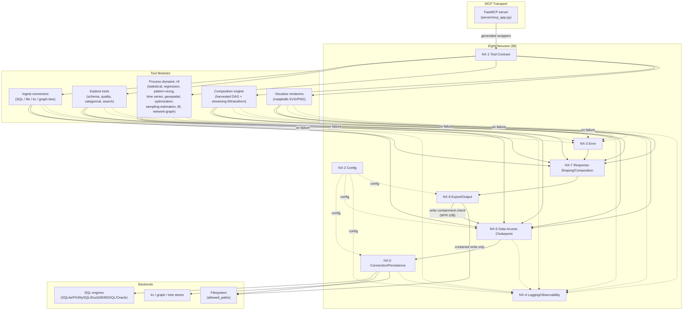
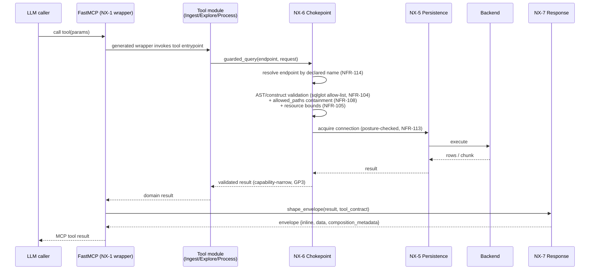
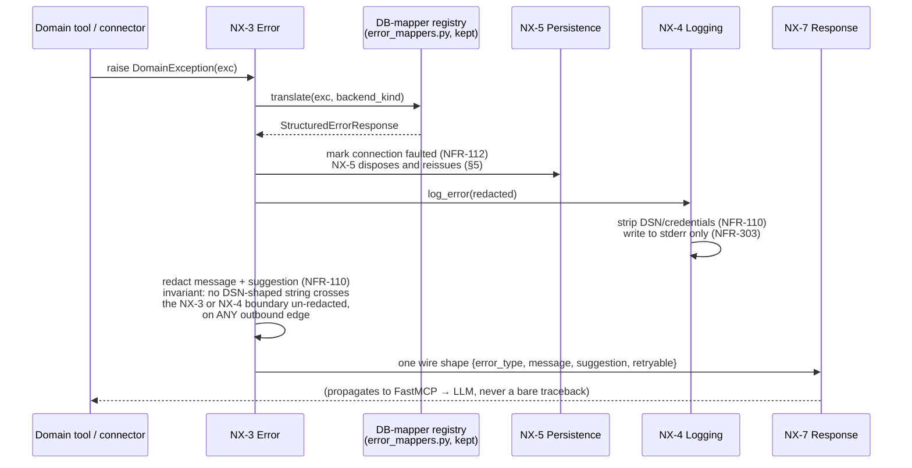
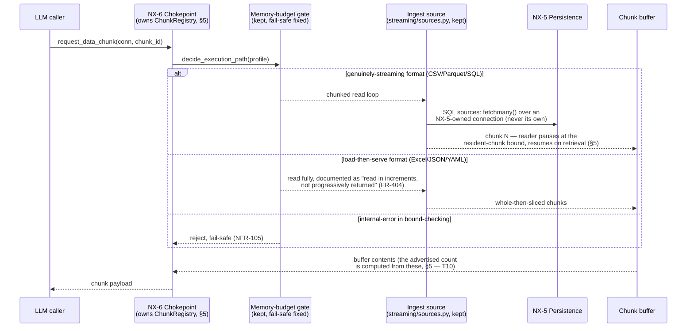
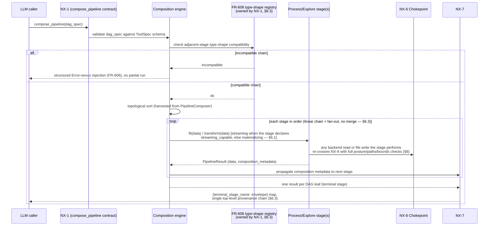
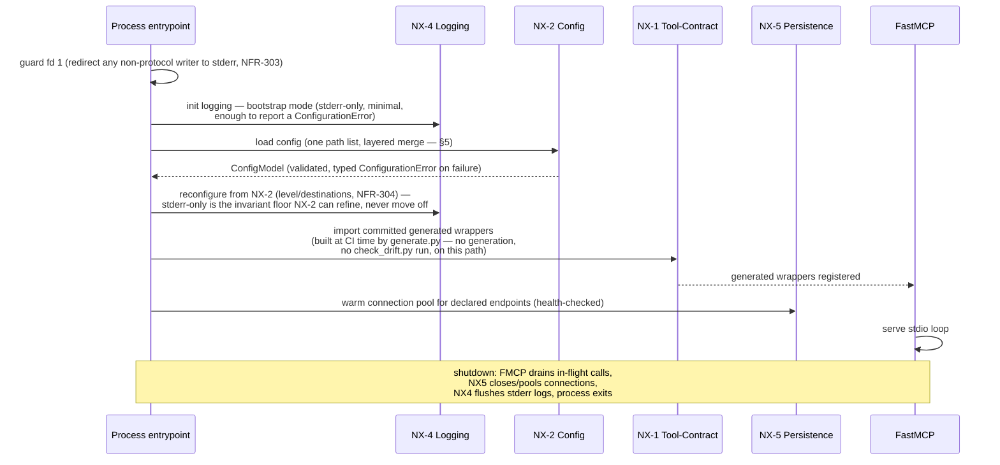

# LocalData MCP v3 — ARCHITECTURE.md

**Status:** CONVERGED & LOCKED (2026-07-22) — `agentic-arch` loop closed after 3 rounds
(57 → 36 → 0 substantive findings; all seven audit disciplines converged in round 3). This
document is now Design Authority for `agentic-prd`.
**Input documents (consumed in full):** `tmp/v3/REQUIREMENTS.md` (converged, round 4),
`tmp/v3/PROJECT-FP.md` (FP1–FP4 adopted), `tmp/v3/PLAN.md`, `tmp/v3/MISSION.md`,
`tmp/v3/audit/AS-IS-CONSOLIDATED.md`, and the `main` tree (`165956fb`, package `2.1.0`).
**Scope:** this document is Design Authority for `agentic-prd` once locked (coding.md#first-principles).
It resolves REQUIREMENTS §6(c)/(d)/(i) concretely, finalizes the §6(b) core/extras manifest as a
`pyproject.toml` shape, and names all 9 nexuses (merged to 8 anchors) as Arch GP per PLAN decision 3.

---

## 1. Overview

LocalData MCP v3 is a **single-process, single-operator, stdio MCP server** that gives one LLM
caller direct Ingest / Explore / Process / Output / Visualize capability over local and
network-reachable data, replacing ad-hoc one-off Python scripts the agent would otherwise write
(MISSION §"Mission statement"). It speaks the Model Context Protocol over stdio via FastMCP; it is
not a network service, not multi-tenant, and not a dashboard (REQUIREMENTS §1 non-goals).

**Architectural style: a nexus-anchored modular monolith.** One Python process, one dependency
graph, organized as independent tool modules (Ingest connectors, Explore reports, nine Process
domains, Visualize renderers) that share **zero private state** and instead route every
cross-cutting concern through one of eight non-optional internal nexuses (§8). This is the direct
structural answer to the AS-IS finding that `main` is "not one architecture but three fused at a
4,317-LOC god-class" (`AS-IS-CONSOLIDATED.md` §1) — v2's constitution declared five *behavioural*
principles and zero nexuses, so every shared concern grew two-or-more competing implementations,
later bridged rather than unified (T1–T14). v3 inverts that: nexuses are established **first**, at
this phase, and every subsequent feature is required to route through them (FR-401 fully — NFR-401,
NFR-402).

**Why this style, not a service-oriented rewrite:** the mission is explicitly single-operator/
single-caller (§1 non-goals); splitting into services would add a distribution/auth surface the KISS
security model (PROJECT-FP #2) does not need and MISSION does not ask for. A modular monolith gets
the benefit AS-IS actually needs — one owner per concern, no dead-rich-stack/live-thin-shim
twins (T4) — at the lowest architectural cost, honoring coding.md's minimal-intervention first
principle applied at the system level (coding.md#first-principles, FP6).

**Relationship to `main`:** v3 is a rewrite+harvest big-bang (PLAN decision 1) off `main`, not an
incremental patch. Salvageable assets (AS-IS §7 — sub-100ms discovery, real CSV/Parquet/SQL
chunking, the memory-budget gate design, the DB-mapper error registry, the `connection_manager/`
mixin design, the L3 test-client shape) are kept and rebuilt on top of the new nexus boundaries;
dead masses (AS-IS §6 — `pipeline/integration/**`, `domains/time_series_analysis/`, the enhanced
manager, the dead `SecurityManager`) are harvested for design and then deleted (FR-605/FR-607).

---

## 2. Guiding Principles (Arch GP)

Seven principles, each refining the chain above it (global FP → coding-domain FP → PROJECT-FP
#1–#4) with **zero contradiction** — validated upward inline. Once this document locks, these are
Design Authority for `agentic-prd` (coding.md#first-principles, Design Authority). (Round-1 note:
the former GP7 "Honest capability surface" restated the substance of the deliberately *downgraded*
FP5, which holds requirement rank, not principle rank — listing it as a numbered Arch GP would
have re-elevated it by the side door. It is now an enforcement note in §8's introduction, and the
former GP8 is renumbered GP7.)

**GP1 — Nexus-or-nothing.** Every cross-cutting concern (§8's eight anchors) has exactly one owning
module; any component needing it imports the nexus and never grows a private copy. A functional
duplicate is a MUST-FIX defect, not a variant.
*Upward check:* direct instantiation of coding-domain FP4 (Anchored Architecture) and PROJECT-FP #3
("no truth declared twice") for THIS project's concrete nexus set — no conflict, that is exactly
what PROJECT-FP #3 asks `agentic-arch` to do.

**GP2 — One declaration, generated everything.** A tool's contract (name, params, types, input/
output type-shapes, docstring) is authored once as data; the FastMCP schema, the wrapper, the
generated docs, and the docstring are all derived, never hand-duplicated (FR-701/704).
*Upward check:* refines PROJECT-FP #3's "flagship" nexus statement into the concrete generation
mechanism §6 specifies; no conflict.

**GP3 — Chokepoint-or-refuse.** Every data-touching call (read or mutate, SQL or non-SQL, backend
read or filesystem write) crosses `guarded_query`/`guarded_mutation` or NX-6's path-containment
service; resource and security failures are fail-safe, never fail-open; the KISS 2×4 matrix (two
assets × four threats) is the **only** frame for what gets built here — a control mapping to no
cell is deleted, not kept "just in case" (NFR-101). Corollary invariant: every object a chokepoint
call hands back to a tool module (`guarded_query`/`guarded_mutation`'s `Result`) is
**capability-narrow** — it exposes no `execute()`, no underlying `Engine`, no live cursor — so
holding a returned object never confers the ability to issue an unguarded operation; live
connection handles exist only at NX-6's internal boundary with NX-5 (§6.2) and appear in no
caller-facing return. Unbypassability is enforced twice: statically
(the import-graph test) and structurally (nothing reachable from a permitted import can execute
backend I/O outside NX-6).
*Upward check:* direct instantiation of PROJECT-FP #2; no conflict — this is PROJECT-FP #2's own
"implementation implications" restated as an architectural rule.

**GP4 — Correct-even-when-meaningless.** Composition returns the arithmetically right result of
what was asked, even when the composed analysis is domain-nonsensical; compatibility is a
declared, pre-execution-checked type-shape (FR-606), never a runtime discovery.
*Upward check:* direct instantiation of PROJECT-FP #1; no conflict.

**GP5 — Proven at the seam.** A capability does not exist until an L3 (MCP-protocol-seam)
`fastmcp.Client` test
exercises it against a real backend; unwired or dead code is deleted, not left "for later" — the
opposite of AS-IS's 40.5%-dead-tree finding.
*Upward check:* direct instantiation of PROJECT-FP #4; no conflict.

**GP6 — Harvest the design, not the code.** Dead-but-capable subsystems (`pipeline/integration/**`,
`domains/time_series_analysis/`) are read for their proven logic and rebuilt **inside** the nexus
boundaries; reviving them wholesale is rejected because it would import their no-nexus assumptions
along with their logic (AS-IS §1's own recommendation).
*Upward check:* refines coding-domain FP6 (minimal-intervention) read at the *system* level:
rebuilding 26k LOC of unanchored framework as a black box is the larger, more failure-prone change;
harvesting its logic into ~8 well-bounded nexus modules is the smaller one for the same
capability. No conflict with PLAN decision 2, which names exactly this disposition.

**GP7 — Decompose by concern, never by accretion.** No class or module may own more than one
nexus's worth of responsibility; the `DatabaseManager` god-class pattern (registration + dispatch +
connection lifecycle + security + streaming + 70 of the 71 tools in one 4,317-LOC class,
`server/database_manager.py`) is structurally forbidden in v3 — modules are sized and split per
coding.md#code-size, with size limits triggering a responsibility review, not a mechanical split.
*Upward check:* refines coding-domain #readability and #code-size read together with GP1; no
conflict — a god-class is definitionally a nexus violation (it *is* several nexuses at once).

---

## 3. Component Map


```mermaid
graph TB
    subgraph Transport["MCP Transport"]
        FMCP["FastMCP server<br/>(server/mcp_app.py)"]
    end

    subgraph NX["Eight Nexuses (§8)"]
        NX1["NX-1 Tool-Contract"]
        NX2["NX-2 Config"]
        NX3["NX-3 Error"]
        NX4["NX-4 Logging/Observability"]
        NX5["NX-5 Connection/Persistence"]
        NX6["NX-6 Data-Access Chokepoint"]
        NX7["NX-7 Response-Shaping/Composition"]
        NX8["NX-8 Export/Output"]
    end

    subgraph Domains["Tool Modules"]
        ING["Ingest connectors<br/>(SQL / file / kv / graph-tree)"]
        EXP["Explore tools<br/>(schema, quality, categorical, search)"]
        PROC["Process domains ×9<br/>(statistical, regression, pattern-recog,<br/>time series, geospatial, optimization,<br/>sampling-estimation, BI, network-graph)"]
        COMP["Composition engine<br/>(harvested DAG + streaming fit/transform)"]
        VIZ["Visualize renderers<br/>(matplotlib SVG/PNG)"]
    end

    subgraph Backends["Backends"]
        SQLB["SQL engines<br/>(SQLite/PG/MySQL/DuckDB/MSSQL/Oracle)"]
        FILEB["Filesystem<br/>(allowed_paths)"]
        KVB["kv / graph / tree stores"]
    end

    FMCP -->|"generated wrappers"| NX1
    NX1 --> ING & EXP & PROC & COMP & VIZ

    ING & EXP & PROC & COMP & VIZ --> NX6
    NX6 --> NX5
    NX5 --> SQLB & FILEB & KVB

    ING & EXP & PROC & COMP & VIZ --> NX7
    NX7 --> NX8
    NX8 -->|"write containment check<br/>(NFR-108)"| NX6
    NX8 -->|"contained write only"| FILEB

    ING & EXP & PROC & COMP & VIZ -.->|"on failure"| NX3
    NX3 --> NX7

    ING & EXP & PROC & COMP & VIZ -.-> NX4
    NX5 -.-> NX4
    NX6 -.-> NX4

    NX2 -.->|"config"| NX5 & NX6 & NX4 & NX8
```

### Per-component responsibility, boundary, must-not

| Component | Responsibility | Boundary | Must NOT |
|---|---|---|---|
| **FastMCP server** (`server/mcp_app.py`) | Process entrypoint; owns fd 1 (stdout) exclusively for JSON-RPC frames; registers tools generated by NX-1; orchestrates startup/shutdown nexus init order (§4e). | Transport only. | Contain tool logic, connection state, or a second logging path. |
| **NX-1 through NX-8** | Own their concern exclusively (§8). | Internal API only; never expose HTTP/network surface. | Be bypassed; grow a second implementation elsewhere. |
| **Ingest connectors** | Translate a backend-specific read into a `pd.DataFrame`/chunk iterator; declare their type-shape to NX-1. | One connector per backend family; no cross-connector logic. | Hold its own connection object (all backend I/O crosses NX-6, which resolves endpoints against NX-5 internally — §6.2); implement its own security check (must cross NX-6). |
| **Explore tools** | Schema/quality/categorical/search reports over data obtained via NX-6 `guarded_query` against a named endpoint. | Read-only by construction. | Mutate state; duplicate NX-7's envelope shaping. |
| **Process domains** | Domain-specific analytical logic (fit/transform/predict), each a self-contained sklearn-compatible unit. | One package per domain (§9); no domain imports another domain's internals — cross-domain compatibility is expressed only via declared type-shapes (NX-1 / FR-606) and NX-7's composition-metadata channel. | Raise a bare exception to the transport (must go through NX-3); hold ad-hoc `eval`/`exec` on caller strings (NX-6 forbids it globally). |
| **Composition engine** | DAG construction, topological-sort scheduling, per-stage fit/transform across a chain of Process/Explore stages — streaming where a stage declares `streaming_capable`, materializing at the boundary of any stage that does not (§6.3) — harvested from `PipelineComposer`/`DataSciencePipeline` (§7). | Orchestrates *existing* domain units; never contains domain logic itself. | Reimplement a domain algorithm; bypass NX-6/NX-7 for any stage's data access or result shaping. |
| **Visualize renderers** | Render a declarative chart spec to SVG/PNG bytes via matplotlib (object-oriented `Figure` + `FigureCanvasAgg` API, never `pyplot` global state) and hand the bytes to NX-8. | Rendering only — chart *construction* logic lives with the domain/Explore tool that requests a chart; sanitization and file output belong to NX-8 exclusively. | Sanitize or write artifacts itself (NX-8 owns the allow-list SVG sanitizer and the contained write path); retain a rendered `Figure` after the call returns (every render path disposes its `Figure` explicitly). |

---

## 4. Data Flows

### 4a. Happy path — connect → query → result, through the chokepoint

How a single tool call is served: the generated NX-1 wrapper dispatches to the tool module, every
backend touch crosses NX-6, and the result returns to the caller only through NX-7's one envelope.


```mermaid
sequenceDiagram
    participant LLM as LLM caller
    participant FMCP as FastMCP (NX-1 wrapper)
    participant Tool as Tool module<br/>(Ingest/Explore/Process)
    participant NX6 as NX-6 Chokepoint
    participant NX5 as NX-5 Persistence
    participant BE as Backend
    participant NX7 as NX-7 Response

    LLM->>FMCP: call tool(params)
    FMCP->>Tool: generated wrapper invokes tool entrypoint
    Tool->>NX6: guarded_query(endpoint, request)
    NX6->>NX6: resolve endpoint by declared name (NFR-114)
    NX6->>NX6: AST/construct validation (sqlglot allow-list, NFR-104)<br/>+ allowed_paths containment (NFR-108)<br/>+ resource bounds (NFR-105)
    NX6->>NX5: acquire connection (posture-checked, NFR-113)
    NX5->>BE: execute
    BE-->>NX5: rows / chunk
    NX5-->>NX6: result
    NX6-->>Tool: validated result (capability-narrow, GP3)
    Tool-->>FMCP: domain result
    FMCP->>NX7: shape_envelope(result, tool_contract)
    NX7-->>FMCP: envelope {inline, data, composition_metadata}
    FMCP-->>LLM: MCP tool result
```

### 4b. Error path — the Error nexus wire shape

How any exception becomes the one structured wire shape: NX-3 translates it, faults the connection
back into NX-5's lifecycle, and redacts **both** outbound edges — the log branch and the LLM-bound
message — before anything leaves the nexus.


```mermaid
sequenceDiagram
    participant Tool as Domain tool / connector
    participant NX3 as NX-3 Error
    participant Map as DB-mapper registry<br/>(error_mappers.py, kept)
    participant NX5 as NX-5 Persistence
    participant NX4 as NX-4 Logging
    participant NX7 as NX-7 Response

    Tool->>NX3: raise DomainException(exc)
    NX3->>Map: translate(exc, backend_kind)
    Map-->>NX3: StructuredErrorResponse
    NX3->>NX5: mark connection faulted (NFR-112)<br/>NX-5 disposes and reissues (§5)
    NX3->>NX4: log_error(redacted)
    NX4->>NX4: strip DSN/credentials (NFR-110)<br/>write to stderr only (NFR-303)
    NX3->>NX3: redact message + suggestion (NFR-110)<br/>invariant: no DSN-shaped string crosses<br/>the NX-3 or NX-4 boundary un-redacted,<br/>on ANY outbound edge
    NX3->>NX7: one wire shape {error_type, message, suggestion, retryable}
    NX7-->>Tool: (propagates to FastMCP → LLM, never a bare traceback)
```

The `retryable` flag is **caller-advisory only**: v3 implements no retry/backoff machinery of its
own (KISS single-operator scope — the LLM caller decides whether to re-issue a call), so the flag
carries a judgment ("transient, safe to re-ask") with no in-process consumer, and no retry bounds
exist to configure. The same redaction invariant extends to NX-5's `HealthCheckResult` text on any
caller-facing path (§5): a failed health probe's message can embed the failing DSN and passes the
same DSN/credential stripping before it reaches a tool result.

### 4c. Streaming path — honest per-format matrix

How a chunk request is served: genuinely-streaming formats stream under a resident-chunk bound
with backpressure, load-then-serve formats are read whole then sliced (and documented as such),
and a bound-check failure fails safe. The `ChunkRegistry` NX-6 owns (§5) is the single authority
for what is advertised and retrievable.


```mermaid
sequenceDiagram
    participant LLM as LLM caller
    participant NX6 as NX-6 Chokepoint<br/>(owns ChunkRegistry, §5)
    participant Mem as Memory-budget gate<br/>(kept, fail-safe fixed)
    participant Src as Ingest source<br/>(streaming/sources.py, kept)
    participant NX5 as NX-5 Persistence
    participant Buf as Chunk buffer

    LLM->>NX6: request_data_chunk(conn, chunk_id)
    NX6->>Mem: decide_execution_path(profile)
    alt genuinely-streaming format (CSV/Parquet/SQL)
        Mem-->>Src: chunked read loop
        Src->>NX5: SQL sources: fetchmany() over an<br/>NX-5-owned connection (never its own)
        Src-->>Buf: chunk N — reader pauses at the<br/>resident-chunk bound, resumes on retrieval (§5)
    else load-then-serve format (Excel/JSON/YAML)
        Mem-->>Src: read fully, documented as "read in increments,<br/>not progressively returned" (FR-404)
        Src-->>Buf: whole-then-sliced chunks
    else internal-error in bound-checking
        Mem-->>NX6: reject, fail-safe (NFR-105)
    end
    Buf-->>NX6: buffer contents (the advertised count<br/>is computed from these, §5 — T10)
    NX6-->>LLM: chunk payload
```

### 4d. Composition/pipeline execution path

How a composed DAG runs: the chain is validated against the FR-606 registry before any execution,
each stage's own data-touching operation re-crosses NX-6 with full checks, and the multi-leaf
result is a map of envelopes keyed by terminal stage name under one provenance chain.


```mermaid
sequenceDiagram
    participant LLM as LLM caller
    participant NX1 as NX-1 (compose_pipeline contract)
    participant CE as Composition engine
    participant Reg as FR-606 type-shape registry<br/>(owned by NX-1, §6.3)
    participant Stage as Process/Explore stage(s)
    participant NX6 as NX-6 Chokepoint
    participant NX7 as NX-7

    LLM->>NX1: compose_pipeline(dag_spec)
    NX1->>CE: validate dag_spec against ToolSpec schema
    CE->>Reg: check adjacent-stage type-shape compatibility
    alt incompatible chain
        Reg-->>CE: incompatible
        CE-->>LLM: structured Error-nexus rejection (FR-606), no partial run
    else compatible chain
        Reg-->>CE: ok
        CE->>CE: topological sort (harvested from PipelineComposer)
        loop each stage in order (linear chain + fan-out, no merge — §6.3)
            CE->>Stage: fit(data) / transform(data)  [streaming when the stage declares<br/>streaming_capable, else materializing — §6.1]
            Stage->>NX6: any backend read or file write the stage performs<br/>re-crosses NX-6 with full posture/paths/bounds checks (§8)
            Stage-->>CE: PipelineResult (data, composition_metadata)
            CE->>NX7: propagate composition metadata to next stage
        end
        CE-->>NX7: one result per DAG leaf (terminal stage)
        NX7-->>LLM: {terminal_stage_name: envelope} map,<br/>single top-level provenance chain (§6.3)
    end
```

### 4e. Startup / shutdown

How the process boots: logging comes up twice (a minimal stderr-only bootstrap mode before config
exists, then a reconfiguration from validated NX-2 config), and NX-1's generated wrappers are
**imported**, never regenerated, on the startup path (§6.1 — generation is a build/CI-time step).

The fd-1 guard's mechanism is order-dependent, and its feasibility is **verified against the
installed transport, not assumed**: the MCP SDK's `mcp.server.stdio.stdio_server(stdin=None,
stdout=None)` accepts an injectable `stdout` AsyncFile (`mcp/server/stdio.py:34-49` in the
installed package) — the frame writer is *not* hardcoded to fd 1 — while FastMCP's high-level
`run_stdio_async` calls `stdio_server()` argless (`fastmcp/server/mixins/transport.py:207`),
wrapping `sys.stdout.buffer` at transport-start time. The guard therefore uses the SDK's
injectable seam: (1) `dup` the real stdout to a saved descriptor; (2) start the transport with
`stdout` bound over the *saved* descriptor (via the SDK parameter, driving FastMCP's low-level
`_mcp_server.run` — a wiring detail owed at PRD, the seam itself is proven); (3) `dup2` stderr
onto fd 1 and rebind `sys.stdout` to stderr, so stray Python *and* C-extension writes land on
stderr, never on the transport. The guard is the NFR-303 SHOULD; **the primary,
feasibility-independent gate is the whole-battery OS-level stdout-purity assertion** — no byte
reaches fd 1 except JSON-RPC frames, asserted across every battery run.


```mermaid
sequenceDiagram
    participant Proc as Process entrypoint
    participant NX4 as NX-4 Logging
    participant NX2 as NX-2 Config
    participant NX1 as NX-1 Tool-Contract
    participant NX5 as NX-5 Persistence
    participant FMCP as FastMCP

    Proc->>Proc: guard fd 1 (redirect any non-protocol writer to stderr, NFR-303)
    Proc->>NX4: init logging — bootstrap mode (stderr-only, minimal,<br/>enough to report a ConfigurationError)
    Proc->>NX2: load config (one path list, layered merge — §5)
    NX2-->>Proc: ConfigModel (validated, typed ConfigurationError on failure)
    Proc->>NX4: reconfigure from NX-2 (level/destinations, NFR-304) —<br/>stderr-only is the invariant floor NX-2 can refine, never move off
    Proc->>NX1: import committed generated wrappers<br/>(built at CI time by generate.py — no generation,<br/>no check_drift.py run, on this path)
    NX1-->>FMCP: generated wrappers registered
    Proc->>NX5: warm connection pool for declared endpoints (health-checked)
    FMCP->>FMCP: serve stdio loop
    Note over Proc,FMCP: shutdown: FMCP drains in-flight calls,<br/>NX5 closes/pools connections,<br/>NX4 flushes stderr logs, process exits
```

---

## 5. Data Model & Storage

**Connection/session state (owned by NX-5).** A `ConnectionRecord` per declared endpoint:
`name` (operator-declared, never caller-supplied per NFR-114), `backend_kind`, `posture`
(read-only/read-write, NFR-113), `credentials_ref` (indirection into NX-2, never inlined —
NFR-110), `pool` (SQLAlchemy `Engine` or non-SQL client handle), `health` (`HealthCheckResult`,
harvested from `connection_manager/health.py` — its text passes the NX-3/NX-4 DSN-redaction
invariant before appearing in any caller-facing tool result, §4b), `resource_limits` (per-endpoint
timeout/max-conn, harvested from `connection_manager/resources.py`), and an explicit lifecycle
`state` field: `healthy | faulted | resetting | closed`. **NFR-112 reset semantics:** when an
operation on a connection raises, NX-3 marks the record `faulted` (§4b) and NX-5 performs
**dispose-and-reissue** — the faulted physical connection is discarded and the pool issues a fresh
one — rather than rollback-in-place, because a rollback can itself fail on a broken connection
while disposal cannot. The transition set is complete: `healthy → faulted` when NX-3 marks the
record on an operation exception (§4b); `faulted → resetting` when NX-5, re-entered on that same
error path, begins the dispose-and-reissue; `resetting → healthy` when the pool's fresh connection
is issued successfully; `resetting → closed` when the reissue itself fails (the endpoint is
unusable until the operator intervenes); and any state `→ closed` on shutdown or endpoint removal
(§4e). Granularity is record-level by declaration: the `state` field describes the endpoint's pool
as a whole, and a single-connection fault runs the `faulted → resetting → healthy` cycle only for
the duration of that one dispose-and-reissue — sibling pooled connections stay usable throughout,
and the record rests at `closed` only when the reissue itself fails. The documented consequence:
connection-session-scoped state (`SET`
statements, temp tables) does not survive a fault; v3's tools do not depend on such state, and the
guarantee NFR-112 needs (the follow-up query sees no partial mutation) holds by construction on a
fresh connection.

**Ephemeral local-file connections are a distinct lightweight type, not a `ConnectionRecord`
variant.** Local file-engine sources (SQLite/DuckDB files) opened ad hoc by path within
`allowed_paths` (read-only default posture, NFR-114) get an `EphemeralFileConnection`: opened
per-call, never pooled, identity is the canonicalized path, no `name`, no `credentials_ref`, no
health probe. NFR-112 is vacuous for this type — there is no reuse to protect, because the
connection never outlives the call that opened it. Its two enforcement homes are stated, not
implied: **posture** — an ephemeral connection is read-only, period, unless an
operator-trust-layer (system/user, per the trust order below) NX-2 entry keyed by canonicalized
path or contained path prefix grants read-write; that entry is a security-relevant declaration
under the introduction rule below, so a project-layer file cannot mint it. **Resource limits** —
having no per-endpoint `resource_limits` record, an ephemeral connection inherits the global
NFR-105 defaults (timeout, concurrency — §6(g)) from NX-2, enforced at the same NX-6/NX-5 point
that enforces `ConnectionRecord` limits, so a runaway query over a large local file has the same
wall-clock owner as any declared endpoint.

**Streaming buffers (owned by NX-6 — one owner, not "Ingest mediated by NX-6").** A
`ChunkRegistry` per active retrieval, owned by the chokepoint every retrieval already crosses
(§4c, §8 NX-6 Owns list): `source_kind` (genuinely-streaming vs. load-then-serve, per the honest
matrix NFR-202) and a buffer of chunks the Ingest reader fills. The T10 closure is a concrete
mechanism, not a restated wish: **the advertised chunk count is computed lazily from the buffer's
actual contents at request time — never cached, never pre-declared** — so
`chunks_advertised == chunks_retrievable` is structurally true (there is only one number, derived
from the servable chunks themselves). Resident memory is bounded three ways, all fail-safe under
the kept `MemoryBudget` machinery (`memory_budget.py`, fail-open defect fixed per NFR-105/203):
(1) a **per-registry resident-chunk bound, scoped to genuinely-streaming registries** — at most K
chunks / B bytes resident, with backpressure (the reader loop pauses at the bound, resumes when
the caller retrieves a buffered chunk — §4c); a load-then-serve registry cannot honor a look-ahead
bound by construction (the whole dataset is read before the first slice), so it is governed
instead by its **upfront admission decision** — the memory-budget gate refuses the load outright
if the estimated full size exceeds budget — plus ceiling (2); (2) a **process-wide aggregate
ceiling** — the budget gate accounts for the sum of all live registries against the one NFR-105
memory ceiling, not each retrieval in isolation, so concurrent in-flight streams cannot
individually pass while jointly exceeding it; (3) a **TTL/idle-eviction rule** — a registry with
no `request_data_chunk` call for the configured idle window is released: the paused reader loop is
terminated, its NX-5 connection returned to the pool, and its memory returned to the budget
accounting, so an abandoned stream can hoard neither memory nor a pooled connection.

Three consequences of this design are declared, not left for discovery. **Served chunks are
evicted on retrieval — cursor semantics**: a chunk leaves the buffer the moment it is served,
which makes bound (1) a true cap on total per-registry residency rather than on look-ahead only;
re-requesting an already-served `chunk_id` returns a structured NX-3 already-served error (the
caller re-issues the originating query if it needs the data again) — a deliberate,
tool-contract-documented departure from `main`'s retained-buffer semantics. **An expired stream
fails structurally, not transparently**: a `request_data_chunk` against a TTL-evicted registry
returns a structured NX-3 error naming the stream expired and non-resumable; eviction takes the
same lock as retrieval, so it cannot race an in-flight request, and because the advertised count
derives from live buffer contents, a served or evicted chunk is atomically no longer advertised —
the advertised number is the count of currently-servable (resident, not-yet-served) chunks —
never a dataset total the buffer cannot yet serve; once the source is exhausted the stream
additionally reports the final total chunk count as metadata, never as servable chunks.
**A paused stream pins its connection, boundedly**: a backpressured SQL reader holds its NX-5
pooled connection for the life of the stream and counts against the per-endpoint max-connections
bound (a declared trade-off, not a surprise); the per-endpoint statement timeout is measured
against backend execution, not pause time, so an actively-consumed stream is never killed for
being slow — while rule (3)'s idle-TTL bounds how long a paused reader can sit on a connection.

Aggregate accounting names its attribution mechanism: a registry's first chunk is measured
exactly (`memory_usage(deep=True)` — the kept machinery's own pattern at
`streaming/sources.py:288`, which caches a per-row estimate from one measured chunk), subsequent
chunks are attributed by per-row extrapolation from that measurement, re-measured on schema
change — never a per-chunk deep traversal on the hot path — and NFR-204's chokepoint-overhead
assertion covers this accounting cost alongside validation latency. NFR-202's battery measures
per classification: a genuinely-streaming cell asserts bounded total residency relative to
retrieval progress under bound (1); a load-then-serve cell asserts the documented "read in
increments, not progressively returned" behavior (FR-404) and that admission was budget-gated —
asserting a look-ahead bound there would fail by design. The **analytical row cap** is the same
memory-constraint class and gets the same treatment (closing SSOT-11): `main`'s
`MAX_ANALYSIS_ROWS = 500_000` module literal (`datascience_tools.py:23`) becomes an NX-2 field
(`query.max_analysis_rows`, default derived from the memory budget) consulted through
`resource_bounds.py` — never a module literal again.

**Results provenance store (NFR-508).** A single embedded SQLite database
(`testbench/results_store/battery_results.db`) — file-based, zero new infrastructure, consistent
with the project's local-first ethos. Three tables: a `meta` table carrying `schema_version`;
`battery_runs` (`run_id` PK, `battery_name`, `run_mode` — `deterministic | randomized` —, `seed`,
`dataset_hash`, `software_versions` JSON, `started_at`, `finished_at`, `git_sha`); and
`battery_results` (`run_id` FK, `test_id`, `pass`, `numeric_output` JSON nullable, `duration_ms`).
`run_mode` is the discriminator NFR-509's compare-and-fail CI job joins on (`battery_name` +
`run_mode`) — `seed` alone cannot provide it, since a deterministic run may also record a fixture
seed.
`dataset_hash` is a **single aggregate hash over the full fixture set the run consumed**; per-test
localization comes from the `test_id` naming convention, which embeds the domain and fixture name
(`domain.dataset.operation…`), so a longitudinal query flags *that* something changed via the hash
and localizes *what* via `test_id` — no per-test dataset reference column is needed. **Schema
ownership and migration:** `testbench/results_store/schema.py` is the one owner of the DDL and of
forward migrations; the posture is additive-only versioned migrations, run at battery-runner
startup before any write, so historical rows stay readable across releases (the store is a
long-lived longitudinal artifact, not CI-ephemeral). **Concurrency, stated to what WAL actually
provides:** WAL mode lets readers (the NFR-506 CI check, a longitudinal query) proceed without
blocking the single active writer — it does **not** provide concurrent writers, so writers use a
configured busy-timeout + bounded-retry wrapper to serialize write bursts safely. Where CI battery
workers run as isolated jobs with no shared filesystem, each worker writes its own per-worker
SQLite file and a post-job step merges them into the canonical store — WAL is a same-host
enabler, not the cross-worker answer. The merge step has one owner and defined key semantics: it
lives in the results-store module (`testbench/results_store/merge.py`, §9), writes through
`store.py`'s parameterized path under `schema.py`'s migration discipline, and asserts
`meta.schema_version` equality between every per-worker file and the canonical store before
merging — refusing on mismatch or on a structurally incomplete file. The logical run's `run_id`
is a UUID minted once by the run coordinator before workers start and passed to every worker, so
all per-worker files share it and one logical battery execution is exactly one `battery_runs`
row — written by the coordinator alone, which also owns `started_at`/`finished_at`; the merge
unions `battery_results` under the declared unique key `(run_id, test_id)` with insert-or-ignore
semantics, so a re-run of the post-job step (a normal CI retry) is idempotent. All results-store
writes use parameterized queries — no
string-interpolated SQL, even in this trusted, non-LLM-facing test path. This store is the
mechanism NFR-506's `Battery-Run:` trailer CI check queries against, and what NFR-509's
randomized-order comparison and NFR-508's longitudinal regression comparison both read.

**Config model (owned by NX-2, §7/§8).** One dataclass-per-truth (`ConfigModel`): every field
carries its own default; every env-var override name is derived from the field path
(`LOCALDATA_<SECTION>_<FIELD>`), not independently declared; one config-file search-path list. The
consolidation target is **all eight T7 config surfaces on `main`**, not just
`config_manager/models.py`: the operationally-critical runtime truths live in `config_schemas.py`
— `QueryConfig.default_chunk_size=100` / `buffer_timeout_seconds=600` (`config_schemas.py:93-94`),
`MemoryConfig.max_budget_mb=512` (`:60`), `StagingConfig.max_concurrent=10` (`:32`),
`ConnectionsConfig.max_concurrent=10` (`:121`), `SecurityConfig.allowed_paths` (`:139`),
`DiskBudgetConfig` (`:157`) — with `config_manager/models.py`, `security/models.py`,
`config_paths.py`, `config_manager/manager.py`'s `DEFAULT_CONFIG_FILES`, `env_loader.py`, and the
`_apply_defaults`/`get_performance_config` literal sets completing the eight. Each folds into
NX-2's one model; **every duplicated truth names its winner**: chunk-size and buffer-timeout are
owned by the query section (successor of `QueryConfig`), max-concurrency by the connections
section (successor of `ConnectionsConfig`, absorbing `StagingConfig.max_concurrent` and
`DatabaseConfig.max_connections`), and `PerformanceConfig`'s overlapping fields (`chunk_size`,
`max_concurrent_connections`, `models.py:134-135`) are **retired** — SSOT-02's own remediation.

**Layer-merge semantics are two-tier, not one rule** (resolving the cumulative-vs-first-wins
tension §8.1's `d5fb7280` row forward-ports): security-relevant fields — `allowed_paths`, per-endpoint
postures, resource ceilings (NFR-108/113/114) — are **pin-eligible, first-wins-by-layer**: an
operator-set higher-trust layer (system → user → project, in that trust order) is authoritative
and a lower-trust layer (e.g. a project file an LLM or collaborator can edit) cannot shadow it.
**Environment variables have an explicit place in that order**: a derived override
(`LOCALDATA_<SECTION>_<FIELD>`) ranks at the **user layer** — a stdio MCP server's process
environment is set by whoever launches it, i.e. the operator's client configuration — so env
participates in last-wins merge for ordinary fields and is subject to first-wins pinning exactly
as a user-layer file would be, always subordinate to system-layer pins. **Pinning defends against
shadowing only, so introduction is layer-gated separately**: security-relevant declarations —
endpoint declarations (name, DSN, posture, `credentials_ref`), credential material,
`allowed_paths` entries — may be **introduced only at operator-trust layers** (system/user, env
included); a project-layer file may narrow what a higher layer declared (drop a path, downgrade a
posture) but can never mint a new endpoint, credential, or path — a project-layer introduction
attempt is refused and reported, closing the hole a mintable read-write endpoint would otherwise
reopen in NFR-114. **Pin-eligibility has exactly one home**: it is declared per-field on the
`ConfigModel` dataclass declaration itself — field metadata alongside the default and the derived
env-var name, the same single-declaration discipline — and the merge logic
(`provenance.py`/`loaders.py`) consumes that metadata; a separately-maintained pin list anywhere
is the rejected re-implementation, and on security-classed sections an absent flag defaults to
pin-eligible (fail-closed). Every other field merges **last-wins cumulative** across the same
layer order. `ConfigModel` carries per-field provenance — the winning `(value, source_layer)`
**plus every losing contribution as a `(layer, attempted_value)` entry** — which is what makes
the *shadowed* half of the startup pinned/shadowed-config report (§8.1, `d5fb7280`) derivable,
not only the pinned half; attempted values for credential-bearing fields pass NFR-110 redaction
before the report is logged through NX-4, never printed. A typed `ConfigurationError` is raised
on validation failure — never a silent `print()` to stdout (closes #39).

---

## 6. Interfaces & Contracts

### 6.1 The Tool-Contract SSOT mechanism (NX-1, the flagship — concretely)

A tool is authored as exactly one `ToolSpec` declaration:

```python
@tool_spec(
    name="query_table",
    summary="Run a read query against a declared connection.",
    params=[
        Param("connection_name", str, "Operator-declared endpoint name (NFR-114)."),
        Param("query", str, "SQL SELECT/WITH statement."),
    ],
    input_shape=TypeShape.NONE,            # source tool: consumes no upstream stage output
    output_shape=TypeShape.TABULAR,        # FR-606 declared type-shape
    streaming_capable=True,                # honest per-stage streaming declaration (§6.3)
    domain=None,                           # None => Ingest/Explore, not a Process domain
)
def query_table(connection_name: str, query: str) -> ToolResult: ...
```

**`TypeShape` is a closed enumeration, fixed here** (FR-606's compatibility mechanism depends on
every declaration drawing from one vocabulary — two implementers must not each invent a
plausible-sounding shape that never matches):

- `TABULAR` — a DataFrame-shaped result (rows × named columns); the workhorse shape for Ingest,
  Explore, and most Process output.
- `SCALAR` — a single value or flat statistic record (a test statistic, a fitted R², an RFM
  segment count summary).
- `VECTOR` — a one-dimensional ordered series (a forecast horizon, residuals, cluster labels).
- `MATRIX` — a two-dimensional numeric array with homogeneous cells (correlation/distance
  matrices, dimensionality-reduction embeddings).
- `FITTED_MODEL` — a fitted-but-not-yet-applied estimator, distinct from its transform output
  (regression/pattern-recognition fit stages emit this; predict/transform stages accept it).
- `GRAPH` — a node/edge structure (network-graph domain, graph/tree stores).
- `GEO` — geometry-bearing tabular data (the geospatial domain's input/output; distinct from
  `TABULAR` so a non-geo stage cannot silently receive geometries it will mangle).
- `CHART_SPEC` — the declarative chart specification Visualize consumes and NX-8 renders (§7).
- `NONE` — the declared absence of a composable data edge, in either position. As `input_shape`:
  the tool is a **source** — it consumes no upstream stage output (connectors and query tools
  take an endpoint name and a query, not a frame); such a stage accepts no inbound `depends_on`
  edge in a `dag_spec` and may appear only chain-initial. As `output_shape`: the tool is a
  **terminal sink** — its product is a rendered artifact or a written file, not composable data
  (Visualize render tools, the FR-4xx/9xx export tools); such a stage accepts no downstream edge
  and may appear only as a leaf. `NONE` appears in no adjacency-table row — nothing feeds it and
  it feeds nothing — so the FR-606 check refuses any `dag_spec` edge into a `NONE` input or out
  of a `NONE` output pre-execution (GP4's no-runtime-discovery promise held at the chain
  endpoints too), and the battery generator's chain enumeration (NFR-502d, §6(k)) treats
  `NONE`-input tools as chain heads and `NONE`-output tools as chain tails by construction.
- `DYNAMIC` — see the `compose_pipeline` contract below; assignable to no other tool.

**The `compose_pipeline` contract, explicitly:** its `ToolSpec` declares
`output_shape=TypeShape.DYNAMIC` (and `input_shape=TypeShape.DYNAMIC`), with defined semantics —
`DYNAMIC` is **excluded from adjacent-stage compatibility checks** (the engine instead validates
the submitted `dag_spec`'s internal edges against the concrete shapes of its stages, §6.3), and a
tool declaring `DYNAMIC` is **barred from appearing as a stage** inside a `dag_spec`, so
`compose_pipeline` cannot nest inside itself and the registry stays free of unbounded recursion.
This keeps the one-declaration generation model intact for the one tool whose real output shape is
determined by its terminal stage at call time.

**Generation is a build/CI-time codegen step producing committed artifacts — never runtime
reflection.** A thin orchestrator (NX-1, `nexus/contract/generate.py`) drives one per-artifact
generator module each (§9 — mirroring the NX-5 mixin precedent), consumes the `ToolSpec` registry,
and **writes committed generated files** for each of the five artifacts below. Process startup
only *imports* the generated wrapper module (§4e) — no generation and no drift comparison run on
the startup or request path, so cold boot pays import cost only. `check_drift.py` runs **in CI
exclusively**: it regenerates in a scratch location and fails the build on any difference from the
committed artifacts, which is precisely what gives FR-704's hand-edit-fails-CI acceptance a
well-defined meaning (a hand edit diverges the committed file from what the generator would
produce). The generated docstring lives **on the generated wrapper**, not on the hand-authored
implementation function — the implementation function carries no caller-facing docstring, so
there is nothing for the generator to write back into hand-authored code. The five artifacts:

1. the FastMCP registration wrapper module (`server/tools_generated.py`, registered into
   `server/mcp_app.py`'s FastMCP instance — replacing the god-class's hand-written registration
   surface: 70 `add_tool` calls in `database_manager.py` plus one `@mcp.tool`-decorated
   `get_metrics` in `localdata_mcp.py:292`, 71 tools total);
2. the docstring (rendered from `summary`/`params`, never hand-duplicated — closes #40's residual
   structural cause and FR-704);
3. the generated docs table row (`docs/tools/*.md`);
4. a parametrized L3 contract test stub, iterating the registry so every tool gets a
   `fastmcp.Client`-seam test asserting a well-formed response (FR-702/NFR-501) — CI fails if any
   registered `ToolSpec` lacks a corresponding test entry;
5. an entry in the FR-606 type-shape compatibility registry the composition engine (§6.3) consults.

A CI check (`nexus/contract/check_drift.py`) fails the build if any FastMCP-registered schema,
docstring, or docs entry differs from what the generator would produce from the current
`ToolSpec` — making a hand-edited generated artifact a hard failure (FR-704's acceptance).

### 6.2 Internal APIs between components

Every nexus exposes a narrow Python protocol (not a network API — this is one process). The set
**domain/Ingest/Explore/Visualize modules may import** is:
`NX6.guarded_query(endpoint_name, request) -> Result`,
`NX6.guarded_mutation(endpoint_name, request) -> Result`,
`NX3.wrap(exc) -> StructuredErrorResponse`,
`NX7.shape_envelope(result, tool_spec) -> ToolResult`, `NX8.render(artifact, format) -> bytes`.
`NX5.get_connection` is deliberately **not** in this set: NX-5 is reachable by NX-6 exclusively
(§8 NX-5), so no tool module can obtain a live connection by importing a permitted nexus — the
import-graph test and the reachability model agree. Tool modules pass the operator-declared
endpoint *name* to NX-6, which resolves it against NX-5 internally. The objects NX-6 returns are
capability-narrow per GP3's corollary invariant (no `execute()`, no `Engine`, no live cursor), so
even a handle held by a tool cannot issue an unguarded operation. All of this is enforced by the
same import-graph architectural test pattern FR-105/NFR-103 already specify — generalized to all
eight nexuses (§8) — plus the dynamic security-battery leg for what static analysis cannot prove.

### 6.3 Composition contract (FR-606)

The `compose_pipeline` `ToolSpec` (§6.1's `DYNAMIC` contract) accepts a `dag_spec`: an ordered
list of `{stage: tool_name, depends_on: [stage_names]}` entries, matching the harvested
`PipelineComposer.add_pipeline(name, pipeline, depends_on=...)` shape (`pipeline/core/composer.py`,
read in full for this document). Before execution, the engine validates every `depends_on` edge's
adjacent-stage type-shape compatibility against the FR-606 registry; an incompatible chain is
rejected with a structured Error-nexus response pre-execution — never a mid-pipeline crash
(closing the exact class of failure that made `main`'s dead composition core untrustworthy,
AS-IS §1). **NX-1 owns both halves of the compatibility mechanism**: the registry (built from
every `ToolSpec`'s declared `input_shape`/`output_shape`) *and* the compatibility relation itself
— a **declared adjacency table** over the closed `TypeShape` set (§6.1), stating which shapes may
feed which — so the composition legality matrix has exactly one home; the composition engine
consults it, NX-7 only carries the resulting metadata. The adjacency table is **hand-authored
declared data at `nexus/contract/compatibility.py`** (§9), deliberately not a `generators/`
output: which shapes may feed which is a policy decision, not a derivation from `ToolSpec`s, so
authored policy and generated artifacts never share a file. Stages declaring `DYNAMIC` cannot
appear in a `dag_spec` (§6.1 — no nesting).

**Multi-leaf response contract:** a DAG with fan-out has multiple terminal (leaf) stages, and
NX-7's rule is determinate: the composed result is a **map `{terminal_stage_name: envelope}`** —
one standard NX-7 envelope per leaf, under a **single top-level provenance chain** recording the
full DAG execution. A linear chain is simply the singleton case of the same rule (a one-entry
map), so there is one response shape, not two (§4d).

**Pipeline-wide resource discipline:** every stage's own data-touching operation (a mid-pipeline
enrichment read, a file spill) **re-crosses NX-6 with the same posture/`allowed_paths`/bounds
checks as a top-level call** (§4d, §8 NX-6) — stages are not exempt because the initial load was
checked. In addition, NFR-105's memory accounting is **aggregate across the pipeline**: a
length-4 chain draws on the same process-wide budget (§5), so N stages cannot each sit just under
the single-operation ceiling while jointly exceeding it. The pipeline-length bound (N=4, §6(k))
and the launch domain set have **one declared home** — the bound is an NX-2 config value
(`composition.max_pipeline_length`), the domain set is derived from the NX-1 registry's `domain`
declarations — consulted by both the composition validator and the battery generator, never
duplicated as literals in each. The field's two consumers are reconciled by stated policy: the
config value is the runtime acceptance bound; the exhaustive battery covers chains up to the
shipped default; an operator raising the field is an accepted departure from the battery-covered
envelope (and a stretch battery runs with a deliberately raised value) — so the tested and
operational envelopes align at the default by declaration, not by hope.

**Topology scope at launch (this document's FR-606 decision):** linear chains with fan-out (one
stage feeding multiple independent downstream stages), **no fan-in/merge**. This matches
scikit-learn `Pipeline`'s own linear fit/transform/predict assumption (which the harvested
`DataSciencePipeline` already builds on, `pipeline/core/pipeline_class.py`) and matches
NFR-502(d)'s pipeline-battery model, which is explicitly an *alternating linear chain*
(A-B-A, A-B-A-B) up to the §6(k) length-4 bound — nothing in the battery's own acceptance
criterion requires join/merge semantics. Fan-in is deferred (§10) rather than designed
half-specified; `PipelineComposer`'s own dependency graph already supports non-linear DAGs
structurally (Kahn's-algorithm topological sort over an arbitrary `_dependency_graph`), so
extending to fan-in later is additive to the harvested scheduler, not a rewrite.

**Streaming through a chain is per-stage-conditional, never a chain-wide guarantee** (FR-603's own
qualifier — "stages that support chunked input" — carried into the architecture rather than
dropped): most sklearn-compatible estimators materialize their full input at `fit()` time (no
`partial_fit`), so a chain containing one non-streaming stage materializes at that stage boundary
regardless of upstream chunking. This is architecturally unavoidable and therefore *declared*, not
implied away: every `ToolSpec` carries a `streaming_capable` flag (§6.1) — the composition-side
counterpart of NFR-202's per-format honest matrix — and the pipeline battery (NFR-502d) asserts
each stage's declared flag against its observed behavior, the same way NFR-202's battery asserts
the format matrix.

### 6.4 Versioning stance

Clean break, per REQUIREMENTS §6(a): ships as `localdata-mcp` **3.0.0**, no v2.1.0 tool-name/
signature compatibility shim, with a migration guide covering the renamed/reshaped tool surface.
`2.0.0` on PyPI is left as-is (Chris's parked decision, PLAN §"Standing dogfood issues"). A
compatibility shim would itself be a second declaration of a tool's contract — exactly what NX-1
exists to prevent — so REQUIREMENTS' Option 1 is architecturally, not just administratively,
correct.

---

## 7. Technology Decisions

The four heaviest decisions (safe-AST evaluation, SQL AST validation, visualization, composition
surface) are summarized in the table and argued in the prose subsections that follow it — the
table stays scannable, the reasoning gets room to be read once.

| Decision | Choice | Alternatives considered | Evidence | Reversal cost |
|---|---|---|---|---|
| **Safe-AST expression evaluation (§6d)** | `asteval` with a **deny-by-default symbol table** (`use_numpy=False`, only whitelisted functions bound by name) as an NX-6 service, replacing the two live `eval()` RCE sites. Detail below. | See "Safe-AST expression evaluation — detail." | REQUIREMENTS §6(d); T3/#42; PROJECT-FP #2. | Low — one NX-6 service function; callers only see `evaluate_numeric_expression(expr, columns) -> float`. |
| **SQL AST validation (NFR-104)** | `sqlglot` as a genuine **allow-list** gate — enumerate what is permitted, refuse everything else including parse failures and unknown nodes; pinned version; bounded validation cache. Detail below. | See "SQL AST validation — detail." | AS-IS §5 nexus 7; `query_parser.py` read in full; `release/2.0.1` CHANGELOG [2.0.1]. | Medium — `sqlglot` is the dominant Python SQL-AST library (dbt, SQLMesh); the chokepoint's dialect policy mapping is the only integration surface. |
| **Visualization engine (§6c)** | `matplotlib` (`Agg` headless backend), object-oriented `Figure` + `FigureCanvasAgg` API only, one `Figure` → SVG + PNG, explicit disposal; declarative chart-spec layer above it; **allow-list** SVG sanitizer owned by NX-8. Detail below. | See "Visualization engine — detail." | REQUIREMENTS §6(c); no visualization dependency exists on `main` today (T13 pattern would recur if undecided). | Low for the renderer (isolated to `visualize/render/`); the chart-spec layer is the reversal boundary a renderer swap must not discard. |
| **Composition surface exposure shape (§6i)** | **Primary: one DAG-spec tool, `compose_pipeline`** (§6.3) on the harvested `PipelineComposer` topo-sort; **secondary: curated zero-logic convenience wrappers** over the same engine. Detail below. | See "Composition surface — detail." | Harvested `pipeline/core/composer.py` (read in full); FR-601/602/604; REQUIREMENTS §6(i). | Medium — the DAG-spec schema is the harder-to-reverse part (§10 risk 1); wrappers are trivially reversible. |
| **sklearn pipeline integration** | The composition engine's per-stage execution is built on the harvested `DataSciencePipeline` pattern (`pipeline/core/pipeline_class.py`, subclassing `sklearn.pipeline.Pipeline`, adding streaming-aware `fit`/`transform` — a **per-stage-conditional** capability, declared per `ToolSpec` and battery-asserted, §6.3 — and per-step metadata tracking) — kept as the **execution runtime** for a `compose_pipeline` DAG stage, stripped of its dead-tree dependencies (`error_handler`, the old `logging_manager` import path) and rewired onto NX-3/NX-4/NX-7. | Writing a from-scratch pipeline executor — rejected: this is precisely the AS-IS §1 "already exists in-tree as ~26k LOC of dead code" situation; the design is sound (confirmed by direct read), only its wiring is dead. | `pipeline/core/pipeline_class.py`, `pipeline/base.py` (read in full — `CompositionMetadata`, `PipelineResult`, `StreamingConfig` dataclasses are well-designed and become NX-7's data model directly, §5). | Low — this is an internal execution detail behind the composition engine's own interface; swapping it does not change `compose_pipeline`'s contract. |
| **Config nexus foundation** | Consolidate **all eight T7 config surfaces** into NX-2's one dataclass-per-truth model (§5). The dataclass-with-`__post_init__`-validation *pattern* is kept (it appears in both `config_manager/models.py` and `config_schemas.py`), but the anchor for the runtime truths is **`config_schemas.py`** — the home of chunk-size, buffer-timeout, memory-budget, concurrency, and `allowed_paths` (§5's verified field list) — with `models.py`'s non-overlapping truths folded in and its `PerformanceConfig` duplicates retired. Layer semantics: two-tier merge per §5 (pin-eligible security fields first-wins, all else last-wins cumulative), env-derivation from fields, one path list. | A from-scratch Pydantic-only config system — rejected: the tree already mixes Pydantic and dataclasses (two schema systems per T7); the fix standardizes on dataclasses-with-validation for the truth model, keeping Pydantic only at the I/O-deserialization boundary. | `config_manager/models.py`, `config_manager/types.py`, `config_schemas.py` (all read for this document — the §5 field/line citations are verified against `main`); AS-IS T7 (eight config surfaces, two schema systems); SSOT-02/SSOT-10/SSOT-11. | Low — config nexus is import-isolated by construction (NX-2). |
| **Logging foundation** | Extend `logging_manager/` (already `structlog`-based, already has a `context.py`/`manager.py` separation) — fix is exactly the two lines T2 identifies (`logging_manager/config.py:65` `StreamHandler(sys.stdout)` → `sys.stderr`; `config_manager/models.py:62-64` `OutputDestination.STDOUT` default → `STDERR`), plus the NFR-303 defensive fd-1 guard at process startup and the whole-battery OS-level stdout-purity assertion. | Replace `structlog` — rejected: it is a mature, already-adopted structured-logging library; the defect is a wiring choice (which stream), not a library choice. | `logging_manager/config.py` (read in full, confirms the exact defect); `config_manager/models.py` (confirms the `[OutputDestination.STDOUT]` default). | Trivial — this is a 2-line fix plus a startup guard; the risk is regression, which NFR-303's whole-battery assertion structurally prevents from shipping silently again. |
| **Persistence nexus foundation** | Revive `connection_manager/` (`EnhancedConnectionManager`, mixin composition: `EngineFactoryMixin`, `HealthMonitorMixin`, `QueryTrackingMixin`, `ResourceManagerMixin`) as NX-5's implementation, replacing the bare `self.connections: Dict[str, Any]` dict in `server/database_manager.py:117`. | Rebuild from scratch — rejected: the mixin-per-concern pattern already read (`connection_manager/manager.py`, in full) is exactly GP7's "decompose by concern" done correctly; it is dead only because nothing wires it, not because its design is wrong (PLAN per-pair disposition: "revive"). | `connection_manager/manager.py` (read in full — pooling, health, metrics, resource limits, thread-safe). | Medium — the revived module becomes the single owner of all connection state; any future change touches every caller through its accessor interface, which is the intended cost of a nexus. |
| **DB-mapper error registry** | Keep `error_mappers.py` (per-backend heuristic translators: SQLite/Postgres/MySQL/DuckDB/Oracle/MSSQL) as NX-3's backend-specific feeder, unchanged in design. | Reimplement per-backend mapping inside the new Error nexus — rejected: AS-IS §7 names this an explicitly good, salvageable pattern; read in full, confirms clean per-backend heuristic mappers with no dead-code entanglement. | `error_mappers.py` (read in full). | Trivial — already isolated, already good. |
| **Dependency core/extras manifest (§6b, finalized)** | See table below. | — | `pyproject.toml` (read in full — confirms `duckdb`, `umap-learn`, `rasterio`/`rtree`/`skgstat`, `pyodbc` are **currently absent from packaging entirely**, live T13); REQUIREMENTS §6(b) DECIDED row. | N/A (packaging metadata, cheap to amend). |

#### Safe-AST expression evaluation — detail (§6d)

The evaluator runs inside NX-6 as a dedicated `evaluate_numeric_expression` service
(`chokepoint/expr_eval.py`), replacing the two `eval(objective_function, {"__builtins__": {}},
local_vars)` call sites found live in `domains/optimization/_tool_functions_lp.py:198,208`
(T3/#42's RCE class). The security model is **deny-by-default symbol-table construction**: the
`asteval.Interpreter` is created with `use_numpy=False` — so no numpy namespace is ever injected
and then pruned — and the symbol table is built empty, then bound *only* with (a) the query's own
numeric columns plus `x`, and (b) the enumerated whitelist of numeric functions (`sum`, `mean`,
`abs`, `sqrt`, `exp`, `log`, and the arithmetic ufuncs — no file I/O, no `np.load`/`np.save`
because numpy's namespace is simply never present). That whitelist lives as **one named constant
in `expr_eval.py`** — the sole source; any documentation of it references the constant, never
restates the list. Required interpreter configuration is stated, not inherited: all of
`no_if`/`no_while`/`no_for`/`no_try`/`no_functiondef`/`no_print`/`no_import` **plus explicit
attribute-access restriction** (asteval's version history includes dunder-traversal bypasses, so
the restriction is a required flag, not a default we hope holds). The format-string escape class
is closed by an invariant worth recording, not leaving implicit: the symbol table contains only
numeric columns, so **no attacker-controlled string ever enters the evaluator's namespace**. The
`asteval` version is pinned and swept by NFR-109's CI CVE gate (§10 risk 2).

*Alternatives:* `numexpr` — array-vectorized, no control flow, but not built for the per-candidate
scalar objective/constraint shape `scipy.optimize.minimize` calls; an in-house restricted AST
walker — exactly the security-critical custom code PROJECT-FP #2 says to minimize, not grow.

#### SQL AST validation — detail (NFR-104)

`sqlglot`, parsed per-dialect (`sqlglot.parse_one(sql, dialect=backend_kind)`), replacing the
regex statement-prefix gate in `query_parser.py` (verified: `BLOCKED_OPERATIONS`/
`ALLOWED_OPERATIONS` are string-keyword regexes over raw text, SQLite-shaped — no notion of
PostgreSQL `COPY ... TO` or DuckDB `read_csv_auto` as constructs). The mechanism is a **genuine
allow-list, fail-safe in every disposition** (GP3 — a deny-walk over node types would be fail-open
for anything it forgot to enumerate):

- **Permitted statement types are enumerated, in three categories**: `SELECT`/`WITH` through
  `guarded_query` on any posture; an enumerated DML set (`INSERT`/`UPDATE`/`DELETE`) through
  `guarded_mutation` on read-write posture only; and the **local-file construct class** as its
  own explicitly-conditioned third category — the per-dialect statements and table functions in
  the policy mapping's `local_file_constructs` entry (DuckDB `read_csv_auto`, `COPY ... TO`,
  `EXPORT DATABASE`; SQLite `ATTACH`), permitted **only** when (a) the endpoint posture allows
  the construct's declared direction — read-side constructs (`read_csv_auto`) through
  `guarded_query` on any posture; write-side constructs (`COPY ... TO`, `EXPORT DATABASE`,
  `ATTACH`) through `guarded_mutation` on read-write posture only, per NFR-104's acceptance —
  and (b) every extracted path literal passes NFR-108's `allowed_paths` containment; refused
  otherwise. Any statement type outside these three enumerated categories is refused.
- **Permitted node/function sets are enumerated per dialect *and per entrypoint*** — the read
  walk and the mutation walk use different node sets: the policy carries, per dialect, the shared
  `allowed_nodes` plus a `mutation_nodes` subset (`Insert`/`Update`/`Delete` and dialect write
  nodes) that only the `guarded_mutation` walk accepts. The `guarded_query` walk refuses a
  mutation node **at any nesting depth, regardless of the enclosing statement type**: a
  data-modifying CTE (`WITH d AS (DELETE FROM t RETURNING *) SELECT * FROM d`) parses as a
  permitted WITH/SELECT statement carrying a `Delete` node and is refused on the read path,
  exactly as NFR-104/NFR-113 mandate ("data-modifying CTEs … on read-posture endpoints are
  rejected regardless of construct"). A construct not on the applicable allow-list is refused —
  including any node `sqlglot` lowers to `Command`/`Anonymous`/unknown (the escape hatch for
  constructs newer than the pinned parser version).
- **Parse failure → refuse. More than one statement → refuse.** Never a vacuous pass over a
  partial tree.
- The deny-set (network/extension-loading constructs: DuckDB `INSTALL`/`LOAD`/`httpfs`, SQLite
  `load_extension`, MySQL `INTO OUTFILE`/`LOAD_FILE`, Postgres server-file functions) is kept as a
  **redundant second layer inside the allow-list**, not as the primary gate.
- The per-dialect policy is **one declarative mapping** — `dialect → {allowed_statements,
  allowed_nodes, mutation_nodes, denied_nodes, local_file_constructs}` (each
  `local_file_constructs` entry direction-tagged `read | write`) — pure data: `policy.py` defines
  the policy schema and aggregates the one mapping from per-dialect **data fragments** in
  `sql_validate/dialects/*.py` (§9), with no per-dialect control flow anywhere, so adding a
  dialect is a one-file data edit (§9 pre-splits `sql_validate/` as a package for the same
  reason).
- The `sqlglot` version is **pinned, with a CI assertion that pin-drift fails the build** — the
  allow-list's semantics are only as stable as the parser they are defined against.

**Per-call cost, stated as the decision it is:** validation results are cached in a bounded LRU
keyed on `(dialect, normalized statement text)` — the composition engine and the batteries drive
many textually-identical statements through the chokepoint, which is exactly the case the cache
serves — and the NFR-204 perf/memory battery carries a chokepoint-overhead assertion (p99
validation latency bound) so the parse cost on cache misses is measured, not assumed. The cache
is fail-closed by construction: normalization is **strictly semantics- and literal-preserving**
(whitespace and keyword case only — never literal masking or fingerprinting), so two statements
differing in a path or value literal never share an entry, and a statement that cannot be
normalized is validated uncached or refused — never served from cache. The cache stores only the
**parse/walk classification** (statement category, node verdict, extracted path literals);
posture and NFR-108 containment are evaluated per call, outside the cache, so a cached verdict
never carries the containment decision and never goes stale against config. The cache bound is an
NX-2 field alongside the other resource bounds (`security.validation_cache_entries` — numeric
default pending PRD, §10), never a module literal.

*Alternative:* keep the regex denylist and extend its keyword list — rejected: NFR-104 requires
construct-level validation; a keyword list cannot distinguish "a SELECT that reaches
`pg_read_file()`" from a benign SELECT. `release/2.0.1` independently patched this same gap class
(§8.1 rows for `ca945c97`/`face12bc`) with the fix shape this decision generalizes structurally.

#### Visualization engine — detail (§6c)

`matplotlib` with the `Agg` (headless, non-interactive) backend, producing SVG and PNG from one
`Figure`. Renderers use the **object-oriented API exclusively** — `Figure()` +
`FigureCanvasAgg`, never the stateful `pyplot` interface whose module-global figure manager
retains figures until explicitly closed — and **every render path disposes its `Figure` before
returning** (an NX-8/Visualize Must-NOT, §3/§8): a long-running single-process server rendering an
unbounded number of charts is exactly the shape where an unclosed-figure leak compounds. NFR-204's
battery asserts stable resident memory across a repeated-Visualize loop as the leak-class
regression guard. A declarative chart-spec (`{"kind": "histogram", "data": ..., "encoding":
{...}}`) sits above matplotlib so FR-504's composition metadata can describe "what chart"
independent of "how it was drawn."

**SVG inertness (FR-501) has one owner and is an allow-list.** The sanitizer is **new code owned
by NX-8** (`nexus/export/renderers/svg.py`) — not `defusedxml`, whose actual scope is XML *parse*
hardening (entity-expansion/XXE/blowup protection) and which exposes no element/attribute
stripping API at all. The sanitizer parses the rendered SVG through `defusedxml` (parse-hardening
is its real, retained role) and then **permits only the element/attribute set matplotlib's Agg SVG
backend legitimately emits** (`svg`, `g`, `path`, `rect`, `text`, `line`, `defs`, `use` with
local references, geometric/style attributes) — everything else is dropped or the artifact
refused. Permitted attributes are additionally constrained **by value** wherever a value can
carry a reference: `style` values must contain no `url()` or external reference of any form, and
every reference-class attribute (`href`/`xlink:href` on `use`) must be a local fragment (`#id`)
— the artifact is refused otherwise, making the "local references" qualifier the general rule
rather than a `use`-specific aside. An allow-list is chosen over "strip `<script>`/`on*=`/`href`" because SVG's active-content
surface (`javascript:` URIs in arbitrary attributes, `<style>` `url()`, `<animate>`, `data:` URIs)
is too large to deny-enumerate; matplotlib's own XML-escaping of data-derived text nodes remains
the first layer, the allow-list the second (FR-501's defense-in-depth clause).

*Alternatives:* `plotnine` — additive footprint over matplotlib, no independent benefit for a
programmatic (non-interactive-authoring) use case; `vega-lite` — cleanest spec/render separation
but needs a headless Node/Chromium renderer for raster output, an unusual dependency class for a
Python-native project.

#### Composition surface — detail (§6i)

**Primary: a single DAG-spec tool, `compose_pipeline`** (§6.3), directly adopting the harvested
`PipelineComposer`'s `add_pipeline(name, depends_on=...)` + Kahn's-algorithm topological sort.
**Secondary: a small number of curated convenience wrappers** (e.g. `clean_then_analyze`) for
the highest-traffic couplings among the §7.3-fixtured domains, selected at PRD time — each
wrapper is a `ToolSpec` whose body
is a fixed `dag_spec` passed straight to the same engine, contributing **zero independent logic**
(so it cannot become a second SSOT, NFR-402).

*Alternatives:* wrapper-family-only — rejected: FR-604's exhaustive AB/BA coverage across 36
unordered domain pairs (72 ordered) growing to length 4 would need dozens of near-identical
`ToolSpec`s, recreating T1's "contract in six places" at the pipeline layer. DAG-spec-only —
considered, but the curated wrappers cost nothing (pure sugar over the same engine) and materially
improve LLM naturalness for common single-hop couplings, so REQUIREMENTS §6(i) option 3 ("both")
is adopted with the DAG-spec tool as the one and only implementation.

### 7.1 Finalized `pyproject.toml` manifest (closes FR-104/T13, realizes §6(b))

| Tier | Packages | Rationale |
|---|---|---|
| **Core** | `fastmcp`, `pandas`, `sqlalchemy`, `psycopg2-binary`, `mysql-connector-python`, `duckdb` (newly declared — currently undeclared per T13/WIRE-13), `pyyaml`, `toml`, `psutil`, `pydantic`, `python-dotenv`, `openpyxl`, `defusedxml`, `xlrd`, `odfpy` (ODS — core format per §7.2, `main`-verified), `numbers-parser` (Numbers — core format per §7.2, `main`-verified), `h5py` (HDF5 — core format per §7.2, `main`-verified), `pyarrow` (CSV/Parquet/**Arrow**, FR-101's amended list), `lxml`, `structlog`, `networkx`, `pydot`, `rdflib`, `SPARQLWrapper` (kv/graph/tree is FR-103 MUST, not extras-gated — an architecture-level clarification of §6(b), flagged §10), `scipy`, `scikit-learn`, `statsmodels`, `numpy`, `asteval` (new, version-pinned — §7's safe-eval decision), `sqlglot` (new, version-pinned with CI pin-drift failure — §7's SQL-validation decision), `matplotlib` (new — §7's visualization decision). | §6(b)'s DECIDED row names SQLAlchemy engines, DuckDB, core file formats, and matplotlib explicitly as core; this row adds the already-core-on-`main` scientific stack and the two new security-critical libraries (`asteval`, `sqlglot`). `networkx`/`rdflib`/`SPARQLWrapper` stay core per §6(b)'s literal DECIDED text — FR-103 is a MUST with no extras carve-out; the full argument and its flagged confirmation item live in §10. Format-to-library correspondence with §7.2 is CI-asserted via the inventory registry. Deliberately absent: `prometheus_client`/`python-json-logger` — the metrics capability is dropped in v3 (§8 NX-4). |
| **`[geospatial]` extra** | `rasterio`, `rtree`, `skgstat`, `geopandas`, `shapely`, `fiona`, `pyproj`. | §6(b) names this extra explicitly — native-code, heaviest footprint. One extra = one concern: `ruptures` (time-series changepoint) does **not** belong here — it ships with the deferred §6(f) changepoint algorithm under a future `[timeseries-advanced]` extra when that algorithm lands (§10), so no extra couples two domains and no undeclared-capability dependency ships early. |
| **`[umap]` extra** | `umap-learn`. | §6(b) names this extra explicitly. |
| **`[mssql]` extra** | `pyodbc`, `pymssql`. | §6(b) names MSSQL as extras explicitly. |
| **`[enterprise]` extra (scope changed: retains `oracledb` only)** | `oracledb` | Oracle is a server engine of the same class as the core-tier engines, but it sits outside §6(e)'s interim floor (PostgreSQL/MySQL/SQLite/DuckDB) and is tiered `[enterprise]` because it requires a licensed test target, not because §6(b) names it heavy. `main`'s `[enterprise]` extra contains `oracledb` **and** `pymssql` (`pyproject.toml`, verified); this manifest moves `pymssql` into the new `[mssql]` extra per §6(b)'s DECIDED text, so `[enterprise]`'s scope IS changed by this decision and `pymssql` has exactly one declared tier: `[mssql]`. |
| **`[modern-databases]` extra (kept)** | `redis`, `elasticsearch`, `pymongo`, `influxdb-client`, `neo4j`, `couchdb` — the kv/graph/document non-relational backends beyond the FR-103 floor (§7.2 below). | These are FR-103-adjacent but not the "at least one kv, one graph/tree" floor NFR-504 requires; kept as an opt-in expansion set per the bounded-launch-scope decision (§6(j)). |
| **`dev`** | unchanged (`pytest`, `pytest-cov`, `mypy` — now **blocking** per NFR-510, not advisory). | — |

### 7.2 Connector inventory (closes REQUIREMENTS §6(e))

The exhaustive, `main`-verified connector list (from `config_manager/types.py`'s `DatabaseType`
enum, read in full, cross-checked against `pyproject.toml`'s driver dependencies):

- **SQL engines (core, NFR-504 floor):** SQLite, PostgreSQL, MySQL, DuckDB.
- **SQL engines (extras):** MSSQL (`pyodbc`/`pymssql`), Oracle (`oracledb`).
- **File formats (core):** CSV, TSV, JSON, YAML, TOML, INI, XML, Excel (`.xlsx`/`.xls`), ODS,
  Numbers, Parquet, Feather, **Arrow** (new, FR-101), HDF5.
- **Non-relational stores (core floor, NFR-504):** graph/tree via `graph_storage.py`/
  `tree_tools.py`; at least one kv-store and one graph/tree-store fixture per NFR-504's interim
  floor. **RDF/SPARQL** (`rdflib`/`SPARQLWrapper`) is core per §7.1.
- **Non-relational stores (extras, `[modern-databases]`):** Redis, Elasticsearch, MongoDB,
  InfluxDB, Neo4j, CouchDB.

This satisfies REQUIREMENTS §6(e) Option 1's "connector-inventory pass" obligation at this phase.
**The inventory's SSOT is code, not this table:** a tier-annotated connector/format registry
(`nexus/contract/inventory.py`, extending the `DatabaseType`-enum shape with format entries and a
`tier` annotation per entry) is the single declaration. The collect-and-build fixture script
(NFR-503/504) consumes **the registry**; this §7.2 table, the §7.1 manifest rows, and the
`pyproject.toml` extras groups are CI-asserted consistent with it by a drift check mirroring
`nexus/contract/check_drift.py` — the same one-declaration discipline NX-1 applies to the tool
contract, applied to its sibling cross-cutting truth (the axis T13 already proved drifts when
hand-synced). The doc tables are rendered views, never a consumed source.

### 7.3 Test-bench data strategy (closes REQUIREMENTS §5's oracle-dataset mapping, in outline)

| FR-301 domain | Oracle | Convention |
|---|---|---|
| Regression | `sklearn.datasets` diabetes / California housing | Published R² baselines |
| Time series | `statsmodels` `AirPassengers` / `macrodata` | Published ARIMA-family fits (auto-ARIMA/SARIMA at launch, §6(f)) |
| Pattern recognition / clustering | Iris | Known cluster assignments |
| Statistical analysis | A standard textbook paired dataset (e.g. `statsmodels`' built-in `sleep`/`anova` examples) | Published test statistics |
| Optimization | Hand-solved small linear program | Analytically-derivable expected answer |
| Network/graph | Hand-computed shortest-path/centrality on a small fixture graph | Analytically-derivable |
| Geospatial | Hand-constructed spatial fixture with known join/distance results | Analytically-derivable |
| Business intelligence (RFM) | Hand-constructed cohort with known segment assignments | Analytically-derivable |
| Sampling/estimation | Small finite population, known mean/variance, fixed seed | Textbook closed-form / bootstrap CI |

Exact dataset versions, license terms, and the collect-and-build script itself are NFR-503
execution detail, owed at PRD time — this table fixes the *strategy* per REQUIREMENTS §5's own
scoping ("this paragraph fixes the strategy so `agentic-arch` has a concrete brief"). Testbench
fixture paths are not a second path-resolution truth: they resolve through NX-2's one config
mechanism (a testbench config file declaring the fixture root inside `allowed_paths`), so
path authority stays with NX-2 in tests exactly as in production. Because §5's introduction rule
reserves `allowed_paths` introduction to operator-trust layers, the battery runner — which is the
process launcher and therefore operator-trust — injects the fixture root at the user layer (via
the derived `LOCALDATA_SECURITY_ALLOWED_PATHS` env override, or by loading the testbench config
file at user-layer rank); the introduction rule is satisfied, not weakened, for test runs.

---

## 8. Cross-Cutting Concerns & Nexuses

All 9 nexuses from AS-IS §5 / PLAN §"9 nexuses", with nexuses 6 (security chokepoint) and 7 (SQL
validation) merged into one anchor per PLAN's explicit instruction — **8 architectural anchors**.
Because the merge shifts every anchor above 5, the old (AS-IS/REQUIREMENTS nine-nexus) numbering
maps to this document's NX-n as follows — REQUIREMENTS' FR/NFR citations use the *old* numbers:

| AS-IS/REQUIREMENTS nexus # | v3 anchor |
|---|---|
| 1 Tool-Contract | NX-1 |
| 2 Config | NX-2 |
| 3 Error | NX-3 |
| 4 Logging/observability | NX-4 |
| 5 Connection/persistence | NX-5 |
| 6 Security chokepoint + 7 SQL validation | NX-6 (merged) |
| 8 Response-shaping | NX-7 |
| 9 Export/output | NX-8 |

So a REQUIREMENTS citation like FR-403's "Response-shaping nexus (NX-8)" resolves to **v3 NX-7**,
and AS-IS nexus 9 (export) is **v3 NX-8**.

**Enforcement note — honest capability surface (requirement rank, ex-FP5).** A claim (streaming,
sub-100ms discovery, chart correctness, per-format matrix cell, per-stage streaming capability) is
either true and enforced by a CI battery assertion, or it is not documented. This is the retained
substance of the downgraded FP5 (`PROJECT-FP.md`), carried at requirement rank — it is *not* an
Arch GP (§2's round-1 note) — and the nexuses below are where the architecture enforces it
structurally: NX-1's drift gate, NFR-202's format matrix, §6.3's `streaming_capable` battery
assertion, NFR-204's perf/leak assertions.

For each anchor: what it owns, where it lives, how components reach it, and the concrete
re-implementation this document rejects.

### NX-1 — Tool-Contract (flagship)

- **Owns:** the single `ToolSpec` declaration per tool; the build/CI-time generator that derives
  schema/wrapper/docstring/docs/contract-test from it as committed artifacts (§6.1); the FR-606
  type-shape registry **and** the compatibility relation (the declared adjacency table, §6.3); the
  tier-annotated connector/format inventory registry (§7.2).
- **Lives at:** `nexus/contract/` (`spec.py` the `ToolSpec` dataclass + decorator + the closed
  `TypeShape` enum, `registry.py` the collected set, `compatibility.py` the hand-authored
  adjacency table — declared data, §6.3 — `inventory.py` the connector/format registry,
  `generate.py` a thin orchestrator over per-artifact generator modules — §9's pre-split,
  mirroring the NX-5 mixin precedent — and `check_drift.py` the CI-only gate). The committed
  generated artifacts have named homes (§9): the wrapper module (generated docstrings included)
  at `server/tools_generated.py`, the L3 contract-test stubs at
  `testbench/batteries/base/contract_generated_test.py`, the type-shape registry entries at
  `nexus/contract/generated_shapes.py`, and the docs rows at `docs/tools/*.md`.
- **Reached by:** every tool module via the `@tool_spec(...)` decorator on its entrypoint function;
  nothing else imports FastMCP's raw registration API directly.
- **Rejected re-implementation:** a second tool hand-registering itself directly with FastMCP,
  bypassing `@tool_spec` — this recreates exactly T1's "contract in six places" defect and is
  caught by `check_drift.py`.

### NX-2 — Config

- **Owns:** the one dataclass-per-truth config model (consolidating all eight T7 surfaces, §5);
  the one config-file search-path list; env-var derivation from field declarations; the two-tier
  layer-merge semantics — pin-eligible security fields first-wins-by-layer with pin-eligibility
  declared as field metadata on the dataclass itself (one home, §5), security-relevant
  declarations introducible only at operator-trust layers, env-var overrides ranked at the user
  layer, everything else last-wins cumulative, with per-field winner-plus-shadowed provenance
  (§5, forward-porting `release/2.0.1`'s fixes, §8.1 rows `d5fb7280`/`9bb13364`); the analytical
  row cap (`query.max_analysis_rows`, §5); the validation-cache bound
  (`security.validation_cache_entries`, §7); and the pipeline-length bound
  (`composition.max_pipeline_length`, §6.3).
- **Lives at:** `nexus/config/` (`models.py` extending the kept `config_manager/models.py` shape,
  `loaders.py`, `env_derive.py`, `provenance.py`).
- **Reached by:** NX-5 (endpoint declarations, credentials refs), NX-6 (resource bounds,
  `allowed_paths`), NX-4 (log level/destinations), NX-8 (export defaults) — no tool module reads
  raw environment variables or files directly.
- **Rejected re-implementation:** a domain module reading its own env var or hardcoding a default
  inline (coding.md#nexuses' "hardcoded-should-be-config" check applies structurally here).

### NX-3 — Error

- **Owns:** one error model, one taxonomy, one wire shape (§4b); the DB-mapper registry
  (`error_mappers.py`, kept unchanged) as its backend-specific feeder; the outbound-edge
  DSN/credential redaction of `message`/`suggestion` before the wire shape leaves the nexus
  (NFR-110, §4b's invariant). Retry/backoff is **out of scope** (KISS single-operator): the wire
  shape's `retryable` flag is caller-advisory only — no in-process retry machinery, no retry
  config, exists to own (§4b).
- **Lives at:** `nexus/error/` (`model.py`, `translate.py` wrapping `error_mappers.py`, `wire.py`
  the shape NX-7 consumes, `redact.py`).
- **Reached by:** every tool module's exception boundary; no tool may raise a bare exception to
  the transport (FR-308/NFR-301).
- **Rejected re-implementation:** an analytical tool catching-and-returning its own ad-hoc dict
  instead of `NX3.wrap(exc)` — the exact `main` defect (T8: "analytical tools raise bare
  `ValueError` to the transport").

### NX-4 — Logging/Observability

- **Owns:** all log output; the fd-1 guard; the two-phase bring-up (bootstrap stderr-only mode
  before NX-2 exists, reconfigured from validated config after — §4e, with stderr-only as the
  invariant floor); credential redaction (NFR-110) applied structurally to every DSN-shaped string
  before it leaves this nexus. **Logging only:** `main`'s Prometheus metrics capability
  (`get_metrics`, `logging_manager/metrics.py`) is dropped in v3 — no REQUIREMENTS FR/NFR asks for
  it, and an unrequired capability is exactly the undeclared surface the honest-capability
  enforcement note (requirement rank, §8 introduction) forbids (§7.1's manifest omits its
  dependencies accordingly).
- **Lives at:** `nexus/observability/`, built on the kept `logging_manager/` package
  (`config.py` fixed per §7, `context.py`, `manager.py` kept in shape; `metrics.py` not carried).
- **Reached by:** every component via `get_logger(__name__)`; nothing calls `print()` or opens its
  own `StreamHandler`.
- **Rejected re-implementation:** a third-party library (solver verbosity, C-extension) writing
  directly to fd 1 — closed structurally by the startup fd-1 guard (§4e), not by convention alone.

### NX-5 — Connection/Persistence

- **Owns:** every live connection object; pooling, health checks, resource limits; the
  `ConnectionRecord` lifecycle (`healthy | faulted | resetting | closed`) and NFR-112's
  dispose-and-reissue reset (§5); the `EphemeralFileConnection` type for ad-hoc local-file opens
  (§5).
- **Lives at:** `nexus/persistence/`, the revived `connection_manager/` (§7).
- **Reached by:** NX-6 exclusively for backend I/O — `NX5.get_connection` is *not* in the
  protocol set tool modules may import (§6.2); the composition engine resolves connections through
  NX-6 the same way (FR-802) — no subsystem establishes its own connection.
- **Rejected re-implementation:** a tool holding `self._my_own_engine` — the exact `main` defect
  (`self.connections: Dict[str, Any]` in the god-class, `server/database_manager.py:117`, 30+ call
  sites per AS-IS §4).

### NX-6 — Data-Access Chokepoint (merged security-enforcement + SQL/construct validation)

- **Owns:** `guarded_query`/`guarded_mutation`; the AST-based SQL **allow-list** with its
  declarative per-dialect policy mapping and bounded validation cache (`sqlglot`, §7);
  `allowed_paths` containment (NFR-108) — for reads **and** for every NX-8 file write (§3, §8
  NX-8); resource bounds (NFR-105), including the process-wide aggregate memory accounting and the
  analytical row cap sourced from NX-2 (§5); the **`ChunkRegistry`** streaming-buffer state — one
  owner, §5's resident bound/backpressure/TTL rules; per-endpoint posture enforcement (NFR-113);
  the `asteval`-based numeric expression evaluator (§7) — where `optimize_constrained`'s
  objective/constraint strings are evaluated, replacing the two live `eval()` sites in
  `_tool_functions_lp.py`.
- **Lives at:** `nexus/chokepoint/` (`guard.py` the two entrypoints, `sql_validate/` a package —
  shared AST-walk scaffolding plus the declarative per-dialect policy, §9's pre-split —
  `path_contain.py`, `resource_bounds.py`, `chunk_registry.py`, `expr_eval.py`).
- **Reached by:** every Ingest/Explore/Process/Composition call that touches a backend or
  evaluates an LLM-authored expression, **including every individual pipeline stage's own
  data-touching operation** (§6.3, §4d) and every NX-8 write — no exceptions (NFR-103, "~40 tools
  bypass the SQL gate" on `main` today closes here).
- **Rejected re-implementation:** a domain tool building its own `pd.read_sql(f"SELECT * FROM
  {table_name}", engine)` — confirmed live on `main` in `_tool_functions_lp.py:188`, which is
  simultaneously an SQL-injection surface (unparameterized f-string) *and* a chokepoint bypass;
  v3 forbids any tool module from importing SQLAlchemy's execution API directly, only NX-6's
  `guarded_query`.

### NX-7 — Response-Shaping / Composition Metadata

- **Owns:** the one response-envelope schema (`{inline, data, composition_metadata, error}`,
  FR-403); the `CompositionMetadata`/`PipelineResult` data model, harvested unmodified in shape
  from `pipeline/base.py` (read in full — already well-designed, only unreachable from the live
  path per T12).
- **Lives at:** `nexus/response/` (`envelope.py`, `metadata.py` reusing the harvested dataclasses).
- **Reached by:** every tool's return path, via NX-1's generated wrapper (so envelope-shaping is
  never opt-in per tool).
- **Rejected re-implementation:** a tool returning a bare dict with its own ad-hoc keys instead of
  the one envelope — the exact `main` defect ("live wrappers emit bare dicts", AS-IS T12).

### NX-8 — Export/Output

- **Owns:** the one renderer interface; per-format renderers (CSV/Parquet/Arrow/JSON/Excel/
  Markdown/schema/graph/tree/SVG/PNG, FR-902); the **allow-list SVG sanitizer — sole owner**
  (§7's visualization detail; Visualize constructs chart-specs and hands bytes over, it never
  sanitizes, §3).
- **Lives at:** `nexus/export/` (`interface.py` the registration protocol, `renderers/` one module
  per format, consolidating the five overlapping `main` export modules — `markdown_export`,
  `mermaid_export`, `tree_export`, `schema_export`, `graph_markdown_export`).
- **Reached by:** Output tool calls and Visualize renderers alike (FR-402/FR-504 — extraction and
  visualization both round-trip through this one nexus, never a parallel export path).
- **Must not:** perform any filesystem write without first passing NX-6's `path_contain` check on
  the canonicalized real target path (NFR-108's write side, §3) — and the empty/unset
  `allowed_paths` default is **fail-closed**: no configured paths means no writes, never
  write-anywhere; leave a rendered `Figure` resident after a render returns (§7, NFR-204's
  leak-class assertion).
- **Rejected re-implementation:** a Visualize tool writing its own PNG-to-disk logic bypassing
  NX-8 — this recreates the five-module export fan-out (T14/WIRE-18) one format at a time.

### KISS 2×4 matrix → nexus mapping

| Threat ↓ / Asset → | User's local data | Remote data |
|---|---|---|
| The user themself | NX-6 (`allowed_paths`, NFR-108/115) | NX-6 (per-endpoint posture, NFR-113) via NX-2 |
| The LLM (mistake/deliberate) | NX-6 (chokepoint, NFR-103/108) | NX-6 (AST validation, NFR-104/106) + NX-4 (credential redaction, NFR-110) |
| An undiscovered bug | NX-6 (atomic writes, NFR-111) | NX-5 (connection reset-to-defined-state, NFR-112) |
| Resource side-effects | NX-6 (memory/CPU/disk bounds, NFR-105, fail-safe) | NX-5 (per-endpoint timeout/max-connections, NFR-105) |

### 8.1 The 14-forward-ported-commit table (NFR-305)

**Provenance note:** this table is derived from the literal `git log v2.0.0..5bffa6b8` in the
`release/2.0.1` worktree — one row per commit, newest first, with per-commit diff scope confirmed
via `git show --stat` for every code commit. It supersedes the earlier changelog-derived version
of this table (which reconstructed cumulative intent without per-commit traceability); NFR-305's
per-commit-diff traceability requirement is met by construction here, and the §10 owed-item for
re-derivation is closed. Docs commits are mapped to the same requirement as the code commit they
document, stated as such.

| Commit | Subject | v3 disposition |
|---|---|---|
| `5bffa6b8` | docs(changelog): set the 2.0.1 release date to 2026-07-22 | **Rejected — release bookkeeping, no independent behavioral intent.** Superseded by v3's clean `3.0.0` versioning (§6.4). |
| `bf971024` | docs: record the always-blocked dialect constructs, and correct a false claim | NFR-104 — documents `face12bc`'s gate behavior; forward-ported as the same construct-level truth NX-1's generated docs derive from the `sql_validate` policy mapping (§7), never hand-stated. |
| `face12bc` | fix(security): block dialect writes and server-file reads in the always-on gate (`query_parser.py` + security tests) | NFR-104 — the construct-level `sqlglot` allow-list (§7) generalizes this exact fix class (dialect write/server-file-read constructs) to every dialect structurally, replacing the patched keyword mechanism the commit extended. |
| `382b6dea` | docs: document the two-list read-only model, endpoints vs paths | NFR-113 + NFR-108 — documents `c6cc49ed`; in v3 the posture/paths truth lives in NX-2 fields and generated docs. |
| `c6cc49ed` | refactor(security): split read-only targeting into typed endpoint and path lists (`readonly_policy`, config resolution, `database_manager`) | NFR-113 (per-endpoint posture) + NFR-108 (path-scoped read-only) — v3 carries both as `ConnectionRecord.posture` and `allowed_paths` containment, enforced at NX-6/NX-5 (§5, §8). |
| `4526847d` | docs: document engine-level read-only, per-endpoint read-only, and its limits | NFR-113 — documents `cef73b00`/`65117183`. |
| `cef73b00` | feat(security): enforce read-only at the engine and on non-SQL mutating tools (`database_manager` + readonly-enforcement tests) | NFR-113 (engine-level posture: SQLite `PRAGMA query_only`, DuckDB `access_mode=READ_ONLY`, applied at NX-5 engine creation) + NFR-106 (non-SQL mutation ops — `add_edge`/`set_node`/`delete_key` — gated equally, via `guarded_mutation`). |
| `65117183` | feat(security): make read-only a per-endpoint decision, not just a master switch (`readonly_policy.py`, `query_guard.py`) | NFR-113 — per-endpoint posture is v3's native model (`ConnectionRecord.posture`, §5); the master-switch-only shape never existed in v3. |
| `ab5d0f43` | chore(release): 2.0.1 | **Rejected — release bookkeeping, no independent behavioral intent** (§6.4). |
| `9bb13364` | docs: correct the security controls, the merge model, and the invented config surface | NFR-403 — documents `d5fb7280`; v3's config docs are generated from NX-2's field declarations, so a docs/reality divergence of this class fails CI instead of needing a correcting commit. |
| `d5fb7280` | feat(config): merge every layer cumulatively and resolve security invariants (`config_manager/resolution.py`, `config_paths.py`, startup report) | NFR-403 — forward-ported **as designed in §5**: two-tier merge (pin-eligible security fields first-wins-by-layer, all else last-wins cumulative), per-field `(value, source_layer)` provenance, and the startup pinned/shadowed report logged via NX-4 (never printed). Also covers the commit's expanded search locations (one path list). |
| `f470d49d` | fix(logging): send console logs to stderr, not stdout | NFR-303/NFR-304 — v3 fixes the same two lines structurally (§7 logging row) plus the fd-1 guard and the whole-battery stdout-purity assertion. |
| `61d57bf6` | refactor(security): delete the unreachable second `max_query_length` check (`security/validation.py`) | NFR-402 — no second SSOT for a nexus concern; in v3 the class is precluded by construction (one NX-6 owner), not deleted after the fact. |
| `ca945c97` | fix(security): enforce readonly, `max_query_length` and `blocked_keywords` on every query-taking tool (`query_guard.py` chokepoint, `database_manager` rewiring) | NFR-103 (every query-taking tool crosses one guard — v3's NX-6 is this commit's `query_guard` idea made total) + NFR-104/NFR-105 (the keyword/length mechanisms are superseded by the AST allow-list + resource bounds; the underlying intent — bound query risk on every tool — is retained). |

---

## 9. Module / Codesize Plan

```
src/localdata_mcp/
  server/
    mcp_app.py            # FastMCP instance; startup/shutdown (§4e); fd-1 guard
    tools_generated.py    # COMMITTED generated wrapper module (artifacts 1+2, §6.1) —
                          #   what §4e imports at startup
  nexus/
    contract/              # NX-1: spec.py (ToolSpec + the closed TypeShape enum),
                           #       registry.py, compatibility.py (hand-authored adjacency
                           #       table, declared data — §6.3), inventory.py (§7.2 SSOT),
                           #       check_drift.py (CI-only), generate.py (thin orchestrator) +
                           #       generators/{wrapper,docstring,docs,test_stub,
                           #       typeshape_registry}.py — pre-split per the NX-5 mixin
                           #       precedent; generated_shapes.py (COMMITTED artifact 5)
    config/                 # NX-2: models.py, loaders.py, env_derive.py, provenance.py (§5)
    error/                   # NX-3: model.py, translate.py, wire.py, redact.py (§4b)
    observability/            # NX-4: (kept logging_manager/ shape, fixed §7; metrics.py dropped)
    persistence/               # NX-5: (revived connection_manager/ shape + lifecycle states §5)
    chokepoint/                 # NX-6: guard.py, path_contain.py, resource_bounds.py,
                                 #       chunk_registry.py (§5), expr_eval.py, and
                                 #       sql_validate/ as a package — walker.py (shared AST
                                 #       scaffolding), policy.py (policy schema + aggregation
                                 #       of the one declarative mapping, §7), dialects/{sqlite,
                                 #       postgresql,mysql,duckdb,mssql,oracle}.py (per-dialect
                                 #       DATA fragments only, no control flow) — pre-split: the most
                                 #       construct-dense module in the plan must not hit
                                 #       coding.md#code-size limits mid-implementation
    response/                    # NX-7: envelope.py, metadata.py
    export/                       # NX-8: interface.py, renderers/{csv,parquet,arrow,json,
                                   #        excel,markdown,schema,graph,tree,svg,png}.py
                                   #        (svg.py owns the allow-list sanitizer, §7)
  ingest/
    connectors/
      sql/                 # SQLite/PG/MySQL/DuckDB/MSSQL/Oracle via SQLAlchemy (FR-102)
      file/                 # CSV/Parquet/Arrow/Excel/JSON/YAML/... (FR-101)
      kv/                     # key-value stores (FR-103)
      graph_tree/              # graph/tree/RDF stores (FR-103)
  explore/                 # schema (FR-201), quality (FR-202), search (FR-203),
                            # categorical mapping (FR-204)
  process/
    domains/
      statistical_analysis/       # FR-301
      regression_modeling/         # FR-301, FR-306 (clone() fix), FR-309 (CLV), FR-310
      pattern_recognition/          # FR-301, FR-311 (abstract-hook completeness)
      time_series/                   # FR-301; harvested auto-ARIMA/SARIMA (§6f)
      geospatial_analysis/            # FR-301 (extras-tier deps)
      optimization/                    # FR-301, FR-305/NFR-102 (asteval, not eval)
      sampling_estimation/              # FR-301
      business_intelligence/             # FR-301, FR-307 (RFM reachability)
      network_graph/                      # FR-301
    composition/            # harvested DAG engine (FR-601-607) + streaming fit/transform
                            # (from pipeline/core/composer.py, pipeline_class.py)
    preprocessing/          # FR-303 data-prep pipeline stages (harvested from
                            # pipeline/preprocessing, missing_value_handler)
  visualize/
    charts/                 # chart-spec construction (FR-503)
    render/                  # matplotlib OO-API backend (FR-501/502) — renders bytes only;
                             # sanitization lives in nexus/export/renderers/svg.py (§7)
  testbench/
    fixtures/                # NFR-503/504 collect-and-build script + datasets
    batteries/
      base/                   # NFR-502a; contract_generated_test.py (COMMITTED artifact 4, §6.1)
      security/                # NFR-502b
      domain/                   # NFR-502c
      pipeline/                  # NFR-502d
      perf_memory/                # NFR-204
    results_store/            # NFR-508 (SQLite, §5): schema.py (DDL + forward migrations,
                              #   the schema's one owner), store.py (parameterized writes),
                              #   merge.py (per-worker merge, §5)
```

Every nexus module (§8) and every domain package obeys coding.md#code-size (Python: 300 LOC/file,
30 LOC/function, 10% tolerance trigger for review) — the revived `connection_manager/`'s existing
mixin-per-concern split (`engine_factory.py`, `health.py`, `query_tracking.py`, `resources.py`) is
the precedent pattern every multi-file nexus module follows (coding.md#nexuses: "genuinely complex
machinery must still read like a story... make it a multi-file module if needed"). Committed
generated artifacts (§6.1's five, at their named homes — e.g. `server/tools_generated.py`,
`nexus/contract/generated_shapes.py`) are machine-written, protected from hand edits by
`check_drift.py`, and exempt from the hand-authored code-size limits; the readability and size
disciplines apply to the generator sources in `nexus/contract/generators/*.py` instead.

**FR-group → module mapping (completeness check):**

| FR/NFR group | Home module(s) |
|---|---|
| FR-1xx Ingest | `ingest/connectors/**` |
| FR-2xx Explore | `explore/**` |
| FR-3xx Process (domain logic) | `process/domains/**` |
| FR-303 Data preparation as pipeline stages | `process/preprocessing/**` (the stages), `process/composition/**` (their composability) |
| FR-4xx Output | `nexus/export/**`, `nexus/response/envelope.py` |
| FR-5xx Visualize | `visualize/**`, `nexus/export/renderers/{svg,png}.py` |
| FR-6xx Composition | `process/composition/**`, `nexus/contract/` (the `compose_pipeline` `ToolSpec`) |
| FR-7xx Tool-Contract | `nexus/contract/**` |
| FR-8xx Persistence | `nexus/persistence/**` |
| FR-9xx Export/Output | `nexus/export/**` |
| NFR-1xx Security | `nexus/chokepoint/**`, `nexus/config/**` (credential home), `nexus/observability/**` (redaction) |
| NFR-2xx Performance | `testbench/batteries/perf_memory/`, `ingest/connectors/**` (streaming semantics), memory-budget machinery (kept, wired into `nexus/chokepoint/resource_bounds.py`) |
| NFR-3xx Reliability | `nexus/error/**`, `nexus/observability/**` |
| NFR-4xx Maintainability | `nexus/**` generally (NFR-401/402); `server/mcp_app.py` (NFR-404, god-class dissolution) |
| NFR-5xx Testability | `testbench/**` |

---

## 10. Risks & Open Questions

**Hard-to-reverse decisions this document made (flagged for the adversarial audit loop):**

1. **DAG-spec-tool-as-primary-composition-surface (§6i, §7).** Committing to one open-ended-body
   `ToolSpec` for `compose_pipeline` is a deliberate exception to GP2's "one declaration, one
   fixed schema" pattern — the tool's *body* schema is itself a nested reference into the FR-606
   type-shape registry, not a flat parameter list like every other tool. §6.1's `DYNAMIC`
   type-shape contract (excluded from adjacency checks, barred as a stage) makes the registry
   entry well-formed, but the generation-model tension remains: the generated docs/contract-test
   for `compose_pipeline` can only assert the DAG-spec's own schema, not every possible composed
   chain's behavior — that coverage instead comes from NFR-502(d)'s battery. Flagged as the
   architecture's own highest-scrutiny item.
2. **`asteval` as the specific safe-eval library (§7).** A maintained external dependency
   protecting the exact primitive class (T3/#42) that produced the project's only live RCE. If
   `asteval` develops its own vulnerability or is abandoned upstream, v3 inherits that risk
   directly. Mitigated by containing all usage inside one NX-6 service function (§7's reversal-cost
   note) and by NFR-109's CI-enforced dependency-CVE sweep, which would catch a disclosed `asteval`
   CVE the same way as any other dependency.
3. **Linear-chain-with-fan-out-only composition topology, no fan-in (§6.3).** Chosen because
   nothing in FR-604/NFR-502(d)'s *battery* model requires merge semantics, but MISSION's mission
   statement itself does not explicitly foreclose fan-in — a future "combine two analyses into
   one" use case would need a join contract this document defers rather than designs. The
   fan-out shape that *does* ship has a determinate response contract (§6.3's
   `{terminal_stage_name: envelope}` map), so the deferral is clean: fan-in adds a join rule
   later, it does not reopen the launch response shape. Mitigated further by the harvested
   scheduler's underlying DAG/topo-sort already supporting arbitrary dependency graphs
   structurally — a scope decision, not a design ceiling.

**Scaling cliffs:**

- **Single-process, single-operator ceiling.** By design (§1 non-goals) — if a future mission
  decision extends LocalData to multi-tenant/networked deployment, the Persistence and Chokepoint
  nexuses need a new threat class (other tenants) the KISS 2×4 matrix does not cover today; this is
  explicitly deferred (REQUIREMENTS §8), not a gap in this design.
- **Pipeline-battery combinatorics.** NFR-502(d)'s exhaustive coverage (72 length-2 pairs, growing
  through length-3/4 totals computed by enumeration against the FR-606 registry) is a CI
  time-budget risk as domain count grows past the launch nine. The honest position: **capacity
  sizing (worker topology, per-pipeline execution cost, CI wall-clock budget) is deferred to
  PRD/NFR-506** — WAL-mode SQLite is only the storage-layer enabler for same-host result writes
  (§5), not a scheduling or capacity answer. Named interim mitigation until the capacity model is
  sized: **length-2 exhaustive runs per-PR; length-3/4 exhaustive runs nightly** — a scheduling
  split, never sampling (which the requirement forbids).

**Known unknowns / items explicitly owed before PRD lock (not silently invented here):**

- **§7.1's inclusion of `networkx`/`rdflib`/`SPARQLWrapper` in core** is this document's own
  reading of §6(b)'s literal (dependency-level, not domain-level) DECIDED text — flagged for
  confirmation at `agentic-prd`, since REQUIREMENTS' Option 1 recommendation framed the choice at
  domain level ("Process-statistical" core, "network/graph" extras) while the DECIDED table row
  named specific libraries only. This document follows the DECIDED row's literal text as
  authoritative (coding.md#first-principles Design Authority: "to the letter... where not literally
  specific, from its Guiding Principles") since FR-103 is an unconditional MUST with no extras
  carve-out anywhere in its own text.
- **fd-1 guard wiring detail (§4e).** The transport's injectable-writer seam is verified
  (`stdio_server(stdout=...)`), but FastMCP's high-level `run()` does not expose it — the PRD owes
  the concrete wiring (drive the low-level `_mcp_server.run` inside a parameterized
  `stdio_server`), not a feasibility re-check.
- **Cold-start re-baseline (NFR-201 extension).** RUN-06's 2.4s cold-import floor was measured
  against `main`'s import graph; v3's core set adds `matplotlib`, `sqlglot`, and `asteval`, so the
  figure must be re-measured against §7.1's actual manifest at PRD time and a cold-start bound
  added alongside NFR-201's warm-discovery bound (which currently constrains only warm
  `list_tools()`). §6.1's build-time generation keeps generation cost off the boot path, so cold
  boot is import cost only — the number to re-baseline.
- **Pipeline-battery capacity model** (worker topology, per-pipeline cost, CI wall-clock budget) —
  owed at PRD alongside NFR-506, per the scaling-cliff note above; the interim
  per-PR/nightly split is the named mitigation until then.
- **`[timeseries-advanced]` extra** (home of `ruptures`) ships with the deferred §6(f) changepoint
  algorithm, not before (§7.1) — owed at whichever phase lands that algorithm.
- **Exact numeric defaults** (§6(g): memory ceiling, timeouts, coverage floor is fixed at 85% —
  living only in CI/pyproject config, restated in no battery assertion — but disk-spill bound,
  CVE-severity threshold, chunk-buffer K/B bounds and idle-TTL (§5), the validation-cache LRU
  size (`security.validation_cache_entries`, §7), and several tolerances)
  remain explicitly pending PRD per REQUIREMENTS' own disposition — not re-decided here, since
  PLAN/MISSION never delegated numeric invention to this phase.

No item above re-opens a question REQUIREMENTS §6 already decided; every "resolved here" item
(§6c/d/i, the core/extras manifest, the connector inventory, the oracle-dataset strategy, the
composition topology, the 14-commit table) was explicitly assigned to `agentic-arch` by
REQUIREMENTS' own text.
