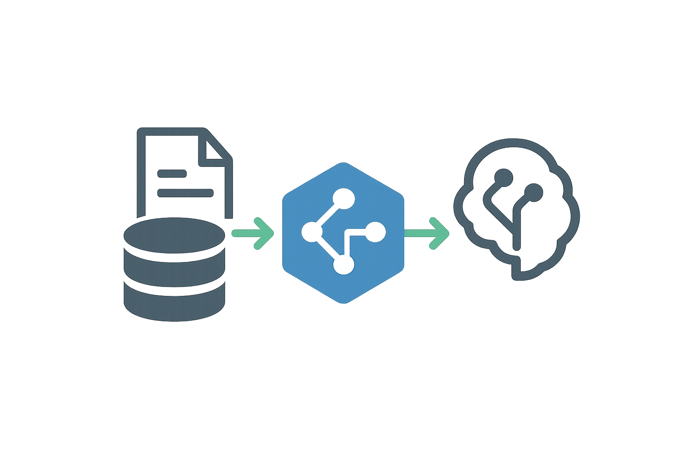

<p align="center">
  
</p>

# LocalData MCP Server

[](LICENSE)
[](https://github.com/ChrisGVE/localdata-mcp/releases)
[](https://github.com/ChrisGVE/localdata-mcp/actions/workflows/ci.yml)
[](https://pypi.org/project/localdata-mcp/)
[](https://www.python.org/downloads/)
[](https://github.com/jlowin/fastmcp)

<!-- mcp-name: io.github.chrisgve/localdata-mcp -->

SQL over your local data files, for LLM agents.

**Every datasource becomes a database.** A CSV, a TSV, a SQLite file — each is
attached under a nickname and addressed as `nickname.table`. That one idea is why
a spreadsheet and a database join in a single ordinary statement, and why there
are seven tools here rather than seventy.

> **Rebuild in progress.** This branch is a ground-up rewrite. It currently
> supports flat files (`.csv`, `.tsv`, `.txt`) and SQLite, done properly — see
> [Where this is going](#where-this-is-going). Earlier releases claimed far more
> surface than they held; this one claims what it has.

## Quick start

```bash
uv tool install localdata-mcp     # or: uvx localdata-mcp
```

Add it to your MCP client configuration:

```json
{
  "mcpServers": {
    "localdata": {
      "command": "localdata-mcp"
    }
  }
}
```

Then point it at a file and ask:

```python
attach("./sales.csv")                     # → {"nickname": "sales", "tables": ["sales.sales"], ...}
query("sales", "SELECT sku, sum(qty) FROM sales.sales GROUP BY sku")
```

`attach` derives the nickname from the filename and **returns the one it
actually used** — if that name was taken, you get `sales_2` and are told what it
collided with. Always read it back rather than assuming.

## The seven verbs

| Verb | What it does |
| --- | --- |
| `attach(database, nickname?, writable?)` | Open a datasource as a database. Returns the nickname used, plus anything it collided with or evicted. |
| `detach(nickname)` | Close it and free the slot. |
| `query(nickname, sql, limit?, path?)` | Run SQL. With `path`, the whole result is written to CSV instead of returned. |
| `info(nickname?, table?)` | Three altitudes: the whole session, one datasource, or one table's columns and row count. |
| `add_table(nickname, source\|columns, join_on?)` | Land another table *inside* an open database. With `join_on`, reports which keys have no match. |
| `drop_table(nickname, table)` | Remove a table. |
| `save(nickname, path)` | Write the database out to a file you keep. |

### Looking one file up against another

The common request — *"can you cross-reference this with that other file?"* —
uses `add_table`, not a second `attach`:

```python
attach("./sales.csv")                                              # → "sales"
add_table("sales", source="./prices.csv", join_on="sku")
query("sales", "SELECT s.sku, s.qty * p.price AS total "
               "FROM sales.sales s JOIN sales.prices p ON s.sku = p.sku")
```

Landing the second file inside the first database is not just tidier. **`save`
writes one database, not a join** — so attaching the two files separately gives
you an answer now and nothing to come back to, while this gives you a lookup you
can keep.

`join_on` makes the tool report whether the match is actually complete, in both
directions:

```json
"join": {
  "complete": false,
  "matched_keys": 1,
  "missing_from_added":    {"values": ["b", "c"], "total": 2},
  "missing_from_existing": {"values": ["z"],      "total": 1}
}
```

### Nothing survives unless you save it

Attached data lives until `detach`, or until the server stops. `save` writes the
whole database — including tables you added — to a file:

```python
save("sales", "./analysis.db")
```

Attaching that file again later is an ordinary attach, so it comes back
**read-only** unless you pass `writable=true`.

An existing file is refused, and there is no flag to override that. The
destination is a name a person chose; deciding to destroy what is already there
is theirs to make, not the agent's — so clearing it happens outside this server.

## What it will not do

These are deliberate, and each one is measured rather than assumed.

- **Ten datasources at once.** SQLite refuses the eleventh `ATTACH`, and every
  slot is an attached database — so the ceiling is not a policy choice. The
  oldest is evicted when the limit is reached, and the eviction is *reported*
  with everything needed to rebuild it.
- **Write is not the default.** Anything attached from outside is read-only; the
  grant is per-attach and is carried by the connection's own URI, so SQLite
  enforces it rather than a check that could be reached around. A database built
  from a flat file is yours, and is writable.
- **The same file twice is refused**, naming the datasource already holding it.
- **Paths are confined** to the working directory and any configured roots.
  Symlinks and `..` are resolved before the check, not after.
- **A mixed-type column is flagged on load.** An `avg()` over a column holding
  both numbers and text silently counts the text as zero and keeps it in the
  denominator — the answer is wrong and nothing says so, unless something says
  so.

## Memory

The working budget is small by default — 100 MB — because this runs on a machine
doing other things. When a load crosses it, **the load finishes**: the overshoot
is tolerated once. The *next* operation then moves the largest in-memory database
out to a temp file and re-attaches it under the same nickname, and nothing in any
response mentions that it happened.

There is deliberately no pre-flight estimate. What a file *will* cost is guessed
from metadata and guessed wrong; what a database *holds* is read from the
database. Residency is measured as `(page_count − freelist_count) × page_size`,
freelist-corrected so a slot emptied by a `DROP` is not moved to disk for data it
no longer has.

## Configuration

Optional. Discovery is a cascade — **first found wins**, not a merge:

1. `$LOCALDATA_CONFIG_PATH`
2. `$XDG_CONFIG_HOME/localdata/config.toml` (defaults to `~/.config`)
3. `./localdata.toml`
4. `~/Library/Application Support/localdata/config.toml` (macOS) or `%APPDATA%\localdata\config.toml` (Windows)

```toml
[workspace]
slots = 10                # 1-10; SQLite refuses the eleventh attachment
memory_budget_mb = 100    # before a database is moved to disk

[paths]
roots = ["~/data"]        # in addition to the working directory
path_limited = true       # false removes the confinement entirely

[network]
enabled = false           # true allows a datasource URL naming a service
```

**An unknown section or key is refused rather than ignored.** A mistyped
`path_limitted = false` that silently kept the safe default would be a security
setting you believe you have changed.

## Claude Code plugin

The repository doubles as a Claude Code plugin, registering the server and
shipping the `local-data` skill — the mental model, the naming conversation, and
how to phrase an incomplete join in the user's own words rather than as an
anti-join. The tools stay mechanical precisely because the skill carries that.

## Where this is going

Level 0 is a gate: flat files and SQLite, done well. Only then more input and
output formats, then more backends — file-based and endpoint-based, anything
SQLAlchemy speaks. Building blocks first.

The full specification is in [docs/architecture/LEVEL0.md](docs/architecture/LEVEL0.md).

## Documentation

- [Level 0 specification](docs/architecture/LEVEL0.md) — the premise, the three user journeys, the seven verbs
- [Measured constraints](docs/CONSTRAINTS.md) — the behaviour that shapes the design, with the numbers behind it
- [First principles](docs/architecture/FIRST_PRINCIPLES.md) — the constitutional foundation

## Development

```bash
git clone https://github.com/ChrisGVE/localdata-mcp.git
cd localdata-mcp
uv sync --all-extras
uv run --extra dev pytest
```

`-m 'not slow'` skips the volume suite.

## Contributing

Contributions are welcome. Please read [CONTRIBUTING.md](CONTRIBUTING.md) before
submitting a pull request.

## License

Apache License 2.0 — see [LICENSE](LICENSE) for details.
