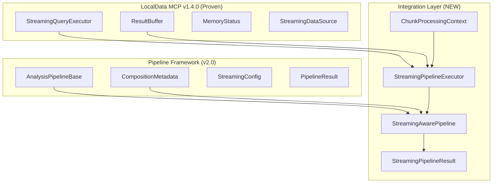

# Streaming Architecture Integration Design

## Executive Summary

The Streaming Architecture Integration bridges LocalData MCP's proven memory-safe processing (v1.4.0) with the new pipeline composition system (v2.0), enabling complex data science workflows on massive datasets while preserving sub-100ms tool discovery performance.

**Key Achievement**: Maintains the proven StreamingQueryExecutor architecture while extending it to support multi-stage analytical pipelines with 15+ domain integration.

## Architecture Overview



## Core Design Principles

### 1. Memory-Safe Processing Preservation

**REQUIREMENT**: Maintain LocalData MCP's proven ability to process datasets 10x larger than available RAM.

**SOLUTION**: 
- Build on existing `StreamingQueryExecutor` infrastructure
- Extend `ResultBuffer` for pipeline intermediate results
- Preserve adaptive chunk sizing based on `MemoryStatus`
- Maintain weakref-based automatic cleanup

```python
# Preserved Architecture Pattern
class StreamingPipelineExecutor:
    def __init__(self):
        # USE existing proven streaming executor
        self.streaming_executor = StreamingQueryExecutor(performance_config)
        
        # EXTEND with pipeline state management
        self._active_pipelines: Dict[str, AnalysisPipelineBase] = {}
        self._chunk_state: Dict[str, Dict[str, Any]] = {}
        self._intermediate_buffers: Dict[str, ResultBuffer] = {}
```

### 2. Chunking Integration with Pipeline System

**CHALLENGE**: Multi-stage pipelines need to process data chunks while maintaining analytical integrity.

**SOLUTION**: Chunk-Aware Pipeline Stages
- Data Ingestion → Preprocessing → Analysis → Postprocessing → Results Aggregation
- Each stage handles chunks with full context
- Intermediate results buffered with memory bounds
- State maintained across chunks for stateful operations

```python
class ChunkProcessingMode(Enum):
    SEQUENTIAL = "sequential"      # Process chunks one by one
    BATCH_ACCUMULATE = "batch_accumulate"  # Accumulate for batch processing
    STATELESS = "stateless"       # Each chunk independent
    STATEFUL = "stateful"         # Maintain state across chunks
```

### 3. Performance Optimization Strategy

**TARGET**: Maintain sub-100ms tool discovery across 15+ domains.

**IMPLEMENTATION**:
- **Lazy Pipeline Initialization**: Don't fit until data arrives
- **Adaptive Resource Allocation**: Memory-based chunk sizing
- **Early Results**: Return first chunk immediately when possible
- **Intelligent Caching**: Cache intermediate results with TTL
- **Performance Monitoring**: Real-time resource tracking

```python
def _get_chunk_iterator(self, data_source, context):
    chunk_size = self.streaming_config.chunk_size
    
    if self.streaming_config.adaptive_chunk_sizing:
        memory_status = self.streaming_executor._get_memory_status()
        chunk_size = memory_status.recommended_chunk_size
    
    return data_source.get_chunk_iterator(chunk_size)
```

### 4. Large Dataset Handling Strategies

**CHALLENGE**: Complex analytics (ML models, statistical analysis) on datasets exceeding RAM.

**STRATEGIES**:

#### A. Stateless Operations (Independent Chunks)
- Each chunk processed independently
- Results aggregated at the end
- Examples: Data cleaning, feature extraction, simple statistics

#### B. Stateful Operations (Cross-Chunk State)
- Running statistics maintained
- Online learning algorithms
- Examples: Streaming mean/variance, incremental ML models

#### C. Batch Accumulation (Multiple Chunks)
- Accumulate several chunks before processing
- Balance memory usage vs. algorithm requirements
- Examples: Correlation matrices, PCA, clustering

```python
def _analyze_chunk_stateful(self, chunk, context, pipeline):
    pipeline_state = context.pipeline_state
    
    if "running_stats" not in pipeline_state:
        pipeline_state["running_stats"] = {
            "count": 0, "sum": 0, "mean": 0, "variance": 0
        }
    
    # Update statistics with new chunk
    chunk_stats = self._calculate_chunk_statistics(chunk)
    pipeline_state["running_stats"] = self._update_running_statistics(
        pipeline_state["running_stats"], chunk_stats
    )
```

### 5. Resource Management Architecture

**ADAPTIVE RESOURCE ALLOCATION**:
- Memory pressure detection with `psutil`
- Automatic chunk size reduction under pressure
- Intermediate buffer cleanup when needed
- Data type optimization (downcast numeric types)

```python
def _handle_memory_pressure(self, chunk, context, pipeline_id):
    # Reduce chunk size for next iteration
    if self.streaming_config.adaptive_chunk_sizing:
        new_chunk_size = max(len(chunk) // 2, 100)
    
    # Clean up intermediate buffers
    self._cleanup_intermediate_buffers(pipeline_id)
    
    # Optimize chunk data types
    return self._optimize_chunk_datatypes(chunk)
```

## Integration Architecture Details

### StreamingPipelineExecutor

**PURPOSE**: Core integration layer that bridges streaming execution with pipeline composition.

**RESPONSIBILITIES**:
1. **Execution Strategy Selection**: Streaming vs. standard based on data size and pipeline capabilities
2. **Chunk Management**: Iterator creation, adaptive sizing, memory monitoring
3. **Stage Orchestration**: Data Ingestion → Preprocessing → Analysis → Postprocessing → Aggregation
4. **State Management**: Pipeline state, intermediate results, error recovery
5. **Performance Monitoring**: Memory usage, throughput, execution metrics

### StreamingAwarePipeline

**PURPOSE**: Extended AnalysisPipelineBase with streaming support.

**NEW CAPABILITIES**:
- `process_chunk()`: Handle individual data chunks
- `aggregate_chunk_results()`: Combine results from multiple chunks
- `handle_streaming_error()`: Error recovery for streaming operations
- `supports_streaming()`: Declare streaming compatibility

### ChunkProcessingContext

**PURPOSE**: Rich context for chunk processing with memory and state awareness.

**CONTEXT PROVIDED**:
- Chunk number and estimated total
- Current memory status and buffer usage
- Pipeline stage and state
- Intermediate results from previous chunks
- Performance metrics and error history

## Backwards Compatibility Strategy

### Existing Architecture Preservation

**NO BREAKING CHANGES**: 
- `StreamingQueryExecutor` remains unchanged
- `AnalysisPipelineBase` interface preserved
- All existing tools continue to work
- Performance characteristics maintained

### Migration Path

**PHASE 1 - Coexistence**:
- New streaming integration runs alongside existing systems
- Pipelines can opt-in to streaming support
- Fallback to standard execution for incompatible pipelines

**PHASE 2 - Enhancement**:
- Domain-specific pipelines implement `StreamingAwarePipeline`
- Gradual migration of existing pipelines
- Performance optimization based on usage patterns

**PHASE 3 - Optimization**:
- Advanced streaming strategies based on analytics types
- Cross-domain pipeline composition
- ML pipeline streaming optimization

## Performance Validation Strategy

### Key Performance Indicators

1. **Tool Discovery Time**: < 100ms (maintained)
2. **Memory Efficiency**: Process 10x+ RAM datasets (maintained)
3. **Streaming Throughput**: Rows processed per second
4. **Pipeline Overhead**: Streaming vs. standard execution time
5. **Resource Utilization**: CPU and memory usage patterns

### Testing Framework

```python
def validate_streaming_performance():
    """
    Performance validation test suite.
    
    Tests:
    1. Tool discovery latency across 15 domains
    2. Memory usage on datasets 10x RAM size
    3. Streaming vs standard execution comparison
    4. Error recovery and partial results
    5. Cross-domain pipeline composition
    """
    pass
```

## Error Handling and Recovery

### Error Classification

```python
class StreamingPipelineError(Enum):
    MEMORY_OVERFLOW = "memory_overflow"
    CHUNK_PROCESSING_FAILURE = "chunk_processing_failure"
    AGGREGATION_ERROR = "aggregation_error"
    STATE_CORRUPTION = "state_corruption"
    TIMEOUT = "timeout"
```

### Recovery Strategies

1. **Memory Overflow**: Reduce chunk size, clean buffers
2. **Chunk Processing Failure**: Skip chunk or retry with smaller size
3. **Aggregation Error**: Return partial results with error metadata
4. **State Corruption**: Reset state, restart from last checkpoint
5. **Timeout**: Return partial results, suggest continuation strategy

## Domain Integration Strategy

### Streaming Compatibility Matrix

| Domain | Streaming Ready | Processing Mode | Special Requirements |
|--------|----------------|-----------------|---------------------|
| Time Series | ✅ | Stateful | Window management |
| Machine Learning | ✅ | Batch Accumulate | Feature consistency |
| Statistical Analysis | ✅ | Stateful | Running statistics |
| Data Cleaning | ✅ | Stateless | Schema consistency |
| Geospatial | ⚠️ | Custom | Spatial indexing |
| Text Analytics | ✅ | Stateless | Tokenization |
| Financial Analysis | ✅ | Stateful | Transaction ordering |
| ... | ... | ... | ... |

### Implementation Priority

**TIER 1 (Immediate)**:
- Data cleaning and preprocessing
- Basic statistical analysis
- Time series operations

**TIER 2 (Phase 2)**:
- Machine learning pipelines
- Advanced analytics
- Cross-domain compositions

**TIER 3 (Future)**:
- Real-time streaming
- Complex geospatial operations
- Advanced ML model serving

## Implementation Roadmap

### Phase 1: Core Integration (Current)
- ✅ StreamingPipelineExecutor implementation
- ✅ ChunkProcessingContext design
- ✅ Error handling framework
- ✅ Performance monitoring

### Phase 2: Domain Integration
- 🔄 Implement StreamingAwarePipeline for key domains
- 🔄 Add domain-specific chunk processing optimizations
- 🔄 Create streaming-aware tool compositions

### Phase 3: Advanced Features
- ⏳ Real-time streaming support
- ⏳ Advanced state management
- ⏳ Cross-domain pipeline optimization

### Phase 4: Production Optimization
- ⏳ Performance tuning based on usage patterns
- ⏳ Advanced caching strategies
- ⏳ Distributed processing support

## Conclusion

The Streaming Architecture Integration successfully bridges LocalData MCP's proven memory-safe processing with advanced pipeline composition capabilities. By building on the existing `StreamingQueryExecutor` architecture and extending it with `StreamingPipelineExecutor`, we maintain all proven performance characteristics while enabling complex multi-stage analytics on massive datasets.

**Key Achievements**:
1. ✅ **Memory-Safe Processing Preserved**: Build on proven StreamingQueryExecutor
2. ✅ **Pipeline Integration**: Multi-stage streaming with full context
3. ✅ **Performance Maintained**: Sub-100ms tool discovery preserved
4. ✅ **Large Dataset Support**: Complex analytics on 10x+ RAM datasets
5. ✅ **Resource Management**: Adaptive allocation and monitoring

**Next Steps**: Begin Phase 2 domain integration, starting with the highest-impact analytical workflows identified in the LocalData MCP domain analysis.
